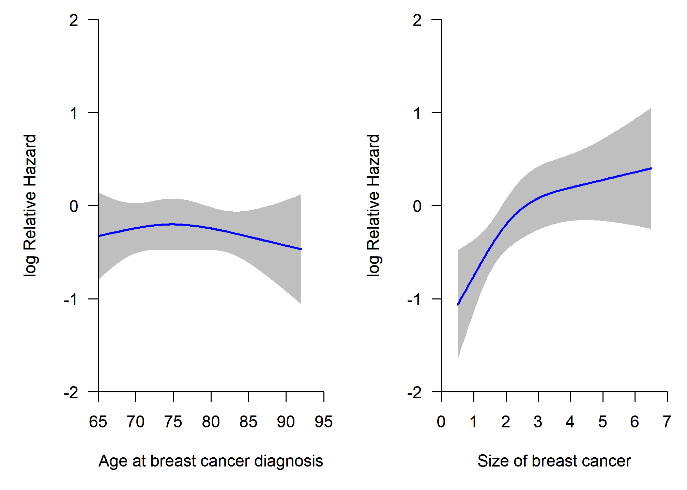
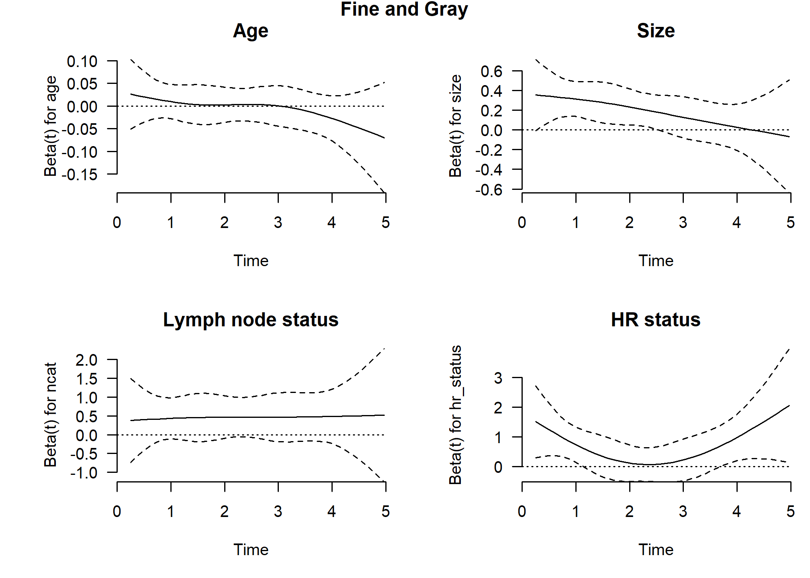

External validation of the performance of competing risks prediction
models: a guide through modern methods - Develop a risk prediction model
using the subdistribution hazard approach
================

-   [Installing and loading packages and import
    data](#installing-and-loading-packages-and-import-data)
-   [Descriptive statistics](#descriptive-statistics)
-   [Develop a competing risks prediction model using the
    subdistribution hazard
    approach](#develop-a-competing-risks-prediction-model-using-the-subdistribution-hazard-approach)
    -   [Cumulative incidence curves](#cumulative-incidence-curves)
    -   [Check non-linearity of continuous
        predictors](#check-non-linearity-of-continuous-predictors)
    -   [Checking proportional subdistribution hazards
        assumption](#checking-proportional-subdistribution-hazards-assumption)
    -   [Model development - fit the risk prediction
        models](#model-development---fit-the-risk-prediction-models)
        -   [Model development using survival package and finegray()
            function](#model-development-using-survival-package-and-finegray-function)
        -   [Model development using mstate package and crprep()
            function](#model-development-using-mstate-package-and-crprep-function)
        -   [Model development using riskRegression package and FGR()
            function](#model-development-using-riskregression-package-and-fgr-function)
-   [Reproducibility ticket](#reproducibility-ticket)

### Installing and loading packages and import data

The following libraries are needed to achieve the outlined goals, the
code chunk below will a) check whether you already have them installed,
b) install them for you if not already present, and c) load the packages
into the session.

``` r
# Use pacman to check whether packages are installed, if not load
if (!require("pacman")) install.packages("pacman")
library(pacman)

pacman::p_load(
  survival,
  rms,
  mstate,
  pseudo,
  pec,
  riskRegression,
  plotrix,
  knitr,
  splines,
  kableExtra,
  gtsummary,
  boot,
  tidyverse,
  rsample,
  gridExtra,
  webshot
)

# Install latest development version of riskRegression
if (!require("devtools", character.only = TRUE)) install.packages("devtools")
if (!require("riskRegression", character.only = TRUE)) devtools::install_github("tagteam/riskRegression")
require("riskRegression", character.only = TRUE)

# Import data ------------------
rdata <- readRDS(here::here("Data/rdata.rds"))
vdata <- readRDS(here::here("Data/vdata.rds"))

rdata$hr_status <- relevel(rdata$hr_status, ref = "ER and/or PR +")
vdata$hr_status <- relevel(vdata$hr_status, ref = "ER and/or PR +")
```

We loaded the development data (rdata) and the validation data (vdata).
More details about development and validation data are provided in the
manuscript.

### Descriptive statistics

<table class="table table-striped" style="margin-left: auto; margin-right: auto;">
<thead>
<tr>
<th style="text-align:left;">
Characteristic
</th>
<th style="text-align:left;">
Development data, N = 1,000
</th>
<th style="text-align:left;">
Validation data, N = 1,000
</th>
</tr>
</thead>
<tbody>
<tr>
<td style="text-align:left;">
Age (years)
</td>
<td style="text-align:left;">
</td>
<td style="text-align:left;">
</td>
</tr>
<tr>
<td style="text-align:left;padding-left: 2em;" indentlevel="1">
Mean (SD)
</td>
<td style="text-align:left;">
75 (7)
</td>
<td style="text-align:left;">
77 (6)
</td>
</tr>
<tr>
<td style="text-align:left;padding-left: 2em;" indentlevel="1">
Median (Range)
</td>
<td style="text-align:left;">
74 (65, 95)
</td>
<td style="text-align:left;">
76 (70, 96)
</td>
</tr>
<tr>
<td style="text-align:left;">
Size (cm)
</td>
<td style="text-align:left;">
</td>
<td style="text-align:left;">
</td>
</tr>
<tr>
<td style="text-align:left;padding-left: 2em;" indentlevel="1">
Mean (SD)
</td>
<td style="text-align:left;">
2.29 (1.31)
</td>
<td style="text-align:left;">
2.13 (1.32)
</td>
</tr>
<tr>
<td style="text-align:left;padding-left: 2em;" indentlevel="1">
Median (Range)
</td>
<td style="text-align:left;">
2.00 (0.10, 8.50)
</td>
<td style="text-align:left;">
1.80 (0.09, 11.00)
</td>
</tr>
<tr>
<td style="text-align:left;">
Nodal status
</td>
<td style="text-align:left;">
</td>
<td style="text-align:left;">
</td>
</tr>
<tr>
<td style="text-align:left;padding-left: 2em;" indentlevel="1">
negative
</td>
<td style="text-align:left;">
642 (64%)
</td>
<td style="text-align:left;">
688 (69%)
</td>
</tr>
<tr>
<td style="text-align:left;padding-left: 2em;" indentlevel="1">
positive
</td>
<td style="text-align:left;">
358 (36%)
</td>
<td style="text-align:left;">
312 (31%)
</td>
</tr>
<tr>
<td style="text-align:left;">
Hormon receptor status
</td>
<td style="text-align:left;">
</td>
<td style="text-align:left;">
</td>
</tr>
<tr>
<td style="text-align:left;padding-left: 2em;" indentlevel="1">
ER and/or PR +
</td>
<td style="text-align:left;">
822 (82%)
</td>
<td style="text-align:left;">
857 (86%)
</td>
</tr>
<tr>
<td style="text-align:left;padding-left: 2em;" indentlevel="1">
ER-/PR-
</td>
<td style="text-align:left;">
178 (18%)
</td>
<td style="text-align:left;">
143 (14%)
</td>
</tr>
</tbody>
</table>

## Develop a competing risks prediction model using the subdistribution hazard approach

### Cumulative incidence curves

First, we draw the cumulative incidence curves of breast cancer
recurrence.

``` r
# Expand datasets -------------------------
rdata.w <- crprep(
  Tstop = "time",
  status = "status_num",
  trans = c(1, 2),
  id = "id",
  keep = c("age", "size", "ncat", "hr_status"),
  data = rdata
)
# Save extended data with weights for recurrence (failcode=1)
# and non recurrence mortality (failcode=2)
rdata.w1 <- rdata.w %>% filter(failcode == 1)
rdata.w2 <- rdata.w %>% filter(failcode == 2)

vdata.w <- crprep(
  Tstop = "time",
  status = "status_num",
  trans = c(1, 2),
  id = "id",
  keep = c("age", "size", "ncat", "hr_status"),
  data = vdata
)
vdata.w1 <- vdata.w %>% filter(failcode == 1)
vdata.w2 <- vdata.w %>% filter(failcode == 2)

# Development set --------
mfit_rdata <- survfit(
  Surv(Tstart, Tstop, status == 1) ~ 1,
  data = rdata.w1, weights = weight.cens
)
mfit_vdata <- survfit(
  Surv(Tstart, Tstop, status == 1) ~ 1,
  data = vdata.w1, weights = weight.cens
)
par(xaxs = "i", yaxs = "i", las = 1)
oldpar <- par(mfrow = c(1, 2), mar = c(5, 5, 1, 1))
plot(mfit_rdata,
     col = 1, lwd = 2,
     xlab = "Years since BC diagnosis",
     ylab = "Cumulative incidence", bty = "n",
     ylim = c(0, 0.25), xlim = c(0, 5), fun = "event", conf.int = TRUE
)
title("Development data")
plot(mfit_vdata,
     col = 1, lwd = 2,
     xlab = "Years since BC diagnosis",
     ylab = "Cumulative incidence", bty = "n",
     ylim = c(0, 0.25), xlim = c(0, 5), fun = "event", conf.int = TRUE
)
title("Validation data")
```


``` r
par(oldpar)
# Cumulative incidences
smfit_rdata <- summary(mfit_rdata, times = c(1, 2, 3, 4, 5))
smfit_vdata <- summary(mfit_vdata, times = c(1, 2, 3, 4, 5))
```

The R packages and functions `cmprsk::cuminc()` and
`mstate::Cuminc()`are good and easy alternatives to estimate the
cumulative incidence function.

<table class="table table-striped" style="margin-left: auto; margin-right: auto;">
<thead>
<tr>
<th style="empty-cells: hide;border-bottom:hidden;" colspan="1">
</th>
<th style="border-bottom:hidden;padding-bottom:0; padding-left:3px;padding-right:3px;text-align: center; " colspan="3">

<div style="border-bottom: 1px solid #ddd; padding-bottom: 5px; ">

Development data

</div>

</th>
<th style="border-bottom:hidden;padding-bottom:0; padding-left:3px;padding-right:3px;text-align: center; " colspan="3">

<div style="border-bottom: 1px solid #ddd; padding-bottom: 5px; ">

Validation data

</div>

</th>
</tr>
<tr>
<th style="text-align:left;">
</th>
<th style="text-align:right;">
Estimate
</th>
<th style="text-align:right;">
Lower .95
</th>
<th style="text-align:right;">
Upper .95
</th>
<th style="text-align:right;">
Estimate
</th>
<th style="text-align:right;">
Lower .95
</th>
<th style="text-align:right;">
Upper .95
</th>
</tr>
</thead>
<tbody>
<tr>
<td style="text-align:left;">
1-year
</td>
<td style="text-align:right;">
0.03
</td>
<td style="text-align:right;">
0.02
</td>
<td style="text-align:right;">
0.04
</td>
<td style="text-align:right;">
0.02
</td>
<td style="text-align:right;">
0.01
</td>
<td style="text-align:right;">
0.03
</td>
</tr>
<tr>
<td style="text-align:left;">
2-year
</td>
<td style="text-align:right;">
0.07
</td>
<td style="text-align:right;">
0.05
</td>
<td style="text-align:right;">
0.08
</td>
<td style="text-align:right;">
0.05
</td>
<td style="text-align:right;">
0.03
</td>
<td style="text-align:right;">
0.06
</td>
</tr>
<tr>
<td style="text-align:left;">
3-year
</td>
<td style="text-align:right;">
0.10
</td>
<td style="text-align:right;">
0.08
</td>
<td style="text-align:right;">
0.12
</td>
<td style="text-align:right;">
0.07
</td>
<td style="text-align:right;">
0.05
</td>
<td style="text-align:right;">
0.09
</td>
</tr>
<tr>
<td style="text-align:left;">
4-year
</td>
<td style="text-align:right;">
0.13
</td>
<td style="text-align:right;">
0.10
</td>
<td style="text-align:right;">
0.15
</td>
<td style="text-align:right;">
0.09
</td>
<td style="text-align:right;">
0.08
</td>
<td style="text-align:right;">
0.11
</td>
</tr>
<tr>
<td style="text-align:left;">
5-year
</td>
<td style="text-align:right;">
0.14
</td>
<td style="text-align:right;">
0.11
</td>
<td style="text-align:right;">
0.16
</td>
<td style="text-align:right;">
0.10
</td>
<td style="text-align:right;">
0.08
</td>
<td style="text-align:right;">
0.12
</td>
</tr>
</tbody>
</table>

The 5-year cumulative incidence of breast cancer recurrence was 14% (95%
CI: 11-16%), and 10% (95%CI: 8-12%)

### Check non-linearity of continuous predictors

Here we investigate the potential non-linear relation between continuous
predictors (i.e. age and size) and the outcomes. We apply three-knot
restricted cubic splines using `rms::rcs()` function (details are given
in e.g. Frank Harrell’s book ‘Regression Model Strategies (second
edition)’, page 27.

``` r
# Defining knots of the restricted cubic splines ------------------
# Extract knots position of the restricted cubic spline based on the
# original distribution of the data

# Age at breast cancer diagnosis
rcs3_age <- rcspline.eval(rdata$age, nk = 3)
attr(rcs3_age, "dim") <- NULL
attr(rcs3_age, "knots") <- NULL
pos_knots_age <- attributes(rcspline.eval(rdata$age, nk = 3))$knots
rdata$age3 <- rcs3_age

# Size of breast cancer
rcs3_size <- rcspline.eval(rdata$size, nk = 3)
attr(rcs3_size, "dim") <- NULL
attr(rcs3_size, "knots") <- NULL
pos_knots_size <- attributes(rcspline.eval(rdata$size, nk = 3))$knots
rdata$size3 <- rcs3_size

# FG model
dd <- datadist(rdata)
options(datadist = "dd")
fit_fg_rcs <- cph(Surv(Tstart, Tstop, status == 1) ~ 
                    rcs(age, pos_knots_age) + rcs(size, pos_knots_size) +
                    ncat + hr_status, 
                  weights = weight.cens,
                  x = T, 
                  y = T, 
                  surv = T, 
                  data = rdata.w1
)
P_fg_age_rcs <- Predict(fit_fg_rcs, "age")
P_fg_size_rcs <- Predict(fit_fg_rcs, "size")
# print(fit_fg_rcs)
# print(summary(fit_fg_rcs))
# print(anova(fit_fg_rcs))

oldpar <- par(mfrow = c(1, 2), mar = c(5, 5, 1, 1))
par(xaxs = "i", yaxs = "i", las = 1)

# FG - age
plot(P_fg_age_rcs$age, 
     P_fg_age_rcs$yhat,
     type = "l", 
     lwd = 2, 
     col = "blue", 
     bty = "n",
  xlab = "Age at breast cancer diagnosis",
  ylab = "log Relative Hazard", 
  ylim = c(-2, 2), 
  xlim = c(65, 95)
)
polygon(c(P_fg_age_rcs$age, 
          rev(P_fg_age_rcs$age)),
  c(P_fg_age_rcs$lower, 
    rev(P_fg_age_rcs$upper)),
  col = "grey75",
  border = FALSE
)
par(new = TRUE)
plot(P_fg_age_rcs$age, 
     P_fg_age_rcs$yhat,
     type = "l", 
     lwd = 2, 
     col = "blue", 
     bty = "n",
     xlab = "Age at breast cancer diagnosis", 
     ylab = "log Relative Hazard",
     ylim = c(-2, 2),
     xlim = c(65, 95)
)

# FG - size
par(xaxs = "i", yaxs = "i", las = 1)
plot(P_fg_size_rcs$size, 
     P_fg_size_rcs$yhat,
     type = "l", 
     lwd = 2, 
     col = "blue", 
     bty = "n",
     xlab = "Size of breast cancer",
     ylab = "log Relative Hazard", 
     ylim = c(-2, 2),
     xlim = c(0, 7)
)
polygon(c(P_fg_size_rcs$size, 
          rev(P_fg_size_rcs$size)),
  c(P_fg_size_rcs$lower, 
    rev(P_fg_size_rcs$upper)),
  col = "grey75",
  border = FALSE
)
par(new = TRUE)
plot(P_fg_size_rcs$size, 
     P_fg_size_rcs$yhat,
     type = "l", 
     lwd = 2, 
     col = "blue", 
     bty = "n",
     xlab = "Size of breast cancer", 
     ylab = "log Relative Hazard",
     ylim = c(-2, 2), 
     xlim = c(0, 7)
)
```



``` r
par(oldpar)
options(datadist = NULL)

# Fit the Fine and Gray model assuming linear relation of
# the continuous predictors
dd <- datadist(rdata, adjto.cat = "first")
options(datadist = "dd")
fit_fg <- cph(Surv(Tstart, Tstop, status == 1) ~ age + size +
                ncat + hr_status,
              weights = weight.cens,
              x = T, 
              y = T, 
              surv = T, 
              data = rdata.w1
)
options(datadist = NULL)
```

<table class="table table-striped" style="margin-left: auto; margin-right: auto;">
<thead>
<tr>
<th style="text-align:left;">
</th>
<th style="text-align:right;">
AIC without splines
</th>
<th style="text-align:right;">
AIC with splines
</th>
</tr>
</thead>
<tbody>
<tr>
<td style="text-align:left;">
Fine and Gray models
</td>
<td style="text-align:right;">
1819.695
</td>
<td style="text-align:right;">
1819.733
</td>
</tr>
</tbody>
</table>

The AIC and the graphical check suggested a potential linear relation
between the continuous predictors (age and size) and the event of
interest (breast cancer recurrence).

### Checking proportional subdistribution hazards assumption

We now examine the fits further by checking the proportionality of the
subdistribution hazards of the models.

``` r
zp_fg <- cox.zph(fit_fg, transform = "identity")

par(las = 1, xaxs = "i", yaxs = "i")
# c(bottom, left, top, right)
oldpar <- par(mfrow = c(2, 2), mar = c(5, 6.1, 3.1, 1))
sub_title <- c("Age", "Size", "Lymph node status", "HR status")
for (i in 1:4) {
  plot(zp_fg[i], 
       resid = F, 
       bty = "n", 
       xlim = c(0, 5))
  abline(0, 0, lty = 3)
  title(sub_title[i])
}
mtext("Fine and Gray", 
      side = 3, 
      line = -1, 
      outer = TRUE, 
      font = 2)
```



``` r
par(oldpar)

kable(round(zp_fg$table, 3)) %>%
  kable_styling("striped", position = "center")
```

<table class="table table-striped" style="margin-left: auto; margin-right: auto;">
<thead>
<tr>
<th style="text-align:left;">
</th>
<th style="text-align:right;">
chisq
</th>
<th style="text-align:right;">
df
</th>
<th style="text-align:right;">
p
</th>
</tr>
</thead>
<tbody>
<tr>
<td style="text-align:left;">
age
</td>
<td style="text-align:right;">
2.439
</td>
<td style="text-align:right;">
1
</td>
<td style="text-align:right;">
0.118
</td>
</tr>
<tr>
<td style="text-align:left;">
size
</td>
<td style="text-align:right;">
4.874
</td>
<td style="text-align:right;">
1
</td>
<td style="text-align:right;">
0.027
</td>
</tr>
<tr>
<td style="text-align:left;">
ncat
</td>
<td style="text-align:right;">
0.177
</td>
<td style="text-align:right;">
1
</td>
<td style="text-align:right;">
0.674
</td>
</tr>
<tr>
<td style="text-align:left;">
hr\_status
</td>
<td style="text-align:right;">
0.127
</td>
<td style="text-align:right;">
1
</td>
<td style="text-align:right;">
0.721
</td>
</tr>
<tr>
<td style="text-align:left;">
GLOBAL
</td>
<td style="text-align:right;">
6.465
</td>
<td style="text-align:right;">
4
</td>
<td style="text-align:right;">
0.167
</td>
</tr>
</tbody>
</table>

The statistical tests showed a potential violation of the proportional
hazards assumption for size of breast cancer. For simplicity we ignore
this violation in the remainder.

### Model development - fit the risk prediction models

We develop and show the results of the Fine and Gray subdistribution
hazard regression model. In R, there are multiple alternatives to fit a
competing risks model using the subdistribution hazard approach:

-   Using `survival::coxph()` after using `survival::finegray()`;  
-   Using `rcs::cph()` or `survival::coxph()` after expanding the data
    with `mstate::crprep()`;  
-   Using `riskRegression::FGR()` which is a formula interface for the
    function `crr` from the `cmprsk` package.

#### Model development using survival package and finegray() function

``` r
rdata_fg <- finegray(Surv(time, status) ~ ., 
                     etype = "rec",
                     data = rdata)

fgfit <- coxph(Surv(fgstart, fgstop, fgstatus) ~ 
                 age + size + ncat + hr_status,
               weight = fgwt, 
               data = rdata_fg)
```

#### Model development using mstate package and crprep() function

``` r
# Expand data to prepare for fitting the model 
primary_event <- 1 # primary event is 1 (breast cancer recurrence)
# set 2 to fit a model for non-recurrence mortality.
rdata.w <- mstate::crprep(
  Tstop = "time",
  status = "status_num",
  trans = c(1, 2),
  id = "id",
  keep = c("age", "size", "ncat", "hr_status"),
  data = rdata
)
rdata.w1 <- rdata.w %>% filter(failcode == primary_event)

dd <- datadist(rdata)
options(datadist = "dd")
options(prType = "html")

fit_fg <- cph(Surv(Tstart, Tstop, status == 1) ~
                age + size + ncat + hr_status, 
                  weights = weight.cens,
                  x = T, 
                  y = T, 
                  surv = T, 
                  data = rdata.w1
)
print(fit_fg)
```

 <strong>Cox Proportional Hazards Model</strong>
 
 <pre>
 cph(formula = Surv(Tstart, Tstop, status == 1) ~ age + size + 
     ncat + hr_status, data = rdata.w1, weights = weight.cens, 
     x = T, y = T, surv = T)
 </pre>
 
 <table class='gmisc_table' style='border-collapse: collapse; margin-top: 1em; margin-bottom: 1em;' >
<thead>
<tr>
<th style='font-weight: 900; border-bottom: 1px solid grey; border-top: 2px solid grey; border-left: 1px solid black; border-right: 1px solid black; text-align: center;'></th>
<th style='font-weight: 900; border-bottom: 1px solid grey; border-top: 2px solid grey; border-right: 1px solid black; text-align: center;'>Model Tests</th>
<th style='font-weight: 900; border-bottom: 1px solid grey; border-top: 2px solid grey; border-right: 1px solid black; text-align: center;'>Discrimination<br>Indexes</th>
</tr>
</thead>
<tbody>
<tr>
<td style='min-width: 9em; border-left: 1px solid black; border-right: 1px solid black; text-align: center;'>Obs 1486</td>
<td style='min-width: 9em; border-right: 1px solid black; text-align: center;'>LR χ<sup>2</sup> 34.31</td>
<td style='min-width: 9em; border-right: 1px solid black; text-align: center;'><i>R</i><sup>2</sup> 0.032</td>
</tr>
<tr>
<td style='min-width: 9em; border-left: 1px solid black; border-right: 1px solid black; text-align: center;'>Events 135</td>
<td style='min-width: 9em; border-right: 1px solid black; text-align: center;'>d.f. 4</td>
<td style='min-width: 9em; border-right: 1px solid black; text-align: center;'><i>D</i><sub>xy</sub> 0.286</td>
</tr>
<tr>
<td style='min-width: 9em; border-left: 1px solid black; border-right: 1px solid black; text-align: center;'>Center 0.8068</td>
<td style='min-width: 9em; border-right: 1px solid black; text-align: center;'>Pr(>χ<sup>2</sup>) 0.0000</td>
<td style='min-width: 9em; border-right: 1px solid black; text-align: center;'><i>g</i> 0.534</td>
</tr>
<tr>
<td style='min-width: 9em; border-left: 1px solid black; border-right: 1px solid black; text-align: center;'></td>
<td style='min-width: 9em; border-right: 1px solid black; text-align: center;'>Score χ<sup>2</sup> 39.30</td>
<td style='min-width: 9em; border-right: 1px solid black; text-align: center;'><i>g</i><sub>r</sub> 1.705</td>
</tr>
<tr>
<td style='min-width: 9em; border-bottom: 2px solid grey; border-left: 1px solid black; border-right: 1px solid black; text-align: center;'></td>
<td style='min-width: 9em; border-bottom: 2px solid grey; border-right: 1px solid black; text-align: center;'>Pr(>χ<sup>2</sup>) 0.0000</td>
<td style='min-width: 9em; border-bottom: 2px solid grey; border-right: 1px solid black; text-align: center;'></td>
</tr>
</tbody>
</table>

 
 <table class='gmisc_table' style='border-collapse: collapse; margin-top: 1em; margin-bottom: 1em;' >
<thead>
<tr><th style='border-bottom: 1px solid grey; font-weight: 900; border-top: 2px solid grey; min-width: 7em; text-align: center;'></th>
<th style='font-weight: 900; border-bottom: 1px solid grey; border-top: 2px solid grey; text-align: right;'>β</th>
<th style='font-weight: 900; border-bottom: 1px solid grey; border-top: 2px solid grey; text-align: right;'>S.E.</th>
<th style='font-weight: 900; border-bottom: 1px solid grey; border-top: 2px solid grey; text-align: right;'>Wald <i>Z</i></th>
<th style='font-weight: 900; border-bottom: 1px solid grey; border-top: 2px solid grey; text-align: right;'>Pr(>|<i>Z</i>|)</th>
</tr>
</thead>
<tbody>
<tr>
<td style='min-width: 7em; text-align: left;'>age</td>
<td style='min-width: 7em; text-align: right;'> 0.0002</td>
<td style='min-width: 7em; text-align: right;'> 0.0122</td>
<td style='min-width: 7em; text-align: right;'>0.02</td>
<td style='min-width: 7em; text-align: right;'>0.9859</td>
</tr>
<tr>
<td style='min-width: 7em; text-align: left;'>size</td>
<td style='min-width: 7em; text-align: right;'> 0.2044</td>
<td style='min-width: 7em; text-align: right;'> 0.0576</td>
<td style='min-width: 7em; text-align: right;'>3.55</td>
<td style='min-width: 7em; text-align: right;'>0.0004</td>
</tr>
<tr>
<td style='min-width: 7em; text-align: left;'>ncat=positive</td>
<td style='min-width: 7em; text-align: right;'> 0.4532</td>
<td style='min-width: 7em; text-align: right;'> 0.1784</td>
<td style='min-width: 7em; text-align: right;'>2.54</td>
<td style='min-width: 7em; text-align: right;'>0.0111</td>
</tr>
<tr>
<td style='min-width: 7em; border-bottom: 2px solid grey; text-align: left;'>hr_status=ER-/PR-</td>
<td style='min-width: 7em; border-bottom: 2px solid grey; text-align: right;'> 0.5860</td>
<td style='min-width: 7em; border-bottom: 2px solid grey; text-align: right;'> 0.1927</td>
<td style='min-width: 7em; border-bottom: 2px solid grey; text-align: right;'>3.04</td>
<td style='min-width: 7em; border-bottom: 2px solid grey; text-align: right;'>0.0024</td>
</tr>
</tbody>
</table>

``` r
options(datadist = NULL)
```

#### Model development using riskRegression package and FGR() function

``` r
# We also fit the FG model using riskRegression::FGR()
# because it is useful to evaluate some of the prediction performance
# measures later

primary_event <- 1 # primary event is 1 (breast cancer recurrence)
# set 2 to fit a model for non-recurrence mortality.

fit_fgr <- FGR(Hist(time, status_num) ~ 
                 age + size +
                 ncat + hr_status, 
               cause = primary_event,
               data = rdata)
```

``` r
res_coef <- cbind.data.frame( 
                             "survival package" = fgfit$coefficients,
                             "mstate + survival/rms packages" = 
                               fit_fg$coefficients,
                             "riskRegression package" = fit_fgr$crrFit$coef)
k <- 4
res_coef <- round(res_coef, k)
kable(res_coef) %>% 
  kable_styling("striped", position = "center")
```

<table class="table table-striped" style="margin-left: auto; margin-right: auto;">
<thead>
<tr>
<th style="text-align:left;">
</th>
<th style="text-align:right;">
survival package
</th>
<th style="text-align:right;">
mstate + survival/rms packages
</th>
<th style="text-align:right;">
riskRegression package
</th>
</tr>
</thead>
<tbody>
<tr>
<td style="text-align:left;">
age
</td>
<td style="text-align:right;">
0.0002
</td>
<td style="text-align:right;">
0.0002
</td>
<td style="text-align:right;">
0.0002
</td>
</tr>
<tr>
<td style="text-align:left;">
size
</td>
<td style="text-align:right;">
0.2044
</td>
<td style="text-align:right;">
0.2044
</td>
<td style="text-align:right;">
0.2044
</td>
</tr>
<tr>
<td style="text-align:left;">
ncatpositive
</td>
<td style="text-align:right;">
0.4532
</td>
<td style="text-align:right;">
0.4532
</td>
<td style="text-align:right;">
0.4532
</td>
</tr>
<tr>
<td style="text-align:left;">
hr\_statusER-/PR-
</td>
<td style="text-align:right;">
0.5860
</td>
<td style="text-align:right;">
0.5860
</td>
<td style="text-align:right;">
0.5860
</td>
</tr>
</tbody>
</table>

The coefficients of the models indicated that higher size, positive
nodal status and ER- and/or PR- were associated with higher risk to
develop a breast cancer recurrence.

## Reproducibility ticket

``` r
sessionInfo()
```

    ## R version 4.0.5 (2021-03-31)
    ## Platform: x86_64-w64-mingw32/x64 (64-bit)
    ## Running under: Windows 10 x64 (build 18363)
    ## 
    ## Matrix products: default
    ## 
    ## locale:
    ## [1] LC_COLLATE=English_United States.1252 
    ## [2] LC_CTYPE=English_United States.1252   
    ## [3] LC_MONETARY=English_United States.1252
    ## [4] LC_NUMERIC=C                          
    ## [5] LC_TIME=English_United States.1252    
    ## 
    ## attached base packages:
    ## [1] splines   stats     graphics  grDevices utils     datasets  methods  
    ## [8] base     
    ## 
    ## other attached packages:
    ##  [1] devtools_2.4.2            usethis_2.0.1            
    ##  [3] webshot_0.5.2             gridExtra_2.3            
    ##  [5] rsample_0.0.9             forcats_0.5.1            
    ##  [7] stringr_1.4.0             dplyr_1.0.5              
    ##  [9] purrr_0.3.4               readr_1.4.0              
    ## [11] tidyr_1.1.3               tibble_3.1.0             
    ## [13] tidyverse_1.3.0           boot_1.3-27              
    ## [15] gtsummary_1.3.7           kableExtra_1.3.4         
    ## [17] knitr_1.31                plotrix_3.8-1            
    ## [19] riskRegression_2020.12.08 pec_2020.11.17           
    ## [21] prodlim_2019.11.13        pseudo_1.4.3             
    ## [23] geepack_1.3-2             KMsurv_0.1-5             
    ## [25] mstate_0.3.1              rms_6.2-0                
    ## [27] SparseM_1.81              Hmisc_4.5-0              
    ## [29] ggplot2_3.3.3             Formula_1.2-4            
    ## [31] lattice_0.20-41           survival_3.2-11          
    ## [33] pacman_0.5.1             
    ## 
    ## loaded via a namespace (and not attached):
    ##   [1] readxl_1.3.1        backports_1.2.1     systemfonts_1.0.1  
    ##   [4] listenv_0.8.0       TH.data_1.0-10      digest_0.6.27      
    ##   [7] foreach_1.5.1       htmltools_0.5.1.1   fansi_0.4.2        
    ##  [10] magrittr_2.0.1      checkmate_2.0.0     memoise_2.0.0      
    ##  [13] cluster_2.1.1       remotes_2.3.0       globals_0.14.0     
    ##  [16] modelr_0.1.8        mets_1.2.8.1        matrixStats_0.58.0 
    ##  [19] sandwich_3.0-0      svglite_2.0.0       prettyunits_1.1.1  
    ##  [22] jpeg_0.1-8.1        colorspace_2.0-0    rvest_1.0.0        
    ##  [25] haven_2.3.1         xfun_0.22           callr_3.6.0        
    ##  [28] crayon_1.4.1        jsonlite_1.7.2      zoo_1.8-9          
    ##  [31] iterators_1.0.13    glue_1.4.2          gtable_0.3.0       
    ##  [34] MatrixModels_0.5-0  pkgbuild_1.2.0      scales_1.1.1       
    ##  [37] mvtnorm_1.1-1       DBI_1.1.1           Rcpp_1.0.6         
    ##  [40] viridisLite_0.3.0   cmprsk_2.2-10       htmlTable_2.1.0    
    ##  [43] foreign_0.8-81      lava_1.6.9          htmlwidgets_1.5.3  
    ##  [46] httr_1.4.2          RColorBrewer_1.1-2  ellipsis_0.3.1     
    ##  [49] pkgconfig_2.0.3     nnet_7.3-15         dbplyr_2.1.1       
    ##  [52] here_1.0.1          utf8_1.2.1          tidyselect_1.1.0   
    ##  [55] rlang_0.4.10        munsell_0.5.0       cellranger_1.1.0   
    ##  [58] tools_4.0.5         cachem_1.0.4        cli_2.4.0          
    ##  [61] generics_0.1.0      broom_0.7.6         evaluate_0.14      
    ##  [64] fastmap_1.1.0       yaml_2.2.1          processx_3.5.1     
    ##  [67] fs_1.5.0            timereg_1.9.8       future_1.21.0      
    ##  [70] nlme_3.1-152        quantreg_5.85       xml2_1.3.2         
    ##  [73] compiler_4.0.5      rstudioapi_0.13     png_0.1-7          
    ##  [76] testthat_3.0.4      gt_0.2.2            reprex_2.0.0       
    ##  [79] broom.helpers_1.2.1 stringi_1.5.3       highr_0.8          
    ##  [82] ps_1.6.0            desc_1.3.0          Matrix_1.3-2       
    ##  [85] vctrs_0.3.7         pillar_1.5.1        lifecycle_1.0.0    
    ##  [88] furrr_0.2.2         data.table_1.14.0   conquer_1.0.2      
    ##  [91] R6_2.5.0            latticeExtra_0.6-29 parallelly_1.24.0  
    ##  [94] sessioninfo_1.1.1   codetools_0.2-18    polspline_1.1.19   
    ##  [97] MASS_7.3-53.1       assertthat_0.2.1    pkgload_1.2.1      
    ## [100] rprojroot_2.0.2     withr_2.4.1         multcomp_1.4-16    
    ## [103] parallel_4.0.5      hms_1.0.0           grid_4.0.5         
    ## [106] rpart_4.1-15        rmarkdown_2.7       numDeriv_2016.8-1.1
    ## [109] lubridate_1.7.10    base64enc_0.1-3
