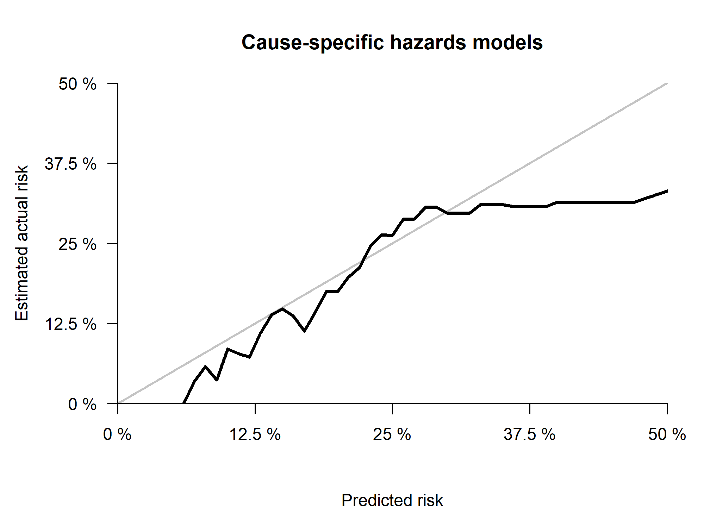

External validation of the performance of competing risks prediction
models: a guide through modern methods - Cause specific hazard models
================

-   [Goals](#goals)
    -   [Installing and loading packages and import
        data](#installing-and-loading-packages-and-import-data)
    -   [Descriptive statistics](#descriptive-statistics)
-   [Goal 1 - develop a risk prediction model with competing
    risks](#goal-1---develop-a-risk-prediction-model-with-competing-risks)
    -   [1.1 Primary investigation - cumulative incidence
        curves](#11-primary-investigation---cumulative-incidence-curves)
    -   [1.2 Secondary investigation - check non-linearity of continuous
        predictors](#12-secondary-investigation----check-non-linearity-of-continuous-predictors)
    -   [1.3 Model development - first check - the proportional hazard
        assumption](#13-model-development---first-check---the-proportional-hazard-assumption)
    -   [1.4 Model development - fit the risk prediction
        models](#14-model-development---fit-the-risk-prediction-models)
-   [Goal 2 - Assessing performance of a competing risk prediction
    model](#goal-2---assessing-performance-of-a-competing-risk-prediction-model)
    -   [2.1 Overall performance
        measures](#21-overall-performance-measures)
    -   [2.2 Discrimination measures](#22-discrimination-measures)
    -   [2.3 Calibration](#23-calibration)
        -   [2.3.1 Observed and Expected ratio ICI E50 E90
            Emax](#231-observed-and-expected-ratio-ici-e50-e90-emax)
        -   [2.3.2 Calibration plot](#232-calibration-plot)
-   [Goal 3 - Clinical utility](#goal-3----clinical-utility)
-   [References](#references)

## Goals

The goals are:  
1. To develop a competing risk prediction model;  
2. To assess the performance of a competing risk prediction model;  
3. To assess the potential clinical utility of a competing risk
prediction model;

### Installing and loading packages and import data

We following libraries are needed to achieve the following goals, if you
have not them installed, please use install.packages(’‘)
(e.g. install.packages(’survival’)) or use the user-friendly approach if
you are using RStudio.

``` r
# Use pacman to check whether packages are installed, if not load
if (!require("pacman")) install.packages("pacman"); library(pacman)

pacman::p_load(
  rio,
  survival,
  rms,
  mstate,
  sqldf,
  pec,
  riskRegression,
  survAUC,
  survivalROC,
  timeROC,
  plotrix,
  splines,
  knitr,
  table1,
  kableExtra,
  boot, 
  tidyverse,
  rsample,
  gridExtra,
  webshot
)
# webshot::install_phantomjs()

rdata<-readRDS(here::here("Data/rdata.rds"))
vdata<-readRDS(here::here("Data/vdata.rds"))

rdata$hr_status<-relevel(rdata$hr_status, ref='ER and/or PR +')
vdata$hr_status<-relevel(vdata$hr_status, ref='ER and/or PR +')
```

We loaded the development (rdata) and the validation data (vdata). More
details about development and validation data are provided in the
manuscript.

### Descriptive statistics

``` r
rsel<-rdata[,c('id', 'age', 'size', 'ncat', 'hr_status')]
vsel<-vdata[,c('id', 'age', 'size', 'ncat', 'hr_status')]
rsel$dt<-1
vsel$dt<-2
cdata<-rbind(rsel,vsel)
cdata$dt<-factor(cdata$dt,levels=c(1,2),
                 labels=c('Development data','Validation data'))

label(cdata$age)<-'Age'
label(cdata$size)<-'Size'
label(cdata$ncat)<-'Nodal status'
label(cdata$hr_status)<-'Hormon receptor status'

# Units
units(cdata$age)<-'years'
units(cdata$size)<-'cm'
options(prType='html')
tab1<-table1(~ age + size + ncat + hr_status| dt, data=cdata, overall=FALSE, topclass="Rtable1-zebra")
# print(tab1)
rm(cdata,vsel,rsel)

tab1
```

    ## [1] "<table class=\"Rtable1-zebra\">\n<thead>\n<tr>\n<th class='rowlabel firstrow lastrow'></th>\n<th class='firstrow lastrow'><span class='stratlabel'>Development data<br><span class='stratn'>(N=1000)</span></span></th>\n<th class='firstrow lastrow'><span class='stratlabel'>Validation data<br><span class='stratn'>(N=1000)</span></span></th>\n</tr>\n</thead>\n<tbody>\n<tr>\n<td class='rowlabel firstrow'><span class='varlabel'>Age<span class='varunits'> (years)</span></span></td>\n<td class='firstrow'></td>\n<td class='firstrow'></td>\n</tr>\n<tr>\n<td class='rowlabel'>Mean (SD)</td>\n<td>75.3 (6.96)</td>\n<td>77.2 (5.58)</td>\n</tr>\n<tr>\n<td class='rowlabel lastrow'>Median [Min, Max]</td>\n<td class='lastrow'>74.0 [65.0, 95.0]</td>\n<td class='lastrow'>76.0 [70.0, 96.0]</td>\n</tr>\n<tr>\n<td class='rowlabel firstrow'><span class='varlabel'>Size<span class='varunits'> (cm)</span></span></td>\n<td class='firstrow'></td>\n<td class='firstrow'></td>\n</tr>\n<tr>\n<td class='rowlabel'>Mean (SD)</td>\n<td>2.29 (1.31)</td>\n<td>2.13 (1.32)</td>\n</tr>\n<tr>\n<td class='rowlabel lastrow'>Median [Min, Max]</td>\n<td class='lastrow'>2.00 [0.100, 8.50]</td>\n<td class='lastrow'>1.80 [0.0900, 11.0]</td>\n</tr>\n<tr>\n<td class='rowlabel firstrow'><span class='varlabel'>Nodal status</span></td>\n<td class='firstrow'></td>\n<td class='firstrow'></td>\n</tr>\n<tr>\n<td class='rowlabel'>negative</td>\n<td>642 (64.2%)</td>\n<td>688 (68.8%)</td>\n</tr>\n<tr>\n<td class='rowlabel lastrow'>positive</td>\n<td class='lastrow'>358 (35.8%)</td>\n<td class='lastrow'>312 (31.2%)</td>\n</tr>\n<tr>\n<td class='rowlabel firstrow'><span class='varlabel'>Hormon receptor status</span></td>\n<td class='firstrow'></td>\n<td class='firstrow'></td>\n</tr>\n<tr>\n<td class='rowlabel'>ER and/or PR +</td>\n<td>822 (82.2%)</td>\n<td>857 (85.7%)</td>\n</tr>\n<tr>\n<td class='rowlabel lastrow'>ER-/PR-</td>\n<td class='lastrow'>178 (17.8%)</td>\n<td class='lastrow'>143 (14.3%)</td>\n</tr>\n</tbody>\n</table>\n"

## Goal 1 - develop a risk prediction model with competing risks

### 1.1 Primary investigation - cumulative incidence curves

First, we draw the cumulative incidence curves of breast cancer
recurrence.

``` r
# Expand datasets 
# Create indicator variables for the outcome
rdata$status_num<-as.numeric(rdata$status)-1
rdata$status1[rdata$status_num==1]<-1
rdata$status1[rdata$status_num!=1]<-0
rdata$status2[rdata$status_num==2]<-2
rdata$status2[rdata$status_num!=2]<-0

# Create indicator variables for the outcome
vdata$status_num<-as.numeric(vdata$status)-1
vdata$status1[vdata$status_num==1]<-1
vdata$status1[vdata$status_num!=1]<-0
vdata$status2[vdata$status_num==2]<-2
vdata$status2[vdata$status_num!=2]<-0

# Median follow-up
# Reverse KM method censoring also competing events (so median follow-up at first event?)

# survfit(coxph(Surv(time,status_num==0)~1,data=rdata)) # 5 years

# Expand data
rdata.w<-crprep(Tstop='time',
                status='status_num',
                trans=c(1,2),
                id='id',
                keep=c('age','size','ncat','hr_status'),
                data=rdata)

# Save extended data with weights for recurrence (failcode=1)
# and non recurrence mortality (failcode=2)
rdata.w1 <- rdata.w %>% filter(failcode==1)
rdata.w2 <- rdata.w %>% filter(failcode==2)

vdata.w<-crprep(Tstop='time',
                status='status_num',
                trans=c(1,2),
                id='id',
                keep=c('age','size','ncat','hr_status'),
                data=vdata)

vdata.w1 <- vdata.w %>% filter(failcode==1)
vdata.w2 <- vdata.w %>% filter(failcode==2)

# Development set
mfit3 <- survfit(
  Surv(Tstart,Tstop,status==1)~1, 
  data=rdata.w1,weights=weight.cens)

mfit4 <- survfit(
  Surv(Tstart,Tstop,status==1)~1, 
  data=vdata.w1,weights=weight.cens) 

par(xaxs='i',yaxs='i',las=1)
oldpar <- par(mfrow=c(1,2), mar=c(5,5,1,1))
plot(mfit3,col=1,lwd=2,
     xlab='Years since BC diagnosis',
     ylab='Cumulative incidence',bty='n',
     ylim=c(0,0.25),xlim=c(0,5),fun='event',conf.int = TRUE)
title('Development data')

plot(mfit4,col=1,lwd=2,
     xlab='Years since BC diagnosis',
     ylab='Cumulative incidence',bty='n',
     ylim=c(0,0.25),xlim=c(0,5),fun='event',conf.int = TRUE)
title('Validation data')
```


``` r
par(oldpar)

# Cumulative incidences
# Cumulative incidences
smfit3<-summary(mfit3,times=c(1,2,3,4,5))
smfit4<-summary(mfit4,times=c(1,2,3,4,5))

res_ci<-cbind(1-smfit3$surv,
              1-smfit3$upper,
              1-smfit3$lower,
              1-smfit4$surv,
              1-smfit4$upper,
              1-smfit4$lower)

res_ci<-round(res_ci,2)

rownames(res_ci)<-c('1-year','2-year',
                    '3-year', '4-year',
                    '5-year')
colnames(res_ci)<-rep(c('Estimate','Lower .95',
                        'Upper .95'),2)

kable(res_ci,
      row.names = TRUE) %>% 
  kable_styling('striped', position ='center') %>%
  add_header_above(c(' '=1, 'Development data'=3, 'Validation data'=3))
```

<table class="table table-striped" style="margin-left: auto; margin-right: auto;">
<thead>
<tr>
<th style="empty-cells: hide;border-bottom:hidden;" colspan="1">
</th>
<th style="border-bottom:hidden;padding-bottom:0; padding-left:3px;padding-right:3px;text-align: center; " colspan="3">

<div style="border-bottom: 1px solid #ddd; padding-bottom: 5px; ">

Development data

</div>

</th>
<th style="border-bottom:hidden;padding-bottom:0; padding-left:3px;padding-right:3px;text-align: center; " colspan="3">

<div style="border-bottom: 1px solid #ddd; padding-bottom: 5px; ">

Validation data

</div>

</th>
</tr>
<tr>
<th style="text-align:left;">
</th>
<th style="text-align:right;">
Estimate
</th>
<th style="text-align:right;">
Lower .95
</th>
<th style="text-align:right;">
Upper .95
</th>
<th style="text-align:right;">
Estimate
</th>
<th style="text-align:right;">
Lower .95
</th>
<th style="text-align:right;">
Upper .95
</th>
</tr>
</thead>
<tbody>
<tr>
<td style="text-align:left;">
1-year
</td>
<td style="text-align:right;">
0.03
</td>
<td style="text-align:right;">
0.02
</td>
<td style="text-align:right;">
0.04
</td>
<td style="text-align:right;">
0.02
</td>
<td style="text-align:right;">
0.01
</td>
<td style="text-align:right;">
0.03
</td>
</tr>
<tr>
<td style="text-align:left;">
2-year
</td>
<td style="text-align:right;">
0.07
</td>
<td style="text-align:right;">
0.05
</td>
<td style="text-align:right;">
0.08
</td>
<td style="text-align:right;">
0.05
</td>
<td style="text-align:right;">
0.03
</td>
<td style="text-align:right;">
0.06
</td>
</tr>
<tr>
<td style="text-align:left;">
3-year
</td>
<td style="text-align:right;">
0.10
</td>
<td style="text-align:right;">
0.08
</td>
<td style="text-align:right;">
0.12
</td>
<td style="text-align:right;">
0.07
</td>
<td style="text-align:right;">
0.05
</td>
<td style="text-align:right;">
0.09
</td>
</tr>
<tr>
<td style="text-align:left;">
4-year
</td>
<td style="text-align:right;">
0.13
</td>
<td style="text-align:right;">
0.10
</td>
<td style="text-align:right;">
0.15
</td>
<td style="text-align:right;">
0.09
</td>
<td style="text-align:right;">
0.08
</td>
<td style="text-align:right;">
0.11
</td>
</tr>
<tr>
<td style="text-align:left;">
5-year
</td>
<td style="text-align:right;">
0.14
</td>
<td style="text-align:right;">
0.11
</td>
<td style="text-align:right;">
0.16
</td>
<td style="text-align:right;">
0.10
</td>
<td style="text-align:right;">
0.08
</td>
<td style="text-align:right;">
0.12
</td>
</tr>
</tbody>
</table>

The median follow-up of the development and validation data was 5 years.
The 5-year cumulative incidence of breast cancer recurrence was 14% (95%
CI: 11-16%), and 10% (95%CI: 8-12%)

### 1.2 Secondary investigation - check non-linearity of continuous predictors

The potential non-linear relation between continuous predictors
(i.e. age and size) and the outcome should be investigated before
developing a competing risk prediction model. Non-linearity of
continuous predictors can be checked using three-knot restricted cubic
splines using rms::rcs() function. More details are given in Frank
Harrell’s book ‘Regression Model Strategies’ on page 27 (second
edition). We developed the competing risks prediction models using the
Fine and Gray model.

``` r
# CSC models without splines
fit_csh<-CSC(Hist(time,status_num)~age+size+
               ncat+hr_status,data=rdata,fitter='cph')

fit_csc1<-fit_csh$models$`Cause 1`
fit_csc2<-fit_csh$models$`Cause 2`

# CSC models
# CS models
# Recurrence
dd<-datadist(rdata)
options(datadist='dd')
fit_csc1_rcs<-cph(Surv(time,status_num==1)~rcs(age,3)+rcs(size,3)+
                    ncat+hr_status,x=T,y=T,surv=T,data=rdata)
# print(fit_csc1_rcs)
# print(summary(fit_csc1_rcs))
# print(anova(fit_csc1_rcs))
P_csc1_age_rcs<-Predict(fit_csc1_rcs,'age')
P_csc1_size_rcs<-Predict(fit_csc1_rcs,'size')
options(datadist=NULL)

# Non-mortality recurrence
dd<-datadist(rdata)
options(datadist='dd')
fit_csc2_rcs<-cph(Surv(time,status_num==2)~rcs(age,3)+rcs(size,3)+
                    ncat+hr_status,x=T,y=T,surv=T,data=rdata)
# print(fit_csc2_rcs)
# print(summary(fit_csc2_rcs))
# print(anova(fit_csc2_rcs))
P_csc2_age_rcs<-Predict(fit_csc2_rcs,'age')
P_csc2_size_rcs<-Predict(fit_csc2_rcs,'size')
options(datadist=NULL)


oldpar <- par(mfrow=c(2,2), mar=c(5,5,1,1))
par(xaxs='i',yaxs='i',las=1)
plot(P_csc1_age_rcs$age,P_csc1_age_rcs$yhat,
     type='l',lwd=2,col='blue',bty='n',
     xlab='Age at breast cancer diagnosis',ylab='log Relative Hazard',ylim=c(-2,2),
     xlim=c(65,95))
polygon(c(P_csc1_age_rcs$age,rev(P_csc1_age_rcs$age)),
        c(P_csc1_age_rcs$lower,rev(P_csc1_age_rcs$upper)),col = "grey75", 
        border = FALSE)
par(new=TRUE)
plot(P_csc1_age_rcs$age,P_csc1_age_rcs$yhat,
     type='l',lwd=2,col='blue',bty='n',
     xlab='Age at breast cancer diagnosis',ylab='log Relative Hazard',
     ylim=c(-2,2),xlim=c(65,95))
title('Recurrence')

# CSC 1- size
par(xaxs='i',yaxs='i',las=1)
plot(P_csc1_size_rcs$size,P_csc1_size_rcs$yhat,
     type='l',lwd=2,col='blue',bty='n',
     xlab='Size of breast cancer',ylab='log Relative Hazard',ylim=c(-2,2),
     xlim=c(0,7))
polygon(c(P_csc1_size_rcs$size,rev(P_csc1_size_rcs$size)),
        c(P_csc1_size_rcs$lower,rev(P_csc1_size_rcs$upper)),col = "grey75", 
        border = FALSE)
par(new=TRUE)
plot(P_csc1_size_rcs$size,P_csc1_size_rcs$yhat,
     type='l',lwd=2,col='blue',bty='n',
     xlab='Size of breast cancer',ylab='log Relative Hazard',
     ylim=c(-2,2),xlim=c(0,7))
title('Recurrence')
par(xaxs='i',yaxs='i',las=1)
options(datadist=NULL)

# CSC 2- age
plot(P_csc2_age_rcs$age,P_csc2_age_rcs$yhat,
     type='l',lwd=2,col='blue',bty='n',
     xlab='Age at breast cancer diagnosis',ylab='log Relative Hazard',ylim=c(-2,2),
     xlim=c(65,95))
polygon(c(P_csc2_age_rcs$age,rev(P_csc2_age_rcs$age)),
        c(P_csc2_age_rcs$lower,rev(P_csc2_age_rcs$upper)),col = "grey75", 
        border = FALSE)
par(new=TRUE)
plot(P_csc2_age_rcs$age,P_csc2_age_rcs$yhat,
     type='l',lwd=2,col='blue',bty='n',
     xlab='Age at breast cancer diagnosis',ylab='log Relative Hazard',
     ylim=c(-2,2),xlim=c(65,95))
title('Non recurrence mortality')

# CSC 2 - size
par(xaxs='i',yaxs='i',las=1)
plot(P_csc2_size_rcs$size,P_csc2_size_rcs$yhat,
     type='l',lwd=2,col='blue',bty='n',
     xlab='Size of breast cancer',ylab='log Relative Hazard',ylim=c(-2,2),
     xlim=c(0,7))
polygon(c(P_csc2_size_rcs$size,rev(P_csc2_size_rcs$size)),
        c(P_csc2_size_rcs$lower,rev(P_csc2_size_rcs$upper)),col = "grey75", 
        border = FALSE)
par(new=TRUE)
plot(P_csc2_size_rcs$size,P_csc2_size_rcs$yhat,
     type='l',lwd=2,col='blue',bty='n',
     xlab='Size of breast cancer',ylab='log Relative Hazard',
     ylim=c(-2,2),xlim=c(0,7))
title('Non recurrence mortality')
```


``` r
options(datadist=NULL)
par(oldpar)

res_AIC<-matrix(c(AIC(fit_csc1),AIC(fit_csc1_rcs),
                  AIC(fit_csc2),AIC(fit_csc2_rcs)),
                  byrow=T,ncol=2,nrow=2,
                  dimnames = list(c('Recurrence specific hazard',
                                    'Non recurrence mortality'),
                                  c('AIC without splines',
                                    'AIC with splines')))
kable(res_AIC,
      row.names = TRUE) %>% 
      kable_styling('striped', position ='center')
```

<table class="table table-striped" style="margin-left: auto; margin-right: auto;">
<thead>
<tr>
<th style="text-align:left;">
</th>
<th style="text-align:right;">
AIC without splines
</th>
<th style="text-align:right;">
AIC with splines
</th>
</tr>
</thead>
<tbody>
<tr>
<td style="text-align:left;">
Recurrence specific hazard
</td>
<td style="text-align:right;">
1779.375
</td>
<td style="text-align:right;">
1780.699
</td>
</tr>
<tr>
<td style="text-align:left;">
Non recurrence mortality
</td>
<td style="text-align:right;">
2572.079
</td>
<td style="text-align:right;">
2574.830
</td>
</tr>
</tbody>
</table>

The AIC and the graphical check suggested a potential linear relation
between the continuous predictors (age and size) and the cause-specific
hazards (breast cancer recurrence and non recurrence mortality).

### 1.3 Model development - first check - the proportional subdistribution hazard assumption

We now examine the fits in a more careful way by checking the
proportionality of the cause-specific hazards of the Cox proportional
hazard regression models.

``` r
zp_csc1 <- cox.zph(fit_csc1, transform='identity')

par(las=1,xaxs='i',yaxs='i')
# c(bottom, left, top, right)
oldpar <- par(mfrow=c(2,2), mar=c(5,6.1,3.1,1))
sub_title<-c("Age","Size","Lymph node status","HR status")
for (i in 1:4) {
  plot(zp_csc1[i], resid=F,bty='n',xlim=c(0,5))
  abline(0,0, lty=3)
  title(sub_title[i])
} 
mtext("Recurrence", side = 3, line = -1, outer = TRUE, font=2)
```


``` r
par(oldpar)

kable(round(zp_csc1$table,3)) %>% 
  kable_styling('striped',position = 'center')
```

<table class="table table-striped" style="margin-left: auto; margin-right: auto;">
<thead>
<tr>
<th style="text-align:left;">
</th>
<th style="text-align:right;">
chisq
</th>
<th style="text-align:right;">
df
</th>
<th style="text-align:right;">
p
</th>
</tr>
</thead>
<tbody>
<tr>
<td style="text-align:left;">
age
</td>
<td style="text-align:right;">
0.458
</td>
<td style="text-align:right;">
1
</td>
<td style="text-align:right;">
0.498
</td>
</tr>
<tr>
<td style="text-align:left;">
size
</td>
<td style="text-align:right;">
2.309
</td>
<td style="text-align:right;">
1
</td>
<td style="text-align:right;">
0.129
</td>
</tr>
<tr>
<td style="text-align:left;">
ncat
</td>
<td style="text-align:right;">
0.016
</td>
<td style="text-align:right;">
1
</td>
<td style="text-align:right;">
0.900
</td>
</tr>
<tr>
<td style="text-align:left;">
hr\_status
</td>
<td style="text-align:right;">
0.078
</td>
<td style="text-align:right;">
1
</td>
<td style="text-align:right;">
0.780
</td>
</tr>
<tr>
<td style="text-align:left;">
GLOBAL
</td>
<td style="text-align:right;">
2.713
</td>
<td style="text-align:right;">
4
</td>
<td style="text-align:right;">
0.607
</td>
</tr>
</tbody>
</table>

``` r
zp_csc2 <- cox.zph(fit_csc2, transform='identity')

par(las=1,xaxs='i',yaxs='i')
# c(bottom, left, top, right)
oldpar <- par(mfrow=c(2,2), mar=c(5,6.1,3.1,1))
sub_title<-c("Age","Size","Lymph node status","HR status")
for (i in 1:4) {
  plot(zp_csc2[i], resid=F,bty='n',xlim=c(0,5))
  abline(0,0, lty=3)
  title(sub_title[i])
} 
mtext("Non recurrence mortality", side = 3, line = -1, outer = TRUE, font=2)
```


``` r
par(oldpar)

kable(round(zp_csc2$table,3)) %>% 
  kable_styling('striped',position = 'center')
```

<table class="table table-striped" style="margin-left: auto; margin-right: auto;">
<thead>
<tr>
<th style="text-align:left;">
</th>
<th style="text-align:right;">
chisq
</th>
<th style="text-align:right;">
df
</th>
<th style="text-align:right;">
p
</th>
</tr>
</thead>
<tbody>
<tr>
<td style="text-align:left;">
age
</td>
<td style="text-align:right;">
2.727
</td>
<td style="text-align:right;">
1
</td>
<td style="text-align:right;">
0.099
</td>
</tr>
<tr>
<td style="text-align:left;">
size
</td>
<td style="text-align:right;">
1.716
</td>
<td style="text-align:right;">
1
</td>
<td style="text-align:right;">
0.190
</td>
</tr>
<tr>
<td style="text-align:left;">
ncat
</td>
<td style="text-align:right;">
5.227
</td>
<td style="text-align:right;">
1
</td>
<td style="text-align:right;">
0.022
</td>
</tr>
<tr>
<td style="text-align:left;">
hr\_status
</td>
<td style="text-align:right;">
0.020
</td>
<td style="text-align:right;">
1
</td>
<td style="text-align:right;">
0.889
</td>
</tr>
<tr>
<td style="text-align:left;">
GLOBAL
</td>
<td style="text-align:right;">
9.374
</td>
<td style="text-align:right;">
4
</td>
<td style="text-align:right;">
0.052
</td>
</tr>
</tbody>
</table>

The statistical tests showed a potential violation of the proportional
non recurrence mortality hazard of nodal status. Since the follow-up is
short we assume, the proportional hazard was not violated.

### 1.4 Model development - fit the risk prediction models

We develop and show the results of the Cox proportional cause-specific
hazards regression models

-   Cox proportional recurrence-specific hazard model

``` r
dd<-datadist(rdata)
options(datadist='dd')
options(prType="html")
fit_csc1_cph<-cph(Surv(time,status_num==1)~age+size+
                    ncat+hr_status,
                    x=T,y=T,surv=T,data=rdata)
print(fit_csc1_cph)
```

 <strong>Cox Proportional Hazards Model</strong>
 
 <pre>
 cph(formula = Surv(time, status_num == 1) ~ age + size + ncat + 
     hr_status, data = rdata, x = T, y = T, surv = T)
 </pre>
 
 <table class='gmisc_table' style='border-collapse: collapse; margin-top: 1em; margin-bottom: 1em;' >
<thead>
<tr>
<th style='font-weight: 900; border-bottom: 1px solid grey; border-top: 2px solid grey; border-left: 1px solid black; border-right: 1px solid black; text-align: center;'></th>
<th style='font-weight: 900; border-bottom: 1px solid grey; border-top: 2px solid grey; border-right: 1px solid black; text-align: center;'>Model Tests</th>
<th style='font-weight: 900; border-bottom: 1px solid grey; border-top: 2px solid grey; border-right: 1px solid black; text-align: center;'>Discrimination<br>Indexes</th>
</tr>
</thead>
<tbody>
<tr>
<td style='min-width: 9em; border-left: 1px solid black; border-right: 1px solid black; text-align: center;'>Obs 1000</td>
<td style='min-width: 9em; border-right: 1px solid black; text-align: center;'>LR χ<sup>2</sup> 46.33</td>
<td style='min-width: 9em; border-right: 1px solid black; text-align: center;'><i>R</i><sup>2</sup> 0.054</td>
</tr>
<tr>
<td style='min-width: 9em; border-left: 1px solid black; border-right: 1px solid black; text-align: center;'>Events 135</td>
<td style='min-width: 9em; border-right: 1px solid black; text-align: center;'>d.f. 4</td>
<td style='min-width: 9em; border-right: 1px solid black; text-align: center;'><i>D</i><sub>xy</sub> 0.326</td>
</tr>
<tr>
<td style='min-width: 9em; border-left: 1px solid black; border-right: 1px solid black; text-align: center;'>Center 2.0201</td>
<td style='min-width: 9em; border-right: 1px solid black; text-align: center;'>Pr(>χ<sup>2</sup>) 0.0000</td>
<td style='min-width: 9em; border-right: 1px solid black; text-align: center;'><i>g</i> 0.627</td>
</tr>
<tr>
<td style='min-width: 9em; border-left: 1px solid black; border-right: 1px solid black; text-align: center;'></td>
<td style='min-width: 9em; border-right: 1px solid black; text-align: center;'>Score χ<sup>2</sup> 53.04</td>
<td style='min-width: 9em; border-right: 1px solid black; text-align: center;'><i>g</i><sub>r</sub> 1.871</td>
</tr>
<tr>
<td style='min-width: 9em; border-bottom: 2px solid grey; border-left: 1px solid black; border-right: 1px solid black; text-align: center;'></td>
<td style='min-width: 9em; border-bottom: 2px solid grey; border-right: 1px solid black; text-align: center;'>Pr(>χ<sup>2</sup>) 0.0000</td>
<td style='min-width: 9em; border-bottom: 2px solid grey; border-right: 1px solid black; text-align: center;'></td>
</tr>
</tbody>
</table>

 
 <table class='gmisc_table' style='border-collapse: collapse; margin-top: 1em; margin-bottom: 1em;' >
<thead>
<tr><th style='border-bottom: 1px solid grey; font-weight: 900; border-top: 2px solid grey; min-width: 7em; text-align: center;'></th>
<th style='font-weight: 900; border-bottom: 1px solid grey; border-top: 2px solid grey; text-align: right;'>β</th>
<th style='font-weight: 900; border-bottom: 1px solid grey; border-top: 2px solid grey; text-align: right;'>S.E.</th>
<th style='font-weight: 900; border-bottom: 1px solid grey; border-top: 2px solid grey; text-align: right;'>Wald <i>Z</i></th>
<th style='font-weight: 900; border-bottom: 1px solid grey; border-top: 2px solid grey; text-align: right;'>Pr(>|<i>Z</i>|)</th>
</tr>
</thead>
<tbody>
<tr>
<td style='min-width: 7em; text-align: left;'>age</td>
<td style='min-width: 7em; text-align: right;'> 0.0153</td>
<td style='min-width: 7em; text-align: right;'> 0.0125</td>
<td style='min-width: 7em; text-align: right;'>1.22</td>
<td style='min-width: 7em; text-align: right;'>0.2237</td>
</tr>
<tr>
<td style='min-width: 7em; text-align: left;'>size</td>
<td style='min-width: 7em; text-align: right;'> 0.2510</td>
<td style='min-width: 7em; text-align: right;'> 0.0564</td>
<td style='min-width: 7em; text-align: right;'>4.45</td>
<td style='min-width: 7em; text-align: right;'><0.0001</td>
</tr>
<tr>
<td style='min-width: 7em; text-align: left;'>ncat=positive</td>
<td style='min-width: 7em; text-align: right;'> 0.5090</td>
<td style='min-width: 7em; text-align: right;'> 0.1769</td>
<td style='min-width: 7em; text-align: right;'>2.88</td>
<td style='min-width: 7em; text-align: right;'>0.0040</td>
</tr>
<tr>
<td style='min-width: 7em; border-bottom: 2px solid grey; text-align: left;'>hr_status=ER-/PR-</td>
<td style='min-width: 7em; border-bottom: 2px solid grey; text-align: right;'> 0.6433</td>
<td style='min-width: 7em; border-bottom: 2px solid grey; text-align: right;'> 0.1926</td>
<td style='min-width: 7em; border-bottom: 2px solid grey; text-align: right;'>3.34</td>
<td style='min-width: 7em; border-bottom: 2px solid grey; text-align: right;'>0.0008</td>
</tr>
</tbody>
</table>

``` r
# print(summary(fit_csc1_cph))
options(datadist=NULL)
```

-   Cox proportional non recurrence mortality-specific hazard model

``` r
dd<-datadist(rdata)
options(datadist='dd')
options(prType="html")
fit_csc2_cph<-cph(Surv(time,status_num==2)~age+size+
                    ncat+hr_status,
                    x=T,y=T,surv=T,data=rdata)
print(fit_csc2_cph)
```

 <strong>Cox Proportional Hazards Model</strong>
 
 <pre>
 cph(formula = Surv(time, status_num == 2) ~ age + size + ncat + 
     hr_status, data = rdata, x = T, y = T, surv = T)
 </pre>
 
 <table class='gmisc_table' style='border-collapse: collapse; margin-top: 1em; margin-bottom: 1em;' >
<thead>
<tr>
<th style='font-weight: 900; border-bottom: 1px solid grey; border-top: 2px solid grey; border-left: 1px solid black; border-right: 1px solid black; text-align: center;'></th>
<th style='font-weight: 900; border-bottom: 1px solid grey; border-top: 2px solid grey; border-right: 1px solid black; text-align: center;'>Model Tests</th>
<th style='font-weight: 900; border-bottom: 1px solid grey; border-top: 2px solid grey; border-right: 1px solid black; text-align: center;'>Discrimination<br>Indexes</th>
</tr>
</thead>
<tbody>
<tr>
<td style='min-width: 9em; border-left: 1px solid black; border-right: 1px solid black; text-align: center;'>Obs 1000</td>
<td style='min-width: 9em; border-right: 1px solid black; text-align: center;'>LR χ<sup>2</sup> 170.94</td>
<td style='min-width: 9em; border-right: 1px solid black; text-align: center;'><i>R</i><sup>2</sup> 0.168</td>
</tr>
<tr>
<td style='min-width: 9em; border-left: 1px solid black; border-right: 1px solid black; text-align: center;'>Events 204</td>
<td style='min-width: 9em; border-right: 1px solid black; text-align: center;'>d.f. 4</td>
<td style='min-width: 9em; border-right: 1px solid black; text-align: center;'><i>D</i><sub>xy</sub> 0.491</td>
</tr>
<tr>
<td style='min-width: 9em; border-left: 1px solid black; border-right: 1px solid black; text-align: center;'>Center 9.06</td>
<td style='min-width: 9em; border-right: 1px solid black; text-align: center;'>Pr(>χ<sup>2</sup>) 0.0000</td>
<td style='min-width: 9em; border-right: 1px solid black; text-align: center;'><i>g</i> 1.047</td>
</tr>
<tr>
<td style='min-width: 9em; border-left: 1px solid black; border-right: 1px solid black; text-align: center;'></td>
<td style='min-width: 9em; border-right: 1px solid black; text-align: center;'>Score χ<sup>2</sup> 186.60</td>
<td style='min-width: 9em; border-right: 1px solid black; text-align: center;'><i>g</i><sub>r</sub> 2.849</td>
</tr>
<tr>
<td style='min-width: 9em; border-bottom: 2px solid grey; border-left: 1px solid black; border-right: 1px solid black; text-align: center;'></td>
<td style='min-width: 9em; border-bottom: 2px solid grey; border-right: 1px solid black; text-align: center;'>Pr(>χ<sup>2</sup>) 0.0000</td>
<td style='min-width: 9em; border-bottom: 2px solid grey; border-right: 1px solid black; text-align: center;'></td>
</tr>
</tbody>
</table>

 
 <table class='gmisc_table' style='border-collapse: collapse; margin-top: 1em; margin-bottom: 1em;' >
<thead>
<tr><th style='border-bottom: 1px solid grey; font-weight: 900; border-top: 2px solid grey; min-width: 7em; text-align: center;'></th>
<th style='font-weight: 900; border-bottom: 1px solid grey; border-top: 2px solid grey; text-align: right;'>β</th>
<th style='font-weight: 900; border-bottom: 1px solid grey; border-top: 2px solid grey; text-align: right;'>S.E.</th>
<th style='font-weight: 900; border-bottom: 1px solid grey; border-top: 2px solid grey; text-align: right;'>Wald <i>Z</i></th>
<th style='font-weight: 900; border-bottom: 1px solid grey; border-top: 2px solid grey; text-align: right;'>Pr(>|<i>Z</i>|)</th>
</tr>
</thead>
<tbody>
<tr>
<td style='min-width: 7em; text-align: left;'>age</td>
<td style='min-width: 7em; text-align: right;'> 0.1118</td>
<td style='min-width: 7em; text-align: right;'> 0.0100</td>
<td style='min-width: 7em; text-align: right;'>11.15</td>
<td style='min-width: 7em; text-align: right;'><0.0001</td>
</tr>
<tr>
<td style='min-width: 7em; text-align: left;'>size</td>
<td style='min-width: 7em; text-align: right;'> 0.2361</td>
<td style='min-width: 7em; text-align: right;'> 0.0481</td>
<td style='min-width: 7em; text-align: right;'> 4.91</td>
<td style='min-width: 7em; text-align: right;'><0.0001</td>
</tr>
<tr>
<td style='min-width: 7em; text-align: left;'>ncat=positive</td>
<td style='min-width: 7em; text-align: right;'> 0.1860</td>
<td style='min-width: 7em; text-align: right;'> 0.1442</td>
<td style='min-width: 7em; text-align: right;'> 1.29</td>
<td style='min-width: 7em; text-align: right;'>0.1971</td>
</tr>
<tr>
<td style='min-width: 7em; border-bottom: 2px solid grey; text-align: left;'>hr_status=ER-/PR-</td>
<td style='min-width: 7em; border-bottom: 2px solid grey; text-align: right;'> 0.2396</td>
<td style='min-width: 7em; border-bottom: 2px solid grey; text-align: right;'> 0.1765</td>
<td style='min-width: 7em; border-bottom: 2px solid grey; text-align: right;'> 1.36</td>
<td style='min-width: 7em; border-bottom: 2px solid grey; text-align: right;'>0.1745</td>
</tr>
</tbody>
</table>

``` r
# print(summary(fit_csc2_cph))
options(datadist=NULL)
```

The coefficients of the models indicated that larger size, positive
nodal status and ER- and/or PR- were associated with higher risk to
develop a breast cancer recurrence, while older patients and larger
tumors are associated with higher risk of non recurrence mortality.

## Goal 2 - Assessing performance of a competing risk prediction model

The performance of a risk prediction models may be evaluated through:

-   discrimination: the ability of the model to identify patients with
    and without the outcome and it requires the coefficients (or the log
    of the subdistribution hazard ratios) of the developed risk
    prediction model to be evaluated.

-   calibration: the agreement between observed and predicted
    probabilities.

-   overall performance measures: as a combination of discrimination and
    calibration and/or as a measure of the explained variation;

### 2.1 Overall performance measures

We calculate the Brier Score and the Index of Prediction Accuracy (IPA,
the scaled Brier) as a overall performance measure.

Some confidence intervals are calculates using the bootstrap percentile
method. So we use bootstrapping the development and validation data.

``` r
# Bootstrapping data
set.seed(20201214)
rboot<-bootstraps(rdata,times=10)
vboot<-bootstraps(vdata,times=10)
# NOTE: B=10 to speed up the procedure for now
```

We calculate the overall performance measures: Brier score, IPA and the
corresponding confidence intervals.

``` r
# Overall performance measures #

# Two measures
# - Brier score
# - IPA

# Development set - apparent validation
score_rdata1<-Score(list("CSH development"=fit_csh),
                    formula=Hist(time,status_num)~1,
                    data=rdata,conf.int=TRUE,times=4.99,
                    cens.model = 'km', metrics='brier',
                    summary='ipa', cause=1) 

# Validation set - external validation
score_vdata1<-
  Score(list("CSH validation"=fit_csh),
        formula=Hist(time,status_num)~1,
        data=vdata,conf.int=TRUE,times=4.99,
        cens.model = 'km', metrics='brier',
        summary='ipa',cause=1) 

# Development set - internal validation (bootstrap)
# mstate::crprep() for every bootstrap sample
crprep_boot<-function(split) {
  crprep(Tstop='time', status='status_num',
         trans=1, data=analysis(split),
         keep=c('status_num','age','size',
                'ncat','hr_status'))
}

# riskRegression::Score() to calculate Brier and IPA for every bootstrap sample
score_boot_1<-function(split) {
  Score(list("CSH"=fit_csh),
        formula=Hist(time,status_num)~1,
        data=analysis(split),conf.int=FALSE,times=4.99,
        cens.model = 'km', metrics='brier',cause=1,
        summary='ipa')$Brier[[1]]$IPA[2] 
}


# Development data
rboot <- rboot %>% mutate(
  cr.prep=map(splits,crprep_boot),
  IPA1=map_dbl(splits,score_boot_1))


# Validation data
vboot <- vboot %>% mutate(
  cr.prep=map(splits,crprep_boot),
  IPA1=map_dbl(splits,score_boot_1),
)

# Table overall measures
alpha<-.05
k<-2 # number of digits
res_ov_csh<-matrix(unlist(c(score_rdata1$Brier$score$Brier[2], 
                            # Brier apparent validation 
                            score_rdata1$Brier$score[2,6],
                            score_rdata1$Brier$score[2,7],
                            
                            score_vdata1$Brier$score$Brier[2], 
                            # Brier external validation
                            score_vdata1$Brier$score[2,6],
                            score_vdata1$Brier$score[2,7],
                            
                            score_rdata1$Brier$score$IPA[2],  
                            # IPA apparent validation
                            quantile(rboot$IPA1,probs=alpha/2),
                            quantile(rboot$IPA1,probs=1-alpha/2),
                            
                            score_vdata1$Brier$score$IPA[2],  
                            # IPA external validation 
                            quantile(vboot$IPA1,probs=alpha/2),
                            quantile(vboot$IPA1,probs=1-alpha/2))),
                  
                   nrow=2,ncol=6, 
                   byrow=T, 
                   dimnames = 
                     list(c('Brier','IPA'),
                          rep(c('Estimate','Lower .95 ','Upper .95'),2)))


res_ov<-round(res_ov_csh,2) # Digits
kable(res_ov) %>% 
  kable_styling('striped', position ="center") %>%
  add_header_above(c(' '=1,
                     'Development data'=3, 
                     'Validation data'=3))
```

<table class="table table-striped" style="margin-left: auto; margin-right: auto;">
<thead>
<tr>
<th style="empty-cells: hide;border-bottom:hidden;" colspan="1">
</th>
<th style="border-bottom:hidden;padding-bottom:0; padding-left:3px;padding-right:3px;text-align: center; " colspan="3">

<div style="border-bottom: 1px solid #ddd; padding-bottom: 5px; ">

Development data

</div>

</th>
<th style="border-bottom:hidden;padding-bottom:0; padding-left:3px;padding-right:3px;text-align: center; " colspan="3">

<div style="border-bottom: 1px solid #ddd; padding-bottom: 5px; ">

Validation data

</div>

</th>
</tr>
<tr>
<th style="text-align:left;">
</th>
<th style="text-align:right;">
Estimate
</th>
<th style="text-align:right;">
Lower .95
</th>
<th style="text-align:right;">
Upper .95
</th>
<th style="text-align:right;">
Estimate
</th>
<th style="text-align:right;">
Lower .95
</th>
<th style="text-align:right;">
Upper .95
</th>
</tr>
</thead>
<tbody>
<tr>
<td style="text-align:left;">
Brier
</td>
<td style="text-align:right;">
0.11
</td>
<td style="text-align:right;">
0.07
</td>
<td style="text-align:right;">
0.16
</td>
<td style="text-align:right;">
0.09
</td>
<td style="text-align:right;">
0.04
</td>
<td style="text-align:right;">
0.13
</td>
</tr>
<tr>
<td style="text-align:left;">
IPA
</td>
<td style="text-align:right;">
0.04
</td>
<td style="text-align:right;">
0.01
</td>
<td style="text-align:right;">
0.05
</td>
<td style="text-align:right;">
0.06
</td>
<td style="text-align:right;">
0.00
</td>
<td style="text-align:right;">
0.08
</td>
</tr>
</tbody>
</table>

The overall performance measures seems better in the validation than in
the development data

### 2.2 Discrimination measures

Discrimination is the ability to differentiate between subjects who have
the outcome and subjects who do not.  
We propose to calculate:

-   Wolbers’ C-index. More details are in the paper and in the
    references below;

-   Uno’s time-dependent AUC measure of discrimination at a specific
    time horizon *t* (i.e. five years in this case). More details are in
    the paper and in the references below;

Values close to 1 indicate good discrimination ability, while values
close to 0.5 indicated poor discrimination ability.  
We used the time horizon at 4.99 and not 5 years since controls are
considered patients at risk after the time horizon.

We calculate the discrimination ability based on the absolute risk to
develop breast cancer recurrence calculated by combining cause-specific
hazards.

``` r
# C-index
# Time-dependent AUC

# Wolbers' C-index
# Apparent
C_rdata1_cph1<-unlist(pec::cindex(fit_csh,cause=1,
                                  eval.times = 4.99)$AppCindex)

# External validation
C_vdata1_cph1<-unlist(pec::cindex(fit_csh,data=vdata,
                                  cause=1,eval.times = 4.99)$AppCindex)

# Time dependent AUC
# Time-dependent AUC (in Table 3 called Uno's TD AUC at 5 years) ###
# Uno's time-dependent Area Under the Curve
# NOTE: no discrimination measures considers data with left-truncation.

# All CSC models using absolute risk as a marker
Uno_rdata1_CSC<-
  timeROC(T=rdata$time, delta=rdata$status1,
          marker=predictRisk(fit_csh,newdata=rdata,cause=1,times=5),
          cause=1,weighting='marginal',times=4.99,
          iid=TRUE)

# External validation
# All CSC models using absolute risk as a marker
Uno_vdata1_CSC<-
  timeROC(T=vdata$time, delta=vdata$status1,
          marker=predictRisk(fit_csh,newdata=vdata,cause=1,times=5),
          cause=1,weighting='marginal',times=4.99,
          iid=TRUE)

# NOTE: if you have a lot of data n > 2000, standard error computation may be really long.
# In that case, please use bootstrap percentile to calculate confidence intervals.
# NOTE: AUC_1: controls = subjects free of any event
# NOTE: AUC_2: controls = subjects not a case
# NOTE: I used AUC_2 for now (to be discussed)

# Bootstraping Wolbers' C-index to calculate the bootstrap percentile confidence intervals
C_boot1_cph1<-function(split) {unlist(pec::cindex(fit_csh,data=analysis(split),
        cause=1,eval.times = 4.99)$AppCindex)}

C_boot1_cph2<-function(split) {unlist(pec::cindex(fit_csh,data=analysis(split),
        cause=2,eval.times = 4.99)$AppCindex)}

# Run time-dependent AUC in the bootstrapped development and validation data
# to calculate the non-parametric CI through percentile bootstrap
rboot <- rboot %>% mutate(C1=map_dbl(splits,C_boot1_cph1),
                          C2=map_dbl(splits,C_boot1_cph2))
vboot <-vboot %>% mutate(C1=map_dbl(splits,C_boot1_cph1),
                         C2=map_dbl(splits,C_boot1_cph2))


alpha<-.05
k<-2
res_discr_csh<-matrix(c(
  
  ## C-index
  # Development CSH1
  C_rdata1_cph1,
  quantile(rboot$C1,probs=alpha/2),
  quantile(rboot$C1,probs=1-alpha/2),
  
  # Validation CSH1
  C_vdata1_cph1,
  quantile(vboot$C1,probs=alpha/2),
  quantile(vboot$C1,probs=1-alpha/2),
  
  ## time-dependent AUC
  # Development CSH1
  Uno_rdata1_CSC$AUC['t=4.99'],
  Uno_rdata1_CSC$AUC['t=4.99']-
    qnorm(1-alpha/2)*Uno_rdata1_CSC$inference$vect_sd_1['t=4.99'],
  Uno_rdata1_CSC$AUC['t=4.99']+
    qnorm(1-alpha/2)*Uno_rdata1_CSC$inference$vect_sd_1['t=4.99'],
  
  # Validation CSH1
  Uno_vdata1_CSC$AUC['t=4.99'],
  Uno_vdata1_CSC$AUC['t=4.99']-
    qnorm(1-alpha/2)*Uno_vdata1_CSC$inference$vect_sd_1['t=4.99'],
  Uno_vdata1_CSC$AUC['t=4.99']+
    qnorm(1-alpha/2)*Uno_vdata1_CSC$inference$vect_sd_1['t=4.99']),
  
    nrow=2,ncol=6, byrow=T, 
    dimnames = list(c('Wolbers C','Uno AUC'),
                rep(c('Estimate','Lower .95 ','Upper .95'),2)))

res_discr_csh<-round(res_discr_csh,k)

kable(res_discr_csh) %>% 
  kable_styling('striped', position ="center") %>%
  add_header_above(c(' '=1,'Development data'=3,
                     'Validation data'=3))
```

<table class="table table-striped" style="margin-left: auto; margin-right: auto;">
<thead>
<tr>
<th style="empty-cells: hide;border-bottom:hidden;" colspan="1">
</th>
<th style="border-bottom:hidden;padding-bottom:0; padding-left:3px;padding-right:3px;text-align: center; " colspan="3">

<div style="border-bottom: 1px solid #ddd; padding-bottom: 5px; ">

Development data

</div>

</th>
<th style="border-bottom:hidden;padding-bottom:0; padding-left:3px;padding-right:3px;text-align: center; " colspan="3">

<div style="border-bottom: 1px solid #ddd; padding-bottom: 5px; ">

Validation data

</div>

</th>
</tr>
<tr>
<th style="text-align:left;">
</th>
<th style="text-align:right;">
Estimate
</th>
<th style="text-align:right;">
Lower .95
</th>
<th style="text-align:right;">
Upper .95
</th>
<th style="text-align:right;">
Estimate
</th>
<th style="text-align:right;">
Lower .95
</th>
<th style="text-align:right;">
Upper .95
</th>
</tr>
</thead>
<tbody>
<tr>
<td style="text-align:left;">
Wolbers C
</td>
<td style="text-align:right;">
0.64
</td>
<td style="text-align:right;">
0.62
</td>
<td style="text-align:right;">
0.68
</td>
<td style="text-align:right;">
0.71
</td>
<td style="text-align:right;">
0.65
</td>
<td style="text-align:right;">
0.73
</td>
</tr>
<tr>
<td style="text-align:left;">
Uno AUC
</td>
<td style="text-align:right;">
0.68
</td>
<td style="text-align:right;">
0.63
</td>
<td style="text-align:right;">
0.73
</td>
<td style="text-align:right;">
0.74
</td>
<td style="text-align:right;">
0.68
</td>
<td style="text-align:right;">
0.79
</td>
</tr>
</tbody>
</table>

The time-dependent AUCs at 5 years were in the external validation were
between 0.71 and 0.74.

### 2.3 Calibration

Calibration is the agreement between observed outcomes and predicted
probabilities. For example, in competing risks models, a predicted
probability of the event of interest at a fixed time horizon *t* of 80%
is considered reliable if it can be expected that 80 out of 100 will
experience the event of interest among patients received a predicted
probability of 80%.

Calibration is measured by:

-   Observed and Expected ratio (OE ratio) at time horizon (*t*);

-   Integrated Calibration Index (ICI): it is the weighted difference
    between smoothed observed proportions and predicted probabilities in
    which observations are weighted by the empirical density function of
    the predicted probabilities;

-   E50, E90 and Emax denote the median, the 90th percentile and the
    maximum absolute difference between observed and predicted
    probabilities of the outcome at time *t*;

-   Calibration plot as a graphical representation of calibration.

#### 2.3.1 Observed and Expected ratio ICI E50 E90 Emax

We calculate the observed/ expected ratio (OE) , ICI, E50, E90 and Emax
at 5 years in the development and validation data.

``` r
# Load the function to calculate the OE ratio
source(here::here("R/OE_function.R"))

# O = estimated cumulative incidence at 5 years
# E = mean of the predicted cumulative incidence at 5 years

Po_t<-summary(
          survfit(Surv(Tstart,Tstop,status==1)~1,
          data=vdata.w1,weights=weight.cens),times=5)
obs_vdata<-1-Po_t$surv
obs_stderror<-Po_t$std.err

# Observed/Expected ratio
OE_vdata<-OE_function(fit=fit_csh,newdata=vdata,cause=1,
            thorizon=5,obs_cif=obs_vdata,
            std.error=obs_stderror)

res_OE<-matrix(OE_vdata,ncol=3,nrow=1,byrow=T,
               dimnames = list(c('O/E ratio'),
                               c('Estimate','Lower.95','Upper.95')))
kable(res_OE) %>% 
  kable_styling('striped', position ='center')
```

<table class="table table-striped" style="margin-left: auto; margin-right: auto;">
<thead>
<tr>
<th style="text-align:left;">
</th>
<th style="text-align:right;">
Estimate
</th>
<th style="text-align:right;">
Lower.95
</th>
<th style="text-align:right;">
Upper.95
</th>
</tr>
</thead>
<tbody>
<tr>
<td style="text-align:left;">
O/E ratio
</td>
<td style="text-align:right;">
0.81
</td>
<td style="text-align:right;">
0.62
</td>
<td style="text-align:right;">
0.99
</td>
</tr>
</tbody>
</table>

The competing risks prediction model slightly overestimates the risk to
develop breast cancer recurrence in the validation data.

``` r
# Calibration measures: ICI, E50, E90, Emax
source(here::here("R/cal_measures.R"))

calmeas_vdata<-cal_measures(vdata,5,fit_csh,
                            Tstop='time',status='status_num',cause=1)

# Squared bias
avg_sqbias_CSC<-mean((predictRisk(fit_csh,newdata=vdata,cause=1,times=5)
                      -obs_vdata)**2)
res_calmeas<-matrix(c(avg_sqbias_CSC,calmeas_vdata),
                    ncol=1,nrow=5,byrow=T,
                    dimnames = list(
                      c('Average squared bias','ICI','E50','E90','Emax'),
                      c('Estimate')))
res_calmeas<-round(res_calmeas,2)
kable(res_calmeas) %>% 
  kable_styling('striped', position ='center')
```

<table class="table table-striped" style="margin-left: auto; margin-right: auto;">
<thead>
<tr>
<th style="text-align:left;">
</th>
<th style="text-align:right;">
Estimate
</th>
</tr>
</thead>
<tbody>
<tr>
<td style="text-align:left;">
Average squared bias
</td>
<td style="text-align:right;">
0.01
</td>
</tr>
<tr>
<td style="text-align:left;">
ICI
</td>
<td style="text-align:right;">
0.02
</td>
</tr>
<tr>
<td style="text-align:left;">
E50
</td>
<td style="text-align:right;">
0.03
</td>
</tr>
<tr>
<td style="text-align:left;">
E90
</td>
<td style="text-align:right;">
0.04
</td>
</tr>
<tr>
<td style="text-align:left;">
Emax
</td>
<td style="text-align:right;">
0.04
</td>
</tr>
</tbody>
</table>

The absolute difference between estimated risk and risk predicted by the
model seems pretty narrow. All values are pretty close to zero.

#### 2.3.2 Calibration plot

Calibration plots of the external validation data are calculated using
pseudo-values.

Calibration plots reports:

-   on the *x-axis* the predicted risk by the the model at a fixed time
    horizon (e.g. at 5 years);

    -   on the *y-axis* the estimated actual risk at a fixed time
        horizon (e.g. at 5 years);

    -   The 45-degree line indicates the good overall calibration.
        Points below the 45-degree line indicates that the model
        overestimate the estimated actual risk. If points are above the
        45-degree line, the model underestimate the estimated actual
        risk.

``` r
x <- Score(list(model1=fit_csh),Hist(time,status_num)~1,data=vdata,
           cause= 1,times=5, plots="cal")
oldpar<-par(mar=c(5.1,5.8,4.1,2.1),mgp=c(4.25,1,0),
            xaxs='i',yaxs='i',las=1)
plotCalibration(x,
                brier.in.legend = FALSE,
                auc.in.legend = FALSE, cens.method = 'pseudo',
                cex=1,xlim=c(0,0.5),ylim=c(0,0.5))
title('Cause-specific hazards models')
```



``` r
par(oldpar)
```

Calibration plot suggests that the prediction model seems to
overestimate the actual risk, especially in the lowest and highest
values of the actual risk.

## Goal 3 - Clinical utility

Discrimination and calibration measures are essential to assess the
prediction performance but insufficient to evaluate the potential
clinical utility of a risk prediction model for decision making.  
Clinical utility is measured by the net benefit that includes the number
of true positives and the number of false positives. For example, in
time-to-event models, the true positives reflect the benefit of being
event free for a given time horizon using additional interventions such
as additional treatments, personalized follow-up or additional
surgeries. The false positives represent the harms of unnecessary
interventions.  
Generally, in medicine, clinicians accepts to treat a certain number of
patients for which interventions are unnecessary to be event free for a
given time horizon. So, false negatives (the harm of not being event
free for a given time horizon) are more important than false positives
(the harm of unnecessary interventions). Thus, net benefit is the number
of true positives classifications minus the false positives
classifications weighted by a factor related to the harm of not
preventing the event versus unnecessary interventions. The weighting is
derived from the threshold probability to death (one minus survival
probability) using a defined time horizon (for example 5 years since
diagnosis). For example, a threshold of 10% implies that additional
interventions for 10 patients of whom one would have experience the
event in 5 years if untreated is acceptable (thus treating 9 unnecessary
patients). This strategy is compared with the strategies of treat all
and treat none patients. If overtreatment is harmful, a higher threshold
should be used.  
Detailed information about net benefit, decision curve calculation and
interpretation are provided in the references below and in the
manuscript (see also the appendix).

``` r
# Run the function to calculate the net benefit and the elements needed to develop decision curve analysis
source(here::here("R/stdca.R"))

# Development data
# Predicted probability calculation
rdata$pred5<-predictRisk(fit_csh,newdata=rdata,times=5)
rdata<-as.data.frame(rdata)
# Development data
dca_rdata_1<-stdca(data=rdata,outcome="status_num",ttoutcome = "time",
                    timepoint=5,predictors="pred5",xstop=0.35,
                    ymin=-0.01, graph=FALSE, cmprsk = TRUE)

# Decision curves plot
oldpar<-par(xaxs='i',yaxs='i',las=1,mar=c(6.1,5.8,4.1,2.1),mgp=c(4.25,1,0))
plot(dca_rdata_1$net.benefit$threshold,
     dca_rdata_1$net.benefit$pred5,type='l',lwd=2,lty=1,
     xlab='', ylab='Net Benefit',
     xlim=c(0,0.5),ylim=c(-0.10,0.10),bty='n',xaxt='n')
legend('topright',c('Treat all','Treat none','Prediction model'),
       lwd=c(2,2,2),lty=c(1,2,1),col=c('darkgray','black','black'),bty='n')
lines(dca_rdata_1$net.benefit$threshold,dca_rdata_1$net.benefit$none,
      type='l',lwd=2, lty=4)
lines(dca_rdata_1$net.benefit$threshold,dca_rdata_1$net.benefit$all,
      type='l',lwd=2,col='darkgray')
axis(1,at=c(0,0.1,0.2,0.3,0.4,0.5))
axis(1,pos=-0.145,at=c(0.1,0.2,0.3,0.4,0.5),
     labels=c('1:9','1:4','1:3','1:2','1:1'))
mtext('Threshold probability',1,line=2)
mtext('Harm to benefit ratio',1,line=5)
title("Development data")
```


``` r
par(oldpar)


# External data
# Validation data
# Predicted probability calculation
vdata$pred5<-predictRisk(fit_csh,newdata=vdata,times=5)
vdata<-as.data.frame(vdata)
# Run decision curve analysis

# Development data
# Model without PGR
dca_vdata_1<-stdca(data=vdata,outcome='status_num',ttoutcome = "time",
                    timepoint=5,predictors='pred5',xstop=0.45,
                    ymin=-0.01, graph=FALSE, cmprsk = TRUE)
# Decision curves plot
oldpar<-par(xaxs='i',yaxs='i',las=1,mar=c(6.1,5.8,4.1,2.1),mgp=c(4.25,1,0))
plot(dca_vdata_1$net.benefit$threshold,
     dca_vdata_1$net.benefit$pred5,type='l',lwd=2,lty=1,
     xlab='', ylab='Net Benefit',
     xlim=c(0,0.5),ylim=c(-0.10,0.10),bty='n',xaxt='n')
lines(dca_vdata_1$net.benefit$threshold,
      dca_vdata_1$net.benefit$none,
      type='l',lwd=2, lty=4)
lines(dca_vdata_1$net.benefit$threshold,
      dca_vdata_1$net.benefit$all,type='l',lwd=2,col='darkgray')
legend('topright',c('Treat all','Treat none','Prediction model'),
       lwd=c(2,2,2),lty=c(1,2,1),col=c('darkgray','black','black'),bty='n')
axis(1,at=c(0,0.1,0.2,0.3,0.4,0.5))
axis(1,pos=-0.145,at=c(0.1,0.2,0.3,0.4,0.5),
     labels=c('1:9','1:4','1:3','1:2','1:1'))
mtext('Threshold probability',1,line=2)
mtext('Harm to benefit ratio',1,line=5)
title("Validation data")
```


``` r
par(oldpar)
```

Based on previous research we used a range of thresholds from 14% to 25%
to reccomend adjuvant chemotherapy. If we choose a threshold of 20% the
model had a net benefit of 0.011 in the development data. This means
that the model would identify 11 patients per 1000 who will have beast
cancer recurrence within 5 years since diagnosis where adjuvant
chemotherapy is really needed. The same interpretation may be used in
the validation data: choosing a threshold of 20% the basic model had a
net benefit of 0.014 Moreover, net benefit can be defined in terms of
reduction of avoidable interventions (e.g adjuvant chemotherapy per 1000
patients) by:


where *NB*<sub>model</sub> is the net benefit of the prediction model,
*NB*<sub>all</sub> is the net benefit of the strategy treat all and
*p*<sub>*t*</sub> is the risk threshold.

## References

-   Overall measures  
    References:
    <https://onlinelibrary.wiley.com/doi/abs/10.1002/bimj.201000073>  
    <https://diagnprognres.biomedcentral.com/articles/10.1186/s41512-018-0029-2>  
    R Vignette:
    <https://cran.r-project.org/web/packages/riskRegression/vignettes/IPA.html#fn.1>  

-   Discrimination measures  
    References:  
    <https://www.ncbi.nlm.nih.gov/pmc/articles/PMC4059461/>  
    <https://onlinelibrary.wiley.com/doi/10.1002/sim.5958>  

-   Calibration  
    <https://onlinelibrary.wiley.com/doi/abs/10.1002/sim.6152>  
    <https://onlinelibrary.wiley.com/doi/full/10.1002/sim.8570>  

-   Clinical utility (decision curves)  
    R/SAS/STATA code and references:
    <https://www.mskcc.org/departments/epidemiology-biostatistics/biostatistics/decision-curve-analysis>  
    More guidelines about net benefit assessment and interpretation  
    <https://www.ncbi.nlm.nih.gov/pmc/articles/PMC6261531/>  
    <https://diagnprognres.biomedcentral.com/articles/10.1186/s41512-019-0064-7>  

-   Other useful references  
    <https://www.ncbi.nlm.nih.gov/pmc/articles/PMC6728752/>  
    <https://www.ncbi.nlm.nih.gov/pmc/articles/PMC7100774/>  

## Reproducibility ticket

``` r
sessioninfo::session_info()
```

    ## - Session info ---------------------------------------------------------------
    ##  setting  value                       
    ##  version  R version 4.0.4 (2021-02-15)
    ##  os       Windows 10 x64              
    ##  system   x86_64, mingw32             
    ##  ui       RTerm                       
    ##  language (EN)                        
    ##  collate  Dutch_Netherlands.1252      
    ##  ctype    Dutch_Netherlands.1252      
    ##  tz       Europe/Berlin               
    ##  date     2021-04-02                  
    ## 
    ## - Packages -------------------------------------------------------------------
    ##  package        * version    date       lib source        
    ##  assertthat       0.2.1      2019-03-21 [1] CRAN (R 4.0.2)
    ##  backports        1.2.1      2020-12-09 [1] CRAN (R 4.0.3)
    ##  base64enc        0.1-3      2015-07-28 [1] CRAN (R 4.0.0)
    ##  bit              4.0.4      2020-08-04 [1] CRAN (R 4.0.3)
    ##  bit64            4.0.5      2020-08-30 [1] CRAN (R 4.0.3)
    ##  blob             1.2.1      2020-01-20 [1] CRAN (R 4.0.2)
    ##  boot           * 1.3-27     2021-02-12 [1] CRAN (R 4.0.4)
    ##  broom            0.7.5      2021-02-19 [1] CRAN (R 4.0.4)
    ##  cachem           1.0.4      2021-02-13 [1] CRAN (R 4.0.3)
    ##  cellranger       1.1.0      2016-07-27 [1] CRAN (R 4.0.2)
    ##  checkmate        2.0.0      2020-02-06 [1] CRAN (R 4.0.2)
    ##  chron            2.3-56     2020-08-18 [1] CRAN (R 4.0.2)
    ##  cli              2.3.1      2021-02-23 [1] CRAN (R 4.0.4)
    ##  cluster          2.1.1      2021-02-14 [1] CRAN (R 4.0.4)
    ##  cmprsk           2.2-10     2020-06-09 [1] CRAN (R 4.0.2)
    ##  codetools        0.2-18     2020-11-04 [1] CRAN (R 4.0.3)
    ##  colorspace       2.0-0      2020-11-11 [1] CRAN (R 4.0.3)
    ##  conquer          1.0.2      2020-08-27 [1] CRAN (R 4.0.2)
    ##  crayon           1.4.1      2021-02-08 [1] CRAN (R 4.0.3)
    ##  curl             4.3        2019-12-02 [1] CRAN (R 4.0.2)
    ##  data.table       1.14.0     2021-02-21 [1] CRAN (R 4.0.4)
    ##  DBI              1.1.1      2021-01-15 [1] CRAN (R 4.0.3)
    ##  dbplyr           2.1.0      2021-02-03 [1] CRAN (R 4.0.3)
    ##  digest           0.6.27     2020-10-24 [1] CRAN (R 4.0.3)
    ##  dplyr          * 1.0.5      2021-03-05 [1] CRAN (R 4.0.4)
    ##  ellipsis         0.3.1      2020-05-15 [1] CRAN (R 4.0.2)
    ##  evaluate         0.14       2019-05-28 [1] CRAN (R 4.0.2)
    ##  fansi            0.4.2      2021-01-15 [1] CRAN (R 4.0.3)
    ##  fastmap          1.1.0      2021-01-25 [1] CRAN (R 4.0.3)
    ##  forcats        * 0.5.1      2021-01-27 [1] CRAN (R 4.0.3)
    ##  foreach          1.5.1      2020-10-15 [1] CRAN (R 4.0.3)
    ##  foreign          0.8-81     2020-12-22 [1] CRAN (R 4.0.3)
    ##  Formula        * 1.2-4      2020-10-16 [1] CRAN (R 4.0.3)
    ##  fs               1.5.0      2020-07-31 [1] CRAN (R 4.0.2)
    ##  furrr            0.2.2      2021-01-29 [1] CRAN (R 4.0.3)
    ##  future           1.21.0     2020-12-10 [1] CRAN (R 4.0.3)
    ##  generics         0.1.0      2020-10-31 [1] CRAN (R 4.0.3)
    ##  ggplot2        * 3.3.3      2020-12-30 [1] CRAN (R 4.0.3)
    ##  globals          0.14.0     2020-11-22 [1] CRAN (R 4.0.3)
    ##  glue             1.4.2      2020-08-27 [1] CRAN (R 4.0.2)
    ##  gridExtra      * 2.3        2017-09-09 [1] CRAN (R 4.0.2)
    ##  gsubfn         * 0.7        2018-03-16 [1] CRAN (R 4.0.4)
    ##  gtable           0.3.0      2019-03-25 [1] CRAN (R 4.0.2)
    ##  haven            2.3.1      2020-06-01 [1] CRAN (R 4.0.2)
    ##  here             1.0.1      2020-12-13 [1] CRAN (R 4.0.3)
    ##  highr            0.8        2019-03-20 [1] CRAN (R 4.0.2)
    ##  Hmisc          * 4.5-0      2021-02-28 [1] CRAN (R 4.0.4)
    ##  hms              1.0.0      2021-01-13 [1] CRAN (R 4.0.3)
    ##  htmlTable        2.1.0      2020-09-16 [1] CRAN (R 4.0.2)
    ##  htmltools        0.5.1.1    2021-01-22 [1] CRAN (R 4.0.3)
    ##  htmlwidgets      1.5.3      2020-12-10 [1] CRAN (R 4.0.3)
    ##  httr             1.4.2      2020-07-20 [1] CRAN (R 4.0.2)
    ##  iterators        1.0.13     2020-10-15 [1] CRAN (R 4.0.3)
    ##  jpeg             0.1-8.1    2019-10-24 [1] CRAN (R 4.0.0)
    ##  jsonlite         1.7.2      2020-12-09 [1] CRAN (R 4.0.3)
    ##  kableExtra     * 1.3.4      2021-02-20 [1] CRAN (R 4.0.4)
    ##  KernSmooth       2.23-18    2020-10-29 [1] CRAN (R 4.0.3)
    ##  knitr          * 1.31       2021-01-27 [1] CRAN (R 4.0.3)
    ##  lattice        * 0.20-41    2020-04-02 [1] CRAN (R 4.0.2)
    ##  latticeExtra     0.6-29     2019-12-19 [1] CRAN (R 4.0.2)
    ##  lava             1.6.9      2021-03-11 [1] CRAN (R 4.0.4)
    ##  lifecycle        1.0.0      2021-02-15 [1] CRAN (R 4.0.4)
    ##  listenv          0.8.0      2019-12-05 [1] CRAN (R 4.0.2)
    ##  lubridate        1.7.10     2021-02-26 [1] CRAN (R 4.0.4)
    ##  magrittr         2.0.1      2020-11-17 [1] CRAN (R 4.0.3)
    ##  MASS             7.3-53.1   2021-02-12 [1] CRAN (R 4.0.4)
    ##  Matrix           1.3-2      2021-01-06 [1] CRAN (R 4.0.3)
    ##  MatrixModels     0.5-0      2021-03-02 [1] CRAN (R 4.0.4)
    ##  matrixStats      0.58.0     2021-01-29 [1] CRAN (R 4.0.3)
    ##  memoise          2.0.0      2021-01-26 [1] CRAN (R 4.0.3)
    ##  mets             1.2.8.1    2020-09-28 [1] CRAN (R 4.0.3)
    ##  modelr           0.1.8      2020-05-19 [1] CRAN (R 4.0.2)
    ##  mstate         * 0.3.1      2020-12-17 [1] CRAN (R 4.0.4)
    ##  multcomp         1.4-16     2021-02-08 [1] CRAN (R 4.0.3)
    ##  munsell          0.5.0      2018-06-12 [1] CRAN (R 4.0.2)
    ##  mvtnorm          1.1-1      2020-06-09 [1] CRAN (R 4.0.0)
    ##  nlme             3.1-152    2021-02-04 [1] CRAN (R 4.0.3)
    ##  nnet             7.3-15     2021-01-24 [1] CRAN (R 4.0.3)
    ##  numDeriv         2016.8-1.1 2019-06-06 [1] CRAN (R 4.0.0)
    ##  openxlsx         4.2.3      2020-10-27 [1] CRAN (R 4.0.3)
    ##  pacman         * 0.5.1      2019-03-11 [1] CRAN (R 4.0.2)
    ##  parallelly       1.24.0     2021-03-14 [1] CRAN (R 4.0.3)
    ##  pec            * 2020.11.17 2020-11-16 [1] CRAN (R 4.0.3)
    ##  pillar           1.5.1      2021-03-05 [1] CRAN (R 4.0.4)
    ##  pkgconfig        2.0.3      2019-09-22 [1] CRAN (R 4.0.2)
    ##  plotrix        * 3.8-1      2021-01-21 [1] CRAN (R 4.0.3)
    ##  png              0.1-7      2013-12-03 [1] CRAN (R 4.0.0)
    ##  polspline        1.1.19     2020-05-15 [1] CRAN (R 4.0.0)
    ##  prodlim        * 2019.11.13 2019-11-17 [1] CRAN (R 4.0.2)
    ##  proto          * 1.0.0      2016-10-29 [1] CRAN (R 4.0.3)
    ##  purrr          * 0.3.4      2020-04-17 [1] CRAN (R 4.0.2)
    ##  quantreg         5.85       2021-02-24 [1] CRAN (R 4.0.4)
    ##  R6               2.5.0      2020-10-28 [1] CRAN (R 4.0.3)
    ##  RColorBrewer     1.1-2      2014-12-07 [1] CRAN (R 4.0.0)
    ##  Rcpp             1.0.6      2021-01-15 [1] CRAN (R 4.0.3)
    ##  readr          * 1.4.0      2020-10-05 [1] CRAN (R 4.0.2)
    ##  readxl           1.3.1      2019-03-13 [1] CRAN (R 4.0.2)
    ##  reprex           1.0.0      2021-01-27 [1] CRAN (R 4.0.3)
    ##  rio            * 0.5.26     2021-03-01 [1] CRAN (R 4.0.4)
    ##  riskRegression * 2020.12.08 2020-12-09 [1] CRAN (R 4.0.3)
    ##  rlang            0.4.10     2020-12-30 [1] CRAN (R 4.0.3)
    ##  rmarkdown        2.7        2021-02-19 [1] CRAN (R 4.0.3)
    ##  rms            * 6.2-0      2021-03-18 [1] CRAN (R 4.0.4)
    ##  rpart            4.1-15     2019-04-12 [1] CRAN (R 4.0.2)
    ##  rprojroot        2.0.2      2020-11-15 [1] CRAN (R 4.0.3)
    ##  rsample        * 0.0.9      2021-02-17 [1] CRAN (R 4.0.3)
    ##  RSQLite        * 2.2.5      2021-03-27 [1] CRAN (R 4.0.4)
    ##  rstudioapi       0.13       2020-11-12 [1] CRAN (R 4.0.3)
    ##  rvest            1.0.0      2021-03-09 [1] CRAN (R 4.0.4)
    ##  sandwich         3.0-0      2020-10-02 [1] CRAN (R 4.0.2)
    ##  scales           1.1.1      2020-05-11 [1] CRAN (R 4.0.2)
    ##  sessioninfo      1.1.1      2018-11-05 [1] CRAN (R 4.0.2)
    ##  SparseM        * 1.81       2021-02-18 [1] CRAN (R 4.0.3)
    ##  sqldf          * 0.4-11     2017-06-28 [1] CRAN (R 4.0.4)
    ##  stringi          1.5.3      2020-09-09 [1] CRAN (R 4.0.2)
    ##  stringr        * 1.4.0      2019-02-10 [1] CRAN (R 4.0.2)
    ##  survAUC        * 1.0-5      2012-09-04 [1] CRAN (R 4.0.4)
    ##  survival       * 3.2-10     2021-03-16 [1] CRAN (R 4.0.4)
    ##  survivalROC    * 1.0.3      2013-01-13 [1] CRAN (R 4.0.0)
    ##  svglite          2.0.0      2021-02-20 [1] CRAN (R 4.0.4)
    ##  systemfonts      1.0.1      2021-02-09 [1] CRAN (R 4.0.3)
    ##  table1         * 1.3        2021-03-28 [1] CRAN (R 4.0.4)
    ##  TH.data          1.0-10     2019-01-21 [1] CRAN (R 4.0.2)
    ##  tibble         * 3.1.0      2021-02-25 [1] CRAN (R 4.0.4)
    ##  tidyr          * 1.1.3      2021-03-03 [1] CRAN (R 4.0.4)
    ##  tidyselect       1.1.0      2020-05-11 [1] CRAN (R 4.0.2)
    ##  tidyverse      * 1.3.0      2019-11-21 [1] CRAN (R 4.0.2)
    ##  timereg          1.9.8      2020-10-05 [1] CRAN (R 4.0.2)
    ##  timeROC        * 0.4        2019-12-18 [1] CRAN (R 4.0.2)
    ##  utf8             1.2.1      2021-03-12 [1] CRAN (R 4.0.4)
    ##  vctrs            0.3.6      2020-12-17 [1] CRAN (R 4.0.4)
    ##  viridisLite      0.3.0      2018-02-01 [1] CRAN (R 4.0.2)
    ##  webshot        * 0.5.2      2019-11-22 [1] CRAN (R 4.0.2)
    ##  withr            2.4.1      2021-01-26 [1] CRAN (R 4.0.3)
    ##  xfun             0.22       2021-03-11 [1] CRAN (R 4.0.4)
    ##  xml2             1.3.2      2020-04-23 [1] CRAN (R 4.0.2)
    ##  yaml             2.2.1      2020-02-01 [1] CRAN (R 4.0.2)
    ##  zip              2.1.1      2020-08-27 [1] CRAN (R 4.0.2)
    ##  zoo              1.8-9      2021-03-09 [1] CRAN (R 4.0.4)
    ## 
    ## [1] C:/Users/efbonneville/Documents/packagesR
    ## [2] C:/Program Files/R/R-4.0.4/library
