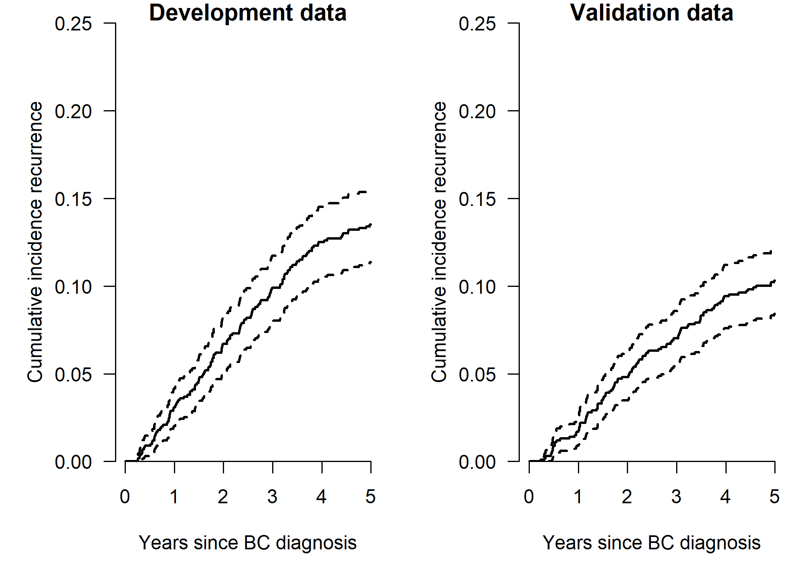
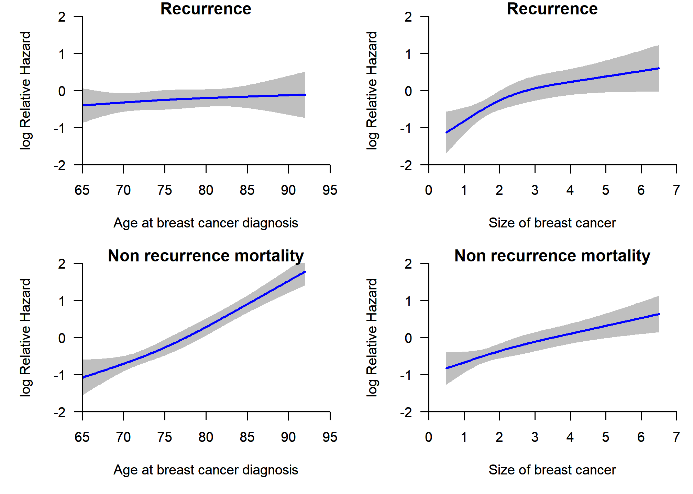
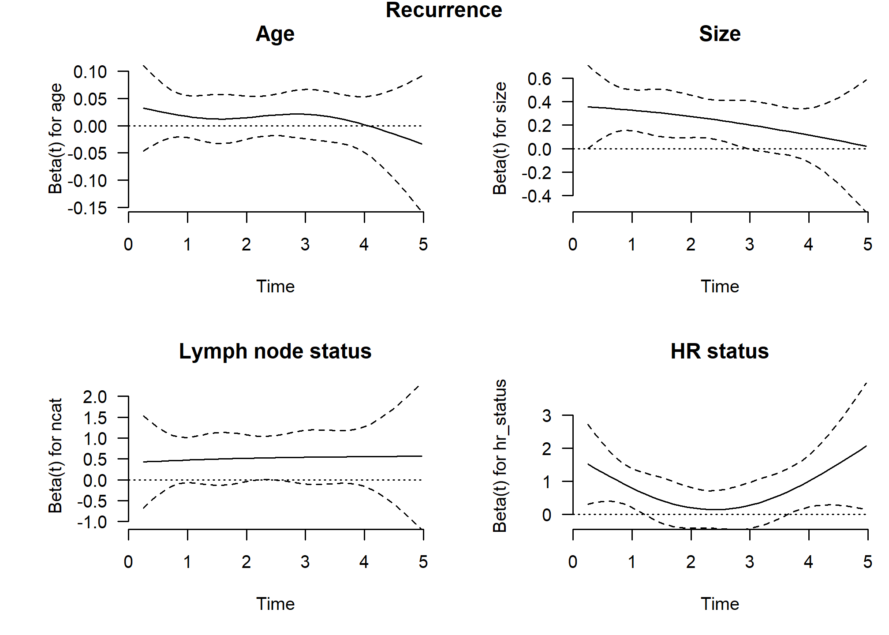
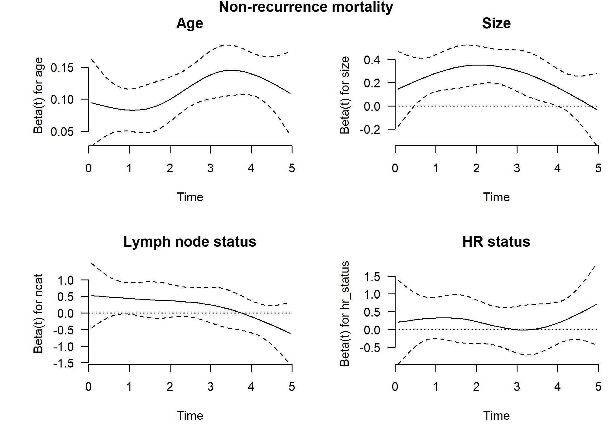
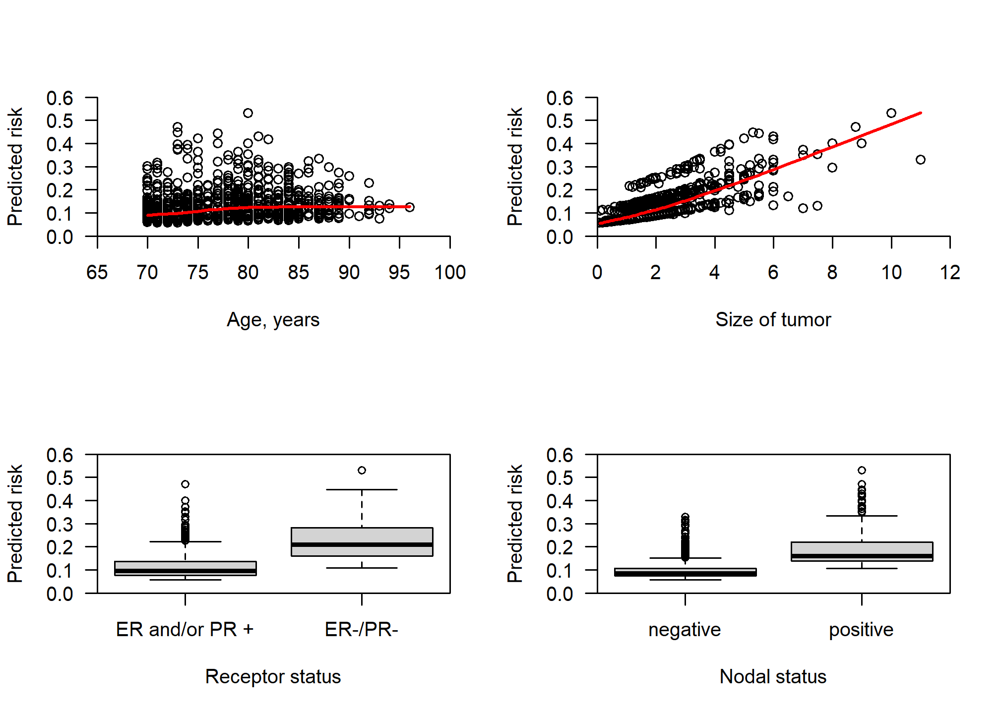
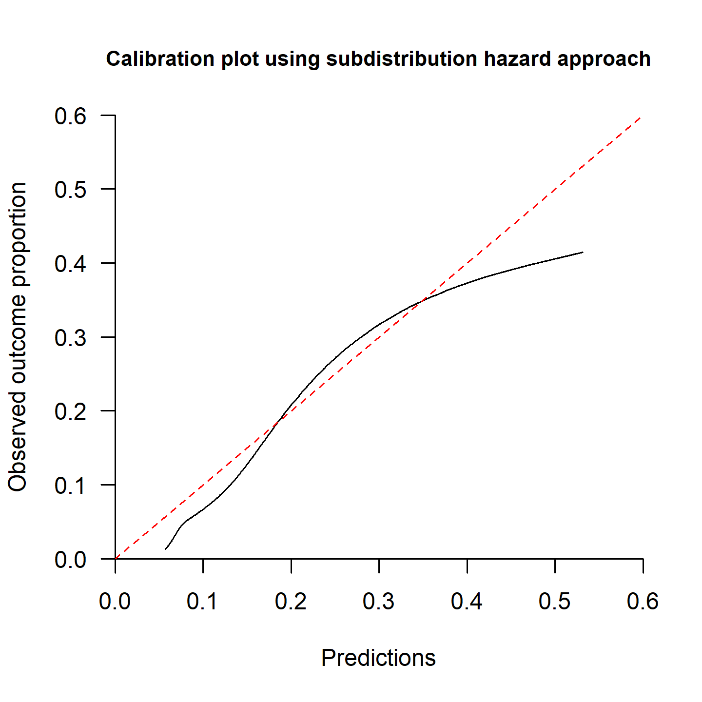
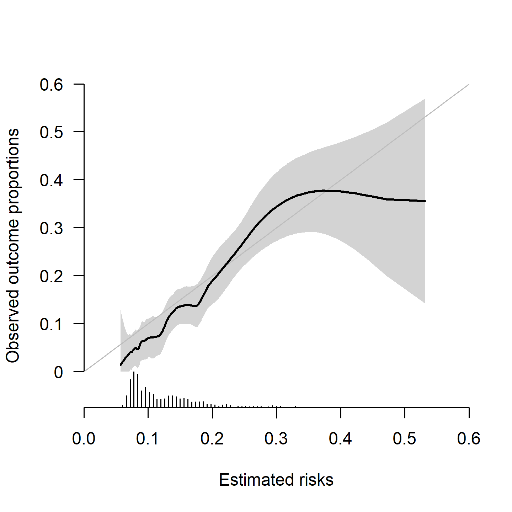
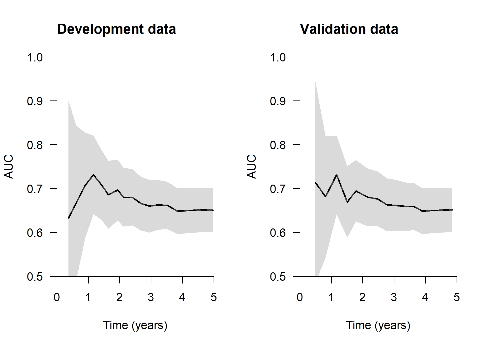
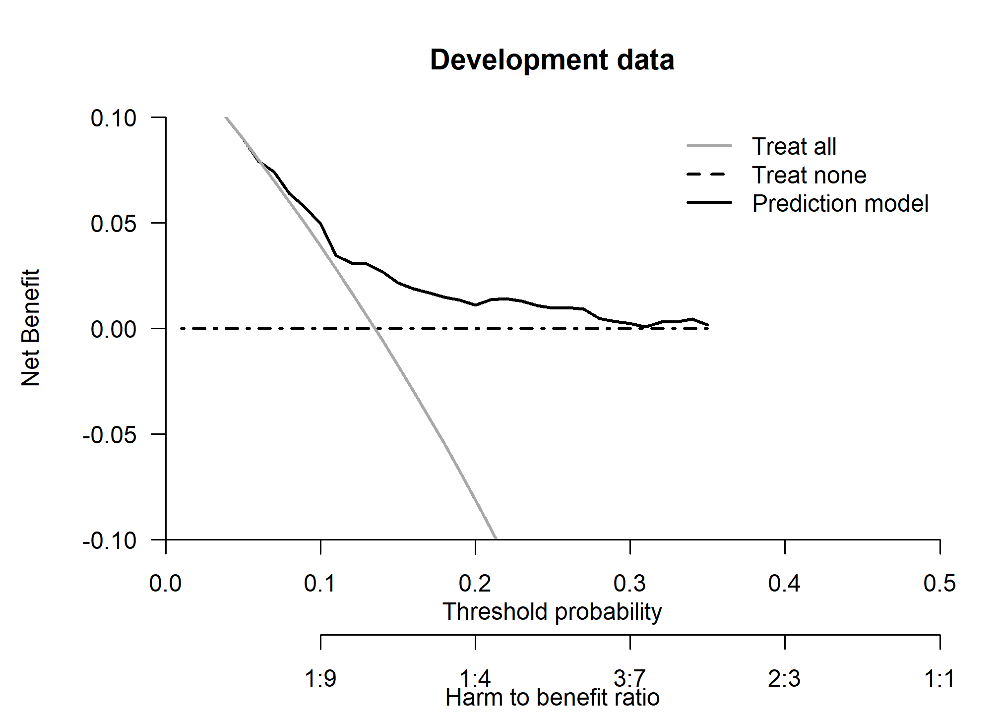
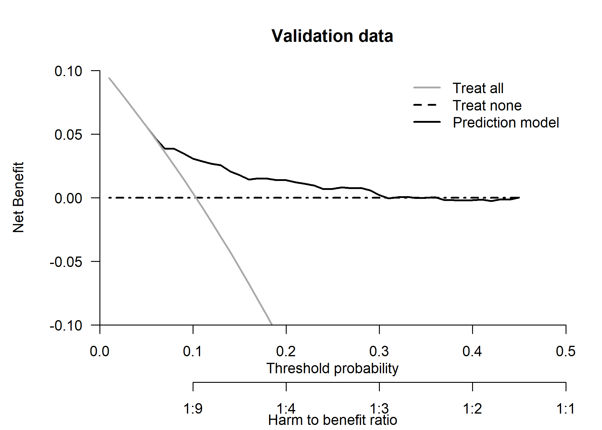

External validation of the performance of competing risks prediction
models: a guide through modern methods - Cause specific hazard models
================

- <a href="#steps" id="toc-steps">Steps</a>
  - <a href="#installing-and-loading-packages-and-import-data"
    id="toc-installing-and-loading-packages-and-import-data">Installing and
    loading packages and import data</a>
  - <a href="#descriptive-statistics"
    id="toc-descriptive-statistics">Descriptive statistics</a>
- <a href="#goal-1---develop-a-competing-risks-prediction-model"
  id="toc-goal-1---develop-a-competing-risks-prediction-model">Goal 1 -
  develop a competing risks prediction model</a>
  - <a href="#11-cumulative-incidence-curves"
    id="toc-11-cumulative-incidence-curves">1.1 Cumulative incidence
    curves</a>
  - <a href="#12-check-non-linearity-of-continuous-predictors"
    id="toc-12-check-non-linearity-of-continuous-predictors">1.2 Check
    non-linearity of continuous predictors</a>
  - <a href="#13-checking-proportional-hazards-assumption"
    id="toc-13-checking-proportional-hazards-assumption">1.3 Checking
    proportional hazards assumption</a>
  - <a href="#14-examine-the-fit-of-the-models"
    id="toc-14-examine-the-fit-of-the-models">1.4 Examine the fit of the
    models</a>
  - <a
    href="#15-plot-of-predictors-vs-estimated-risk-at-5-years-in-the-validation-data"
    id="toc-15-plot-of-predictors-vs-estimated-risk-at-5-years-in-the-validation-data">1.5
    Plot of predictors vs estimated risk at 5 years in the validation
    data</a>
- <a
  href="#goal-2---assessing-performance-of-a-competing-risks-prediction-model"
  id="toc-goal-2---assessing-performance-of-a-competing-risks-prediction-model">Goal
  2 - Assessing performance of a competing risks prediction model</a>
  - <a href="#21-calibration" id="toc-21-calibration">2.1 Calibration</a>
    - <a href="#211-calibration-using-pseudo-observations"
      id="toc-211-calibration-using-pseudo-observations">2.1.1 Calibration
      using pseudo observations</a>
      - <a href="#2111-calibration-plot-using-pseudo-observations"
        id="toc-2111-calibration-plot-using-pseudo-observations">2.1.1.1
        Calibration plot using pseudo observations</a>
      - <a
        href="#2112-numerical-summaries-of-calibration-using-pseudo-observations"
        id="toc-2112-numerical-summaries-of-calibration-using-pseudo-observations">2.1.1.2
        Numerical summaries of calibration using pseudo observations</a>
    - <a href="#212-calibration-using-the-subdistribution-hazard-approach"
      id="toc-212-calibration-using-the-subdistribution-hazard-approach">2.1.2
      Calibration using the subdistribution hazard approach</a>
      - <a
        href="#2121-calibration-plot-using-the-subdistribution-hazard-approach"
        id="toc-2121-calibration-plot-using-the-subdistribution-hazard-approach">2.1.2.1
        Calibration plot using the subdistribution hazard approach</a>
      - <a
        href="#2122-numerical-summaries-of-calibration-using-the-subdistribution-hazard-approach"
        id="toc-2122-numerical-summaries-of-calibration-using-the-subdistribution-hazard-approach">2.1.2.2
        Numerical summaries of calibration using the subdistribution hazard
        approach</a>
    - <a
      href="#2123-calibration-plot-using-pseudo-observations-loess-smoothing"
      id="toc-2123-calibration-plot-using-pseudo-observations-loess-smoothing">2.1.2.3
      Calibration plot using pseudo-observations (LOESS smoothing)</a>
    - <a href="#213-observed-and-expected-ratio"
      id="toc-213-observed-and-expected-ratio">2.1.3 Observed and Expected
      ratio</a>
    - <a href="#214-calibration-intercept-and-slope-using-pseudo-observations"
      id="toc-214-calibration-intercept-and-slope-using-pseudo-observations">2.1.4
      Calibration intercept and slope using pseudo observations</a>
  - <a href="#22-discrimination" id="toc-22-discrimination">2.2
    Discrimination</a>
    - <a href="#221-c-index-and-time-dependent-auc"
      id="toc-221-c-index-and-time-dependent-auc">2.2.1 C-index and
      time-dependent AUC</a>
    - <a href="#222-plot-area-under-the-curves-over-the-time"
      id="toc-222-plot-area-under-the-curves-over-the-time">2.2.2 Plot Area
      under the curve(s) over the time</a>
    - <a href="#223-royston-sauerbrei-d-statistic-and-r2d"
      id="toc-223-royston-sauerbrei-d-statistic-and-r2d">2.2.3
      Royston-Sauerbrei D statistic and R<sup>2</sup><sub>D</sub></a>
  - <a href="#23-overall-prediction-error"
    id="toc-23-overall-prediction-error">2.3 Overall prediction error</a>
- <a href="#goal-3---clinical-utility"
  id="toc-goal-3---clinical-utility">Goal 3 - Clinical utility</a>
- <a href="#reproducibility-ticket"
  id="toc-reproducibility-ticket">Reproducibility ticket</a>

## Steps

The steps taken in this file are:  
1. To develop a competing risks prediction model using the cause
specific hazards approach. 2. To assess the performance of the model in
terms of calibration, discrimination and overall prediction error. We
calculate the apparent (no internal validation) validation and the
external validation. 3. To assess the potential clinical utility the
model using decision curve analysis.

### Installing and loading packages and import data

The following libraries are used in this file, the code chunk below will
a) check whether you already have them installed, b) install them for
you if not already present, and c) load the packages into the session.

``` r
# Use pacman to check whether packages are installed, if not load
if (!require("pacman")) install.packages("pacman")
library(pacman)

pacman::p_load(
  survival,
  rms,
  cmprsk,
  riskRegression,
  mstate,
  pseudo,
  pec,
  riskRegression,
  plotrix,
  knitr,
  splines,
  kableExtra,
  gtsummary,
  boot,
  tidyverse,
  rsample,
  gridExtra,
  webshot
)

# Import data ------------------
rdata <- readRDS(here::here("Data/rdata.rds"))
vdata <- readRDS(here::here("Data/vdata.rds"))

rdata$hr_status <- relevel(rdata$hr_status, ref = "ER and/or PR +")
vdata$hr_status <- relevel(vdata$hr_status, ref = "ER and/or PR +")
```

We loaded the development data (rdata) and the validation data (vdata).
More details about development and validation data are provided in the
manuscript.

### Descriptive statistics

<table style="NAborder-bottom: 0; margin-left: auto; margin-right: auto;" class="table table-striped">
<thead>
<tr>
<th style="text-align:left;">
Characteristic
</th>
<th style="text-align:center;">
Development data, N = 1,000
</th>
<th style="text-align:center;">
Validation data, N = 1,000
</th>
</tr>
</thead>
<tbody>
<tr>
<td style="text-align:left;">
Age (years)
</td>
<td style="text-align:center;">
</td>
<td style="text-align:center;">
</td>
</tr>
<tr>
<td style="text-align:left;padding-left: 2em;" indentlevel="1">
Mean (SD)
</td>
<td style="text-align:center;">
75 (7)
</td>
<td style="text-align:center;">
77 (6)
</td>
</tr>
<tr>
<td style="text-align:left;padding-left: 2em;" indentlevel="1">
Median (Range)
</td>
<td style="text-align:center;">
74 (65, 95)
</td>
<td style="text-align:center;">
76 (70, 96)
</td>
</tr>
<tr>
<td style="text-align:left;">
Size (cm)
</td>
<td style="text-align:center;">
</td>
<td style="text-align:center;">
</td>
</tr>
<tr>
<td style="text-align:left;padding-left: 2em;" indentlevel="1">
Mean (SD)
</td>
<td style="text-align:center;">
2.29 (1.31)
</td>
<td style="text-align:center;">
2.13 (1.32)
</td>
</tr>
<tr>
<td style="text-align:left;padding-left: 2em;" indentlevel="1">
Median (Range)
</td>
<td style="text-align:center;">
2.00 (0.10, 8.50)
</td>
<td style="text-align:center;">
1.80 (0.09, 11.00)
</td>
</tr>
<tr>
<td style="text-align:left;">
Nodal status
</td>
<td style="text-align:center;">
</td>
<td style="text-align:center;">
</td>
</tr>
<tr>
<td style="text-align:left;padding-left: 2em;" indentlevel="1">
negative
</td>
<td style="text-align:center;">
642 (64%)
</td>
<td style="text-align:center;">
688 (69%)
</td>
</tr>
<tr>
<td style="text-align:left;padding-left: 2em;" indentlevel="1">
positive
</td>
<td style="text-align:center;">
358 (36%)
</td>
<td style="text-align:center;">
312 (31%)
</td>
</tr>
<tr>
<td style="text-align:left;">
Hormon receptor status
</td>
<td style="text-align:center;">
</td>
<td style="text-align:center;">
</td>
</tr>
<tr>
<td style="text-align:left;padding-left: 2em;" indentlevel="1">
ER and/or PR +
</td>
<td style="text-align:center;">
822 (82%)
</td>
<td style="text-align:center;">
857 (86%)
</td>
</tr>
<tr>
<td style="text-align:left;padding-left: 2em;" indentlevel="1">
ER-/PR-
</td>
<td style="text-align:center;">
178 (18%)
</td>
<td style="text-align:center;">
143 (14%)
</td>
</tr>
</tbody>
<tfoot>
<tr>
<td style="padding: 0; " colspan="100%">
<sup>1</sup> n (%)
</td>
</tr>
</tfoot>
</table>

## Goal 1 - develop a competing risks prediction model

### 1.1 Cumulative incidence curves

First, we draw the cumulative incidence curves of breast cancer
recurrence.

<details>
<summary>
Click to expand code
</summary>

``` r
# Expand datasets -------------------------

# Expand data to prepare for fitting the model
rdata.w <- crprep(
  Tstop = "time",
  status = "status_num",
  trans = c(1, 2),
  id = "id",
  keep = c("age", "size", "ncat", "hr_status"),
  data = rdata
)
# Save extended data with weights for recurrence (failcode=1)
# and non recurrence mortality (failcode=2)
rdata.w1 <- rdata.w |> filter(failcode == 1)
rdata.w2 <- rdata.w |> filter(failcode == 2)
vdata.w <- crprep(
  Tstop = "time",
  status = "status_num",
  trans = c(1, 2),
  id = "id",
  keep = c("age", "size", "ncat", "hr_status"),
  data = vdata
)
vdata.w1 <- vdata.w |> filter(failcode == 1)
vdata.w2 <- vdata.w |> filter(failcode == 2)

# Development set --------
mfit_rdata <- survfit(
  Surv(Tstart, Tstop, status == 1) ~ 1,
  data = rdata.w1, 
  weights = weight.cens
)
mfit_vdata <- survfit(
  Surv(Tstart, Tstop, status == 1) ~ 1,
  data = vdata.w1, 
  weights = weight.cens
)
par(xaxs = "i", yaxs = "i", las = 1)
oldpar <- par(mfrow = c(1, 2), mar = c(5, 5, 1, 1))
plot(
  mfit_rdata,
  col = 1, lwd = 2,
  xlab = "Years since BC diagnosis",
  ylab = "Cumulative incidence recurrence", bty = "n",
  ylim = c(0, 0.25), 
  xlim = c(0, 5), 
  fun = "event", 
  conf.int = TRUE
)
title("Development data")
plot(
  mfit_vdata,
  col = 1, lwd = 2,
  xlab = "Years since BC diagnosis",
  ylab = "Cumulative incidence recurrence", bty = "n",
  ylim = c(0, 0.25), 
  xlim = c(0, 5), 
  fun = "event",
  conf.int = TRUE
)
title("Validation data")
par(oldpar)

# Cumulative incidences
smfit_rdata <- summary(mfit_rdata, times = c(1, 2, 3, 4, 5))
smfit_vdata <- summary(mfit_vdata, times = c(1, 2, 3, 4, 5))
```

</details>



The R packages and functions `cmprsk::cuminc()` and
`mstate::Cuminc()`are good and easy alternatives to estimate the
cumulative incidence function.

<table class="table table-striped" style="margin-left: auto; margin-right: auto;">
<thead>
<tr>
<th style="empty-cells: hide;border-bottom:hidden;" colspan="1">
</th>
<th style="border-bottom:hidden;padding-bottom:0; padding-left:3px;padding-right:3px;text-align: center; " colspan="3">

<div style="border-bottom: 1px solid #ddd; padding-bottom: 5px; ">

Development data

</div>

</th>
<th style="border-bottom:hidden;padding-bottom:0; padding-left:3px;padding-right:3px;text-align: center; " colspan="3">

<div style="border-bottom: 1px solid #ddd; padding-bottom: 5px; ">

Validation data

</div>

</th>
</tr>
<tr>
<th style="text-align:left;">
</th>
<th style="text-align:right;">
Estimate
</th>
<th style="text-align:right;">
Lower .95
</th>
<th style="text-align:right;">
Upper .95
</th>
<th style="text-align:right;">
Estimate
</th>
<th style="text-align:right;">
Lower .95
</th>
<th style="text-align:right;">
Upper .95
</th>
</tr>
</thead>
<tbody>
<tr>
<td style="text-align:left;">
1-year
</td>
<td style="text-align:right;">
0.03
</td>
<td style="text-align:right;">
0.02
</td>
<td style="text-align:right;">
0.04
</td>
<td style="text-align:right;">
0.02
</td>
<td style="text-align:right;">
0.01
</td>
<td style="text-align:right;">
0.03
</td>
</tr>
<tr>
<td style="text-align:left;">
2-year
</td>
<td style="text-align:right;">
0.07
</td>
<td style="text-align:right;">
0.05
</td>
<td style="text-align:right;">
0.08
</td>
<td style="text-align:right;">
0.05
</td>
<td style="text-align:right;">
0.03
</td>
<td style="text-align:right;">
0.06
</td>
</tr>
<tr>
<td style="text-align:left;">
3-year
</td>
<td style="text-align:right;">
0.10
</td>
<td style="text-align:right;">
0.08
</td>
<td style="text-align:right;">
0.12
</td>
<td style="text-align:right;">
0.07
</td>
<td style="text-align:right;">
0.05
</td>
<td style="text-align:right;">
0.09
</td>
</tr>
<tr>
<td style="text-align:left;">
4-year
</td>
<td style="text-align:right;">
0.13
</td>
<td style="text-align:right;">
0.10
</td>
<td style="text-align:right;">
0.15
</td>
<td style="text-align:right;">
0.09
</td>
<td style="text-align:right;">
0.08
</td>
<td style="text-align:right;">
0.11
</td>
</tr>
<tr>
<td style="text-align:left;">
5-year
</td>
<td style="text-align:right;">
0.14
</td>
<td style="text-align:right;">
0.11
</td>
<td style="text-align:right;">
0.16
</td>
<td style="text-align:right;">
0.10
</td>
<td style="text-align:right;">
0.08
</td>
<td style="text-align:right;">
0.12
</td>
</tr>
</tbody>
</table>

The 5-year cumulative incidence of breast cancer recurrence was 14% (95%
CI: 11-16%), and 10% (95%CI: 8-12%).

### 1.2 Check non-linearity of continuous predictors

Here we investigate the potential non-linear relation between continuous
predictors (i.e. age and size) and the outcomes. We apply three-knot
restricted cubic splines using `rms::rcs()` function (details are given
in e.g. Frank Harrell’s book ‘Regression Model Strategies (second
edition)’, page 27. We assess the potential non-linearity graphically
(plotting the two continuous predictors against the log relative hazards
(XB or linear predictor) of both event types. Also, we compare the
models with and without splines based on the AIC using `stats::AIC()`.

<details>
<summary>
Click to expand code
</summary>

``` r
# Models without splines
fit_csh <- CSC(
  Hist(time, status_num) ~ age + size + ncat + hr_status,
  data = rdata,
  fitter = "cph"
)

fit_csc1 <- fit_csh$models$`Cause 1`
fit_csc2 <- fit_csh$models$`Cause 2`

# Models with splines
dd <- datadist(rdata)
options(datadist = "dd")

# Recurrence
fit_csc1_rcs <- cph(
  Surv(time, status_num == 1) ~ rcs(age, 3) + rcs(size, 3) + ncat + hr_status,
  x = T,
  y = T,
  surv = T,
  data = rdata
)
# print(fit_csc1_rcs)
# print(summary(fit_csc1_rcs))
# print(anova(fit_csc1_rcs))
P_csc1_age_rcs <- Predict(fit_csc1_rcs, "age")
P_csc1_size_rcs <- Predict(fit_csc1_rcs, "size")
options(datadist = NULL)
# Non-recurrence mortality
dd <- datadist(rdata)
options(datadist = "dd")
fit_csc2_rcs <- cph(
  Surv(time, status_num == 2) ~ rcs(age, 3) + rcs(size, 3) + ncat + hr_status,
  x = T,
  y = T,
  surv = T,
  data = rdata
)
# print(fit_csc2_rcs)
# print(summary(fit_csc2_rcs))
# print(anova(fit_csc2_rcs))
P_csc2_age_rcs <- Predict(fit_csc2_rcs, "age")
P_csc2_size_rcs <- Predict(fit_csc2_rcs, "size")
options(datadist = NULL)
oldpar <- par(mfrow = c(2, 2), mar = c(5, 5, 1, 1))
par(xaxs = "i", yaxs = "i", las = 1)
plot(
  P_csc1_age_rcs$age,
  P_csc1_age_rcs$yhat,
  type = "l",
  lwd = 2,
  col = "blue",
  bty = "n",
  xlab = "Age at breast cancer diagnosis",
  ylab = "log Relative Hazard",
  ylim = c(-2, 2),
  xlim = c(65, 95)
)
polygon(
  c(P_csc1_age_rcs$age, rev(P_csc1_age_rcs$age)),
  c(P_csc1_age_rcs$lower, rev(P_csc1_age_rcs$upper)),
  col = "grey75",
  border = FALSE
)
par(new = TRUE)
plot(
  P_csc1_age_rcs$age,
  P_csc1_age_rcs$yhat,
  type = "l",
  lwd = 2,
  col = "blue",
  bty = "n",
  xlab = "Age at breast cancer diagnosis",
  ylab = "log Relative Hazard",
  ylim = c(-2, 2),
  xlim = c(65, 95)
)
title("Recurrence")
# CSC 1- size
par(xaxs = "i", yaxs = "i", las = 1)
plot(
  P_csc1_size_rcs$size,
  P_csc1_size_rcs$yhat,
  type = "l",
  lwd = 2,
  col = "blue",
  bty = "n",
  xlab = "Size of breast cancer",
  ylab = "log Relative Hazard",
  ylim = c(-2, 2),
  xlim = c(0, 7)
)
polygon(
  c(P_csc1_size_rcs$size, rev(P_csc1_size_rcs$size)),
  c(P_csc1_size_rcs$lower, rev(P_csc1_size_rcs$upper)),
  col = "grey75",
  border = FALSE
)
par(new = TRUE)
plot(
  P_csc1_size_rcs$size,
  P_csc1_size_rcs$yhat,
  type = "l",
  lwd = 2,
  col = "blue",
  bty = "n",
  xlab = "Size of breast cancer",
  ylab = "log Relative Hazard",
  ylim = c(-2, 2),
  xlim = c(0, 7)
)
title("Recurrence")
par(xaxs = "i", yaxs = "i", las = 1)
options(datadist = NULL)
# CSC 2- age
plot(
  P_csc2_age_rcs$age,
  P_csc2_age_rcs$yhat,
  type = "l",
  lwd = 2,
  col = "blue",
  bty = "n",
  xlab = "Age at breast cancer diagnosis",
  ylab = "log Relative Hazard",
  ylim = c(-2, 2),
  xlim = c(65, 95)
)
polygon(
  c(P_csc2_age_rcs$age, rev(P_csc2_age_rcs$age)),
  c(P_csc2_age_rcs$lower, rev(P_csc2_age_rcs$upper)),
  col = "grey75",
  border = FALSE
)
par(new = TRUE)
plot(
  P_csc2_age_rcs$age,
  P_csc2_age_rcs$yhat,
  type = "l",
  lwd = 2,
  col = "blue",
  bty = "n",
  xlab = "Age at breast cancer diagnosis",
  ylab = "log Relative Hazard",
  ylim = c(-2, 2),
  xlim = c(65, 95)
)
title("Non recurrence mortality")
# CSC 2 - size
par(xaxs = "i", yaxs = "i", las = 1)
plot(
  P_csc2_size_rcs$size,
  P_csc2_size_rcs$yhat,
  type = "l",
  lwd = 2,
  col = "blue",
  bty = "n",
  xlab = "Size of breast cancer",
  ylab = "log Relative Hazard",
  ylim = c(-2, 2),
  xlim = c(0, 7)
)
polygon(
  c(P_csc2_size_rcs$size, rev(P_csc2_size_rcs$size)),
  c(P_csc2_size_rcs$lower, rev(P_csc2_size_rcs$upper)),
  col = "grey75",
  border = FALSE
)
par(new = TRUE)
plot(
  P_csc2_size_rcs$size,
  P_csc2_size_rcs$yhat,
  type = "l",
  lwd = 2,
  col = "blue",
  bty = "n",
  xlab = "Size of breast cancer",
  ylab = "log Relative Hazard",
  ylim = c(-2, 2),
  xlim = c(0, 7)
)
title("Non recurrence mortality")
options(datadist = NULL)
par(oldpar)
```

</details>



<table class="table table-striped" style="margin-left: auto; margin-right: auto;">
<thead>
<tr>
<th style="text-align:left;">
</th>
<th style="text-align:right;">
AIC without splines
</th>
<th style="text-align:right;">
AIC with splines
</th>
</tr>
</thead>
<tbody>
<tr>
<td style="text-align:left;">
Recurrence specific hazard
</td>
<td style="text-align:right;">
1779.375
</td>
<td style="text-align:right;">
1780.699
</td>
</tr>
<tr>
<td style="text-align:left;">
Non recurrence mortality
</td>
<td style="text-align:right;">
2572.079
</td>
<td style="text-align:right;">
2574.830
</td>
</tr>
</tbody>
</table>

Both the graphical comparison and the AIC comparison suggested no
relevant departure from linear relations between the continuous
predictors (age and size) and the cause-specific hazards (recurrence and
non-recurrence mortality).

### 1.3 Checking proportional hazards assumption

We now examine the fits further by checking the proportionality of the
cause-specific hazards.

<details>
<summary>
Click to expand code
</summary>

``` r
zp_csc1 <- cox.zph(fit_csc1, transform = "identity")
par(las = 1, xaxs = "i", yaxs = "i")
# c(bottom, left, top, right)
oldpar <- par(mfrow = c(2, 2), mar = c(5, 6.1, 3.1, 1))
sub_title <- c("Age", "Size", "Lymph node status", "HR status")
for (i in 1:4) {
  plot(
    zp_csc1[i],
    resid = F,
    bty = "n",
    xlim = c(0, 5)
  )
  abline(0, 0, lty = 3)
  title(sub_title[i])
}
mtext("Recurrence", side = 3, line = -1, outer = TRUE, font = 2)
par(oldpar)
kable(round(zp_csc1$table, 3)) |>
  kable_styling("striped", position = "center")
```

</details>

<table class="table table-striped" style="margin-left: auto; margin-right: auto;">
<thead>
<tr>
<th style="text-align:left;">
</th>
<th style="text-align:right;">
chisq
</th>
<th style="text-align:right;">
df
</th>
<th style="text-align:right;">
p
</th>
</tr>
</thead>
<tbody>
<tr>
<td style="text-align:left;">
age
</td>
<td style="text-align:right;">
0.458
</td>
<td style="text-align:right;">
1
</td>
<td style="text-align:right;">
0.498
</td>
</tr>
<tr>
<td style="text-align:left;">
size
</td>
<td style="text-align:right;">
2.309
</td>
<td style="text-align:right;">
1
</td>
<td style="text-align:right;">
0.129
</td>
</tr>
<tr>
<td style="text-align:left;">
ncat
</td>
<td style="text-align:right;">
0.016
</td>
<td style="text-align:right;">
1
</td>
<td style="text-align:right;">
0.900
</td>
</tr>
<tr>
<td style="text-align:left;">
hr_status
</td>
<td style="text-align:right;">
0.078
</td>
<td style="text-align:right;">
1
</td>
<td style="text-align:right;">
0.780
</td>
</tr>
<tr>
<td style="text-align:left;">
GLOBAL
</td>
<td style="text-align:right;">
2.713
</td>
<td style="text-align:right;">
4
</td>
<td style="text-align:right;">
0.607
</td>
</tr>
</tbody>
</table>
<details>
<summary>
Click to expand code
</summary>

``` r
zp_csc2 <- cox.zph(fit_csc2, transform = "identity")
par(las = 1, xaxs = "i", yaxs = "i")
# c(bottom, left, top, right)
oldpar <- par(mfrow = c(2, 2), mar = c(5, 6.1, 3.1, 1))
sub_title <- c("Age", "Size", "Lymph node status", "HR status")
for (i in 1:4) {
  plot(
    zp_csc2[i],
    resid = F,
    bty = "n",
    xlim = c(0, 5)
  )
  abline(0, 0, lty = 3)
  title(sub_title[i])
}
mtext(
  "Non-recurrence mortality",
  side = 3,
  line = -1,
  outer = TRUE,
  font = 2
)
par(oldpar)
kable(round(zp_csc2$table, 3)) |>
  kable_styling("striped", position = "center")
```

</details>

<table class="table table-striped" style="margin-left: auto; margin-right: auto;">
<thead>
<tr>
<th style="text-align:left;">
</th>
<th style="text-align:right;">
chisq
</th>
<th style="text-align:right;">
df
</th>
<th style="text-align:right;">
p
</th>
</tr>
</thead>
<tbody>
<tr>
<td style="text-align:left;">
age
</td>
<td style="text-align:right;">
2.727
</td>
<td style="text-align:right;">
1
</td>
<td style="text-align:right;">
0.099
</td>
</tr>
<tr>
<td style="text-align:left;">
size
</td>
<td style="text-align:right;">
1.716
</td>
<td style="text-align:right;">
1
</td>
<td style="text-align:right;">
0.190
</td>
</tr>
<tr>
<td style="text-align:left;">
ncat
</td>
<td style="text-align:right;">
5.227
</td>
<td style="text-align:right;">
1
</td>
<td style="text-align:right;">
0.022
</td>
</tr>
<tr>
<td style="text-align:left;">
hr_status
</td>
<td style="text-align:right;">
0.020
</td>
<td style="text-align:right;">
1
</td>
<td style="text-align:right;">
0.889
</td>
</tr>
<tr>
<td style="text-align:left;">
GLOBAL
</td>
<td style="text-align:right;">
9.374
</td>
<td style="text-align:right;">
4
</td>
<td style="text-align:right;">
0.052
</td>
</tr>
</tbody>
</table>

The statistical tests showed a potential violation of the proportional
hazards assumption for nodal status in the model for non-recurrence
mortality. For simplicity we ignore this violation in the remainder.

### 1.4 Examine the fit of the models

- Cox proportional hazard model for recurrence

 <strong>Cox Proportional Hazards Model</strong>
 
 <pre>
 cph(formula = Surv(time, status_num == 1) ~ age + size + ncat + 
     hr_status, data = rdata, x = T, y = T, surv = T)
 </pre>
 
 <table class='gmisc_table' style='border-collapse: collapse; margin-top: 1em; margin-bottom: 1em;' >
<thead>
<tr>
<th style='font-weight: 900; border-bottom: 1px solid grey; border-top: 2px solid grey; border-left: 1px solid black; border-right: 1px solid black; text-align: center;'></th>
<th style='font-weight: 900; border-bottom: 1px solid grey; border-top: 2px solid grey; border-right: 1px solid black; text-align: center;'>Model Tests</th>
<th style='font-weight: 900; border-bottom: 1px solid grey; border-top: 2px solid grey; border-right: 1px solid black; text-align: center;'>Discrimination<br>Indexes</th>
</tr>
</thead>
<tbody>
<tr>
<td style='min-width: 9em; border-left: 1px solid black; border-right: 1px solid black; text-align: center;'>Obs 1000</td>
<td style='min-width: 9em; border-right: 1px solid black; text-align: center;'>LR χ<sup>2</sup> 46.33</td>
<td style='min-width: 9em; border-right: 1px solid black; text-align: center;'><i>R</i><sup>2</sup> 0.054</td>
</tr>
<tr>
<td style='min-width: 9em; border-left: 1px solid black; border-right: 1px solid black; text-align: center;'>Events 135</td>
<td style='min-width: 9em; border-right: 1px solid black; text-align: center;'>d.f. 4</td>
<td style='min-width: 9em; border-right: 1px solid black; text-align: center;'><i>R</i><sup><span style='font-size: 70%;'>2</span></sup><sub style='position: relative; left: -.47em; bottom: -.4em;'><span style='font-size: 70%;'>4,1000</span></sub> 0.041</td>
</tr>
<tr>
<td style='min-width: 9em; border-left: 1px solid black; border-right: 1px solid black; text-align: center;'>Center 2.0201</td>
<td style='min-width: 9em; border-right: 1px solid black; text-align: center;'>Pr(>χ<sup>2</sup>) 0.0000</td>
<td style='min-width: 9em; border-right: 1px solid black; text-align: center;'><i>R</i><sup><span style='font-size: 70%;'>2</span></sup><sub style='position: relative; left: -.47em; bottom: -.4em;'><span style='font-size: 70%;'>4,135</span></sub> 0.269</td>
</tr>
<tr>
<td style='min-width: 9em; border-left: 1px solid black; border-right: 1px solid black; text-align: center;'></td>
<td style='min-width: 9em; border-right: 1px solid black; text-align: center;'>Score χ<sup>2</sup> 53.04</td>
<td style='min-width: 9em; border-right: 1px solid black; text-align: center;'><i>D</i><sub>xy</sub> 0.326</td>
</tr>
<tr>
<td style='min-width: 9em; border-bottom: 2px solid grey; border-left: 1px solid black; border-right: 1px solid black; text-align: center;'></td>
<td style='min-width: 9em; border-bottom: 2px solid grey; border-right: 1px solid black; text-align: center;'>Pr(>χ<sup>2</sup>) 0.0000</td>
<td style='min-width: 9em; border-bottom: 2px solid grey; border-right: 1px solid black; text-align: center;'></td>
</tr>
</tbody>
</table>

 
 <table class='gmisc_table' style='border-collapse: collapse; margin-top: 1em; margin-bottom: 1em;' >
<thead>
<tr><th style='border-bottom: 1px solid grey; font-weight: 900; border-top: 2px solid grey; min-width: 7em; text-align: center;'></th>
<th style='font-weight: 900; border-bottom: 1px solid grey; border-top: 2px solid grey; text-align: right;'>β</th>
<th style='font-weight: 900; border-bottom: 1px solid grey; border-top: 2px solid grey; text-align: right;'>S.E.</th>
<th style='font-weight: 900; border-bottom: 1px solid grey; border-top: 2px solid grey; text-align: right;'>Wald <i>Z</i></th>
<th style='font-weight: 900; border-bottom: 1px solid grey; border-top: 2px solid grey; text-align: right;'>Pr(>|<i>Z</i>|)</th>
</tr>
</thead>
<tbody>
<tr>
<td style='min-width: 7em; text-align: left;'>age</td>
<td style='min-width: 7em; text-align: right;'> 0.0153</td>
<td style='min-width: 7em; text-align: right;'> 0.0125</td>
<td style='min-width: 7em; text-align: right;'>1.22</td>
<td style='min-width: 7em; text-align: right;'>0.2237</td>
</tr>
<tr>
<td style='min-width: 7em; text-align: left;'>size</td>
<td style='min-width: 7em; text-align: right;'> 0.2510</td>
<td style='min-width: 7em; text-align: right;'> 0.0564</td>
<td style='min-width: 7em; text-align: right;'>4.45</td>
<td style='min-width: 7em; text-align: right;'><0.0001</td>
</tr>
<tr>
<td style='min-width: 7em; text-align: left;'>ncat=positive</td>
<td style='min-width: 7em; text-align: right;'> 0.5090</td>
<td style='min-width: 7em; text-align: right;'> 0.1769</td>
<td style='min-width: 7em; text-align: right;'>2.88</td>
<td style='min-width: 7em; text-align: right;'>0.0040</td>
</tr>
<tr>
<td style='min-width: 7em; border-bottom: 2px solid grey; text-align: left;'>hr_status=ER-/PR-</td>
<td style='min-width: 7em; border-bottom: 2px solid grey; text-align: right;'> 0.6433</td>
<td style='min-width: 7em; border-bottom: 2px solid grey; text-align: right;'> 0.1926</td>
<td style='min-width: 7em; border-bottom: 2px solid grey; text-align: right;'>3.34</td>
<td style='min-width: 7em; border-bottom: 2px solid grey; text-align: right;'>0.0008</td>
</tr>
</tbody>
</table>

- Cox proportional hazard model for non recurrence mortality

 <strong>Cox Proportional Hazards Model</strong>
 
 <pre>
 cph(formula = Surv(time, status_num == 2) ~ age + size + ncat + 
     hr_status, data = rdata, x = T, y = T, surv = T)
 </pre>
 
 <table class='gmisc_table' style='border-collapse: collapse; margin-top: 1em; margin-bottom: 1em;' >
<thead>
<tr>
<th style='font-weight: 900; border-bottom: 1px solid grey; border-top: 2px solid grey; border-left: 1px solid black; border-right: 1px solid black; text-align: center;'></th>
<th style='font-weight: 900; border-bottom: 1px solid grey; border-top: 2px solid grey; border-right: 1px solid black; text-align: center;'>Model Tests</th>
<th style='font-weight: 900; border-bottom: 1px solid grey; border-top: 2px solid grey; border-right: 1px solid black; text-align: center;'>Discrimination<br>Indexes</th>
</tr>
</thead>
<tbody>
<tr>
<td style='min-width: 9em; border-left: 1px solid black; border-right: 1px solid black; text-align: center;'>Obs 1000</td>
<td style='min-width: 9em; border-right: 1px solid black; text-align: center;'>LR χ<sup>2</sup> 170.94</td>
<td style='min-width: 9em; border-right: 1px solid black; text-align: center;'><i>R</i><sup>2</sup> 0.168</td>
</tr>
<tr>
<td style='min-width: 9em; border-left: 1px solid black; border-right: 1px solid black; text-align: center;'>Events 204</td>
<td style='min-width: 9em; border-right: 1px solid black; text-align: center;'>d.f. 4</td>
<td style='min-width: 9em; border-right: 1px solid black; text-align: center;'><i>R</i><sup><span style='font-size: 70%;'>2</span></sup><sub style='position: relative; left: -.47em; bottom: -.4em;'><span style='font-size: 70%;'>4,1000</span></sub> 0.154</td>
</tr>
<tr>
<td style='min-width: 9em; border-left: 1px solid black; border-right: 1px solid black; text-align: center;'>Center 9.06</td>
<td style='min-width: 9em; border-right: 1px solid black; text-align: center;'>Pr(>χ<sup>2</sup>) 0.0000</td>
<td style='min-width: 9em; border-right: 1px solid black; text-align: center;'><i>R</i><sup><span style='font-size: 70%;'>2</span></sup><sub style='position: relative; left: -.47em; bottom: -.4em;'><span style='font-size: 70%;'>4,204</span></sub> 0.559</td>
</tr>
<tr>
<td style='min-width: 9em; border-left: 1px solid black; border-right: 1px solid black; text-align: center;'></td>
<td style='min-width: 9em; border-right: 1px solid black; text-align: center;'>Score χ<sup>2</sup> 186.60</td>
<td style='min-width: 9em; border-right: 1px solid black; text-align: center;'><i>D</i><sub>xy</sub> 0.491</td>
</tr>
<tr>
<td style='min-width: 9em; border-bottom: 2px solid grey; border-left: 1px solid black; border-right: 1px solid black; text-align: center;'></td>
<td style='min-width: 9em; border-bottom: 2px solid grey; border-right: 1px solid black; text-align: center;'>Pr(>χ<sup>2</sup>) 0.0000</td>
<td style='min-width: 9em; border-bottom: 2px solid grey; border-right: 1px solid black; text-align: center;'></td>
</tr>
</tbody>
</table>

 
 <table class='gmisc_table' style='border-collapse: collapse; margin-top: 1em; margin-bottom: 1em;' >
<thead>
<tr><th style='border-bottom: 1px solid grey; font-weight: 900; border-top: 2px solid grey; min-width: 7em; text-align: center;'></th>
<th style='font-weight: 900; border-bottom: 1px solid grey; border-top: 2px solid grey; text-align: right;'>β</th>
<th style='font-weight: 900; border-bottom: 1px solid grey; border-top: 2px solid grey; text-align: right;'>S.E.</th>
<th style='font-weight: 900; border-bottom: 1px solid grey; border-top: 2px solid grey; text-align: right;'>Wald <i>Z</i></th>
<th style='font-weight: 900; border-bottom: 1px solid grey; border-top: 2px solid grey; text-align: right;'>Pr(>|<i>Z</i>|)</th>
</tr>
</thead>
<tbody>
<tr>
<td style='min-width: 7em; text-align: left;'>age</td>
<td style='min-width: 7em; text-align: right;'> 0.1118</td>
<td style='min-width: 7em; text-align: right;'> 0.0100</td>
<td style='min-width: 7em; text-align: right;'>11.15</td>
<td style='min-width: 7em; text-align: right;'><0.0001</td>
</tr>
<tr>
<td style='min-width: 7em; text-align: left;'>size</td>
<td style='min-width: 7em; text-align: right;'> 0.2361</td>
<td style='min-width: 7em; text-align: right;'> 0.0481</td>
<td style='min-width: 7em; text-align: right;'> 4.91</td>
<td style='min-width: 7em; text-align: right;'><0.0001</td>
</tr>
<tr>
<td style='min-width: 7em; text-align: left;'>ncat=positive</td>
<td style='min-width: 7em; text-align: right;'> 0.1860</td>
<td style='min-width: 7em; text-align: right;'> 0.1442</td>
<td style='min-width: 7em; text-align: right;'> 1.29</td>
<td style='min-width: 7em; text-align: right;'>0.1971</td>
</tr>
<tr>
<td style='min-width: 7em; border-bottom: 2px solid grey; text-align: left;'>hr_status=ER-/PR-</td>
<td style='min-width: 7em; border-bottom: 2px solid grey; text-align: right;'> 0.2396</td>
<td style='min-width: 7em; border-bottom: 2px solid grey; text-align: right;'> 0.1765</td>
<td style='min-width: 7em; border-bottom: 2px solid grey; text-align: right;'> 1.36</td>
<td style='min-width: 7em; border-bottom: 2px solid grey; text-align: right;'>0.1745</td>
</tr>
</tbody>
</table>

The coefficients of the models indicated that larger tumor size,
positive nodal status and negative hormone receptor status status were
associated with higher risk to develop a breast cancer recurrence, while
older patients and larger tumors are associated with higher risk of non
recurrence mortality. The associations were considered statistically
significant at the usual alpha = 0.05.

### 1.5 Plot of predictors vs estimated risk at 5 years in the validation data

To get further insight into the effect of the covariates, we plot the
covariate values observed in the validation set against the estimated
absolute risk of breast cancer recurrence at 5 years. This gives an idea
of the size of the effects.

<details>
<summary>
Click to expand code
</summary>

``` r
# Models -------------
fit_csh <- CSC(
  formula = Hist(time, status_num) ~ age + size + ncat + hr_status,
  data = rdata
)

# External validation at 5 years
horizon <- 5

# Calculate predicted probabilities
vdata$pred <- predictRisk(
  fit_csh,
  cause = 1,
  newdata = vdata,
  times = horizon
)

# Age
oldpar <- par(mfrow = c(2, 2))
par(xaxs = "i", yaxs = "i", las = 1)
plot(vdata$age,
  vdata$pred,
  bty = "n",
  xlim = c(65, 100),
  ylim = c(0, .6),
  xlab = "Age, years",
  ylab = "Estimated risk"
)
lines(
  lowess(vdata$age, vdata$pred),
  col = "red",
  lwd = 2
)

# Size
par(xaxs = "i", yaxs = "i", las = 1)
plot(
  vdata$size,
  vdata$pred,
  bty = "n",
  xlim = c(0, 12),
  ylim = c(0, .6),
  xlab = "Size of tumor",
  ylab = "Estimated risk"
)
lines(
  lowess(vdata$size, vdata$pred),
  col = "red",
  lwd = 2
)

# HR status
par(xaxs = "i", yaxs = "i", las = 1)
plot(
  vdata$hr_status,
  vdata$pred,
  ylim = c(0, .6),
  bty = "n",
  xlab = "Receptor status",
  ylab = "Estimated risk"
)

# Nodal status
par(xaxs = "i", yaxs = "i", las = 1)
plot(
  vdata$ncat,
  vdata$pred,
  ylim = c(0, .6),
  bty = "n",
  xlab = "Nodal status",
  ylab = "Estimated risk"
)
par(oldpar)
```

</details>



## Goal 2 - Assessing performance of a competing risks prediction model

Here we evaluate the performance of the prediction model in terms of
calibration, discrimination and overall prediction error.

### 2.1 Calibration

We assess calibration by:

- The calibration plot as a graphical representation of calibration
  using the pseudo observations and the subdistribution hazard approach
- Numerical summaries of calibration:  
- The observed vs expected ratio (O/E ratio) ;  
- The squared bias, i.e., the average squared difference between primary
  event indicators and risk predictions;
- The integrated Calibration Index (ICI), i.e., the average absolute
  difference between primary event indicators and risk predictions;  
- E50, E90 and Emax denote the median, 90th percentile and the maximum
  of the absolute differences between primary event indicators and risk
  predictions;  
- Calibration intercept/slope estimated using pseudo observations:  
- If on average the risk estimates equal the primary event indicators,
  the calibration intercept will be zero. A negative calibration
  intercept indicates that the risk estimates are on average too high
  and a positive intercept indicates that the risk estimates are on
  average too low.  
- A calibration slope between 0 and 1 indicates overfitting of the
  model, i.e., too extreme predictions, both on the low and on the high
  end. A calibration slope \>1 indicates predictions do not show enough
  variation.

#### 2.1.1 Calibration using pseudo observations

We calculate calibration plot and numerical summaries of calibration as
ICI, E50, E90, Emax and root squared bias using pseudo value approach.

##### 2.1.1.1 Calibration plot using pseudo observations

<details>
<summary>
Click to expand code
</summary>

``` r
# Models ----------
fit_csh <- CSC(Hist(time, status_num) ~
age + size +
  ncat + hr_status,
data = rdata,
fitter = "cph"
)

# useful objects
primary_event <- 1 # Set to 2 if cause 2 was of interest
horizon <- 5 # Set time horizon for prediction (here 5 years)

# Predicted risk estimation
pred <- predictRisk(fit_csh,
  cause = primary_event,
  times = horizon,
  newdata = vdata
)


# Calibration plot (pseudo-obs approach) ----------------------------------
# First compute riskRegression::Score()
score_vdata <- Score(
  list("csh_validation" = fit_csh),
  formula = Hist(time, status_num) ~ 1,
  cens.model = "km",
  data = vdata,
  conf.int = TRUE,
  times = horizon,
  #  metrics = c("auc", "brier"),
  summary = c("ipa"),
  cause = primary_event,
  plots = "calibration"
)

calplot_pseudo <- plotCalibration(
  x = score_vdata,
  brier.in.legend = FALSE,
  auc.in.legend = FALSE,
  cens.method = "pseudo",
  bandwidth = 0.05, # leave as NULL for default choice of smoothing
  cex = 1,
  round = FALSE, # Important, keeps all unique risk estimates rather than rounding
  xlim = c(0, 0.6),
  ylim = c(0, 0.6),
  rug = TRUE,
  xlab = "Predictions",
  bty = "n"
)
title("Calibration plot using pseudo observations")
```

</details>


Calibration plot suggests that the prediction model seems to
overestimate the observed outcome proportion of the primary event,
especially at the lower and higher values of the estimated risk.

##### 2.1.1.2 Numerical summaries of calibration using pseudo observations

<details>
<summary>
Click to expand code
</summary>

``` r
# We can extract predicted and observed, observed will depend on degree of smoothing (bandwidth)
dat_pseudo <- calplot_pseudo$plotFrames$csh_validation

# Calculate difference between predicted and observed (make sure to use all estimated risks, not just unique ones)
diff_pseudo <- pred - dat_pseudo$Obs[match(pred, dat_pseudo$Pred)]

# Collect all numerical summary measures
numsum_pseudo <- c(
  "ICI" = mean(abs(diff_pseudo)),
  setNames(quantile(abs(diff_pseudo), c(0.5, 0.9)), c("E50", "E90")),
  "Emax" = max(abs(diff_pseudo)),
  "Root squared bias" = sqrt(mean(diff_pseudo^2))
)
```

</details>
<table class="table table-striped" style="margin-left: auto; margin-right: auto;">
<thead>
<tr>
<th style="text-align:left;">
</th>
<th style="text-align:right;">
ICI
</th>
<th style="text-align:right;">
E50
</th>
<th style="text-align:right;">
E90
</th>
<th style="text-align:right;">
Emax
</th>
<th style="text-align:right;">
Root squared bias
</th>
</tr>
</thead>
<tbody>
<tr>
<td style="text-align:left;">
Calibration measures - pseudo observations
</td>
<td style="text-align:right;">
0.0308
</td>
<td style="text-align:right;">
0.0298
</td>
<td style="text-align:right;">
0.0524
</td>
<td style="text-align:right;">
0.1584
</td>
<td style="text-align:right;">
0.0349
</td>
</tr>
</tbody>
</table>

Numerical calibration measures identified overestimation of the risk
especially in the higher values of the observed outcome proportion of
the primary event.

#### 2.1.2 Calibration using the subdistribution hazard approach

Here we assess calibration using the subdistribution hazard approach
(Austin et al.)

##### 2.1.2.1 Calibration plot using the subdistribution hazard approach

<details>
<summary>
Click to expand code
</summary>

``` r
# Models ----------
fit_csh <- CSC(Hist(time, status_num) ~
age + size +
  ncat + hr_status,
data = rdata,
fitter = "cph"
)


# useful objects
primary_event <- 1 # Set to 2 if cause 2 was of interest
horizon <- 5 # Set time horizon for prediction (here 5 years)


# Calibration plot (flexible regression approach) -------------------------

# Add estimated risk and complementary log-log of it to dataset
vdata$pred <- predictRisk(fit_csh,
  cause = primary_event,
  newdata = vdata,
  times = horizon
)
vdata$cll_pred <- log(-log(1 - pred))

# 5 knots seems to give somewhat equivalent graph to pseudo method with bw = 0.05
n_internal_knots <- 5 # Austin et al. advise to use between 3 (more smoothing, less flexible) and 5 (less smoothing, more flexible)
rcs_vdata <- ns(vdata$cll_pred, df = n_internal_knots + 1)
colnames(rcs_vdata) <- paste0("basisf_", colnames(rcs_vdata))
vdata_bis <- cbind.data.frame(vdata, rcs_vdata)

# Use subdistribution hazards (Fine-Gray) model
form_fgr <- reformulate(
  termlabels = colnames(rcs_vdata),
  response = "Hist(time, status_num)"
)

# Regress subdistribution of event of interest on cloglog of estimated risks
calib_fgr <- FGR(
  formula = form_fgr,
  cause = primary_event,
  data = vdata_bis
)

# Add observed and predicted together in a data frame
dat_fgr <- cbind.data.frame(
  "obs" = predict(calib_fgr, times = horizon, newdata = vdata_bis),
  "pred" = vdata$pred
)

# Calibration plot
dat_fgr <- dat_fgr[order(dat_fgr$pred), ]
par(xaxs = "i", yaxs = "i", las = 1)
plot(
  x = dat_fgr$pred,
  y = dat_fgr$obs,
  type = "l",
  xlim = c(0, 0.6),
  ylim = c(0, 0.6),
  xlab = "Predictions",
  ylab = "Observed outcome proportion",
  bty = "n"
)
abline(a = 0, b = 1, lty = "dashed", col = "red")
title("Calibration plot using subdistribution hazard approach", 
      cex.main = .90)
```

</details>



Calibration plot suggests that the prediction model seems to
overestimate the observed outcome proportion of the primary event,
especially at the lower and higher values of the estimated risk.

##### 2.1.2.2 Numerical summaries of calibration using the subdistribution hazard approach

Here we assess calibration using the subdistribution hazard approach
(Austin et al.)

<details>
<summary>
Click to expand code
</summary>

``` r
# Numerical summary measures
diff_fgr <- dat_fgr$pred - dat_fgr$obs

numsum_fgr <- c(
  "ICI" = mean(abs(diff_fgr)),
  setNames(quantile(abs(diff_fgr), c(0.5, 0.9)), c("E50", "E90")),
  "Emax" = max(abs(diff_fgr)),
  "Root squared bias" = sqrt(mean(diff_fgr^2))
)
```

</details>
<table class="table table-striped" style="margin-left: auto; margin-right: auto;">
<thead>
<tr>
<th style="text-align:left;">
</th>
<th style="text-align:right;">
ICI
</th>
<th style="text-align:right;">
E50
</th>
<th style="text-align:right;">
E90
</th>
<th style="text-align:right;">
Emax
</th>
<th style="text-align:right;">
Root squared bias
</th>
</tr>
</thead>
<tbody>
<tr>
<td style="text-align:left;">
Calibration measures - subdistribution
</td>
<td style="text-align:right;">
0.0274
</td>
<td style="text-align:right;">
0.0305
</td>
<td style="text-align:right;">
0.0346
</td>
<td style="text-align:right;">
0.1167
</td>
<td style="text-align:right;">
0.0292
</td>
</tr>
</tbody>
</table>

Numerical calibration measures identified overestimation of the risk
especially in the higher values of the observed outcome proportion of
the primary event.

#### 2.1.2.3 Calibration plot using pseudo-observations (LOESS smoothing)

<details>
<summary>
Click to expand code
</summary>

``` r
# Use pseudo-observations calculated by Score() (can alternatively use pseudo::pseudoci)
pseudos <- data.frame(score_vdata$Calibration$plotframe)
pseudos <- pseudos[order(pseudos$risk), ]

# Use linear loess (weighted local regression with polynomial degree = 1) smoothing
smooth_pseudos <- predict(
  stats::loess(pseudovalue ~ risk, data = pseudos, degree = 1, span = 0.33), 
  se = TRUE
)

# Calibration plot (reported in manuscript):

# First, prepare histogram of estimated risks for x-axis
spike_bounds <- c(-0.075, 0)
bin_breaks <- seq(0, 0.6, length.out = 100 + 1)
freqs <- table(cut(pred, breaks = bin_breaks))
bins <- bin_breaks[-1]
freqs_valid <- freqs[freqs > 0]
freqs_rescaled <- spike_bounds[1] + (spike_bounds[2] - spike_bounds[1]) * 
  (freqs_valid - min(freqs_valid)) / (max(freqs_valid) - min(freqs_valid))

# Produce plot
par(xaxs = "i", yaxs = "i", las = 1)
plot(
  x = pseudos$risk, 
  y = pseudos$pseudovalue,
  xlim = c(0, 0.6), 
  ylim = c(spike_bounds[1], 0.6),
  yaxt = "n",
  frame.plot = FALSE,
  xlab = "Estimated risks",
  ylab = "Observed outcome proportions", 
  type = "n"
)
axis(2, seq(0, 0.6, by = 0.1), labels = seq(0, 0.6, by = 0.1))
polygon(
  x = c(pseudos$risk, rev(pseudos$risk)),
  y = c(
    pmax(smooth_pseudos$fit - qt(0.975, smooth_pseudos$df) * smooth_pseudos$se, 0),
    rev(smooth_pseudos$fit + qt(0.975, smooth_pseudos$df) * smooth_pseudos$se)
  ),
  border = FALSE,
  col = "lightgray"
)
abline(a = 0, b = 1, col = "gray")
lines(x = pseudos$risk, y = smooth_pseudos$fit, lwd = 2)
segments(
  x0 = bins[freqs > 0], 
  y0 = spike_bounds[1], 
  x1 = bins[freqs > 0], 
  y1 = freqs_rescaled
)
```

</details>



#### 2.1.3 Observed and Expected ratio

<details>
<summary>
Click to expand code
</summary>

``` r
# Models ----------
fit_csh <- CSC(Hist(time, status_num) ~
age + size +
  ncat + hr_status,
data = rdata,
fitter = "cph"
)


# useful objects
primary_event <- 1 # Set to 2 if cause 2 was of interest
horizon <- 5 # Set time horizon for prediction (here 5 years)

# Add estimated risk and complementary log-log of it to dataset
pred <- predictRisk(fit_csh,
  cause = primary_event,
  newdata = vdata,
  times = horizon
)

## Observed/Expected ratio --------------------------------------------
# First calculate Aalen-Johansen estimate (as 'observed')
obj <- summary(survfit(Surv(time, status) ~ 1,
  data = vdata
),
times = horizon
)

aj <- list(
  "obs" = obj$pstate[, primary_event + 1],
  "se" = obj$std.err[, primary_event + 1]
)


# Calculate O/E
OE <- aj$obs / mean(pred)

# For the confidence interval we use method proposed in Debray et al. (2017) doi:10.1136/bmj.i6460
k <- 2
alpha <- 0.05
OE_summary <- cbind(
  "OE" = OE,
  "Lower .95" = exp(log(OE - qnorm(1 - alpha / 2) * aj$se / aj$obs)),
  "Upper .95" = exp(log(OE + qnorm(1 - alpha / 2) * aj$se / aj$obs))
)

OE_summary <- round(OE_summary, k)
```

</details>
<table class="table table-striped" style="margin-left: auto; margin-right: auto;">
<thead>
<tr>
<th style="text-align:right;">
OE
</th>
<th style="text-align:right;">
Lower .95
</th>
<th style="text-align:right;">
Upper .95
</th>
</tr>
</thead>
<tbody>
<tr>
<td style="text-align:right;">
0.81
</td>
<td style="text-align:right;">
0.62
</td>
<td style="text-align:right;">
0.99
</td>
</tr>
</tbody>
</table>

Observed and expected ratio shown slight overestimation of the risk
predicted by the model.

#### 2.1.4 Calibration intercept and slope using pseudo observations

<details>
<summary>
Click to expand code
</summary>

``` r
# Models ----------
fit_csh <- CSC(Hist(time, status_num) ~
age + size +
  ncat + hr_status,
data = rdata,
fitter = "cph"
)


# useful objects
primary_event <- 1 # Set to 2 if cause 2 was of interest
horizon <- 5 # Set time horizon for prediction (here 5 years)

# Predicted risk estimation
pred <- predictRisk(fit_csh,
  cause = primary_event,
  times = horizon,
  newdata = vdata
)


# Calibration plot (pseudo-obs approach) ----------------------------------
# First compute riskRegression::Score()
score_vdata <- Score(
  list("csh_validation" = fit_csh),
  formula = Hist(time, status_num) ~ 1,
  cens.model = "km",
  data = vdata,
  conf.int = TRUE,
  times = horizon,
  #  metrics = c("auc", "brier"),
  summary = c("ipa"),
  cause = primary_event,
  plots = "calibration"
)


## Calibration intercept and slope --------------------------------------
# Use pseudo-observations calculated by Score() (can alternatively use pseudo::pseudoci)
pseudos <- data.frame(score_vdata$Calibration$plotframe)

# Note:
# - 'pseudos' is the data.frame with ACTUAL pseudo-observations, not the smoothed ones
# - Column ID is not the id in vdata; it is just a number assigned to each row of
# the original validation data sorted by time and event indicator
pseudos$cll_pred <- log(-log(1 - pseudos$risk)) # add the cloglog risk ests

# Fit model for calibration intercept
fit_cal_int <- geese(
  pseudovalue ~ offset(cll_pred),
  data = pseudos,
  id = ID,
  scale.fix = TRUE,
  family = gaussian,
  mean.link = "cloglog",
  corstr = "independence",
  jack = TRUE
)

# Fit model for calibration slope
fit_cal_slope <- geese(
  pseudovalue ~ offset(cll_pred) + cll_pred,
  data = pseudos,
  id = ID,
  scale.fix = TRUE,
  family = gaussian,
  mean.link = "cloglog",
  corstr = "independence",
  jack = TRUE
)

# Perform joint test on intercept and slope
betas <- fit_cal_slope$beta
vcov_mat <- fit_cal_slope$vbeta
wald <- drop(betas %*% solve(vcov_mat) %*% betas)
# pchisq(wald, df = 2, lower.tail = FALSE)
```

</details>
<table class="table table-striped" style="margin-left: auto; margin-right: auto;">
<thead>
<tr>
<th style="text-align:left;">
</th>
<th style="text-align:right;">
estimate
</th>
<th style="text-align:right;">
2.5 %
</th>
<th style="text-align:right;">
97.5 %
</th>
</tr>
</thead>
<tbody>
<tr>
<td style="text-align:left;">
Intercept
</td>
<td style="text-align:right;">
-0.15
</td>
<td style="text-align:right;">
-0.36
</td>
<td style="text-align:right;">
0.05
</td>
</tr>
<tr>
<td style="text-align:left;">
Slope
</td>
<td style="text-align:right;">
1.22
</td>
<td style="text-align:right;">
0.84
</td>
<td style="text-align:right;">
1.60
</td>
</tr>
</tbody>
</table>

The calibration intercept was estimated at -0.15 \[95% CI -0.36 to
0.05\] also pointing towards slight overestimation (though not
statistically significant). This number for example means that for an
estimated risk of 30%, the expected actual risk is
1-0.7^(exp(-0.15))=26%. The calibration slope was 1.22 \[95% CI 0.84 to
1.60\], which would indicate too homogeneous predictions but the wide
confidence interval precludes any firm conclusions from it. The p-value
for the joint test on calibration intercept and slope was 0.09.

### 2.2 Discrimination

We here calculate

- The 5-year C-index. More details are in the main manuscript and its
  references;
- The 5-year time-dependent AUC. More details are in the manuscript and
  in its references;
  - Plot time-dependent AUC over the time;
- Royston-Sauerbrei D statistic and R<sup>2</sup><sub>D</sub> as a
  measure of prognostic separation;

#### 2.2.1 C-index and time-dependent AUC

<details>
<summary>
Click to expand code
</summary>

``` r
# Models
fit_csh <- CSC(Hist(time, status_num) ~
age + size +
  ncat + hr_status,
data = rdata,
fitter = "cph"
)

# useful objects
primary_event <- 1 # Set to 2 if cause 2 was of interest
horizon <- 5 # Set time horizon for prediction (here 5 years)

# C-index
# Development set (Apparent validation)

C_rdata <- pec::cindex(
  object = fit_csh,
  formula = Hist(time, status_num) ~ 1,
  cause = primary_event,
  eval.times = horizon,
  data = rdata
)$AppCindex$CauseSpecificCox

# Validation set
C_vdata <- pec::cindex(
  object = fit_csh,
  formula = Hist(time, status_num) ~ 1,
  cause = primary_event,
  eval.times = horizon,
  data = vdata
)$AppCindex$CauseSpecificCox


# Bootstraping C-index to calculate the bootstrap percentile confidence intervals

B <- 100
set.seed(1234)
rboot <- bootstraps(rdata, times = B) # development - bootstrap
vboot <- bootstraps(vdata, times = B) # validation - bootstrap

C_boot <- function(split) {
  pec::cindex(
    object = fit_csh,
    formula = Hist(time, status_num) ~ 1,
    cause = primary_event,
    eval.times = horizon,
    data = analysis(split)
  )$AppCindex$CauseSpecificCox
}

# Run time-dependent AUC in the bootstrapped development and validation data
# to calculate the non-parametric CI through percentile bootstrap
rboot <- rboot |> mutate(
  C_rboot = map_dbl(splits, C_boot),
)
vboot <- vboot |> mutate(
  C_vboot = map_dbl(splits, C_boot),
)


# Time-dependent AUC ---------

# Development data
score_rdata <- Score(
  list("csh_development" = fit_csh),
  formula = Hist(time, status_num) ~ 1,
  cens.model = "km",
  data = rdata,
  conf.int = TRUE,
  times = horizon,
  metrics = c("auc"),
  cause = primary_event,
  plots = "calibration"
)

# Validation data
score_vdata <- Score(
  list("csh_validation" = fit_csh),
  formula = Hist(time, status_num) ~ 1,
  cens.model = "km",
  data = vdata,
  conf.int = TRUE,
  times = horizon,
  metrics = c("auc"),
  cause = primary_event,
  plots = "calibration"
)
```

</details>
<table class="table table-striped" style="margin-left: auto; margin-right: auto;">
<thead>
<tr>
<th style="empty-cells: hide;border-bottom:hidden;" colspan="1">
</th>
<th style="border-bottom:hidden;padding-bottom:0; padding-left:3px;padding-right:3px;text-align: center; " colspan="3">

<div style="border-bottom: 1px solid #ddd; padding-bottom: 5px; ">

Development data

</div>

</th>
<th style="border-bottom:hidden;padding-bottom:0; padding-left:3px;padding-right:3px;text-align: center; " colspan="3">

<div style="border-bottom: 1px solid #ddd; padding-bottom: 5px; ">

Validation data

</div>

</th>
</tr>
<tr>
<th style="text-align:left;">
</th>
<th style="text-align:right;">
Estimate
</th>
<th style="text-align:right;">
Lower .95
</th>
<th style="text-align:right;">
Upper .95
</th>
<th style="text-align:right;">
Estimate
</th>
<th style="text-align:right;">
Lower .95
</th>
<th style="text-align:right;">
Upper .95
</th>
</tr>
</thead>
<tbody>
<tr>
<td style="text-align:left;">
C-index
</td>
<td style="text-align:right;">
0.64
</td>
<td style="text-align:right;">
0.6
</td>
<td style="text-align:right;">
0.7
</td>
<td style="text-align:right;">
0.71
</td>
<td style="text-align:right;">
0.67
</td>
<td style="text-align:right;">
0.76
</td>
</tr>
<tr>
<td style="text-align:left;">
Time dependent AUC
</td>
<td style="text-align:right;">
0.65
</td>
<td style="text-align:right;">
0.6
</td>
<td style="text-align:right;">
0.7
</td>
<td style="text-align:right;">
0.71
</td>
<td style="text-align:right;">
0.66
</td>
<td style="text-align:right;">
0.77
</td>
</tr>
</tbody>
</table>

The time-dependent AUC at 5 years was 0.71 in the validation set.

#### 2.2.2 Plot Area under the curve(s) over the time

We plot the time-dependent AUCs over the follow-up time using
development and validation data.

<details>
<summary>
Click to expand code
</summary>

``` r
# Models --------------
fit_csh <- CSC(Hist(time, status_num) ~
age + size +
  ncat + hr_status,
data = rdata,
fitter = "cph"
)
primary_event <- 1 # Set to 2 if cause 2 was of interest

# AUCs development data
AUC_rdata <- Score(
  list("csh_development" = fit_csh),
  formula = Hist(time, status_num) ~ 1,
  cens.model = "km",
  data = rdata,
  conf.int = TRUE,
  times = seq(0.4, 5.1, 0.2),
  metrics = c("auc"),
  cause = primary_event
)

# AUCs validation data
AUC_vdata <- Score(
  list("csh_validation" = fit_csh),
  formula = Hist(time, status_num) ~ 1,
  cens.model = "km",
  data = vdata,
  conf.int = TRUE,
  times = seq(0.5, 5.01, 0.1),
  metrics = c("auc"),
  cause = primary_event
)

# Plot
par(las = 1, xaxs = "i", yaxs = "i")
oldpar <- par(mfrow = c(1, 2))
plot(AUC_rdata$times,
  AUC_rdata$AUC$score$AUC,
  type = "l",
  bty = "n",
  xlim = c(0, 5),
  ylim = c(.5, 1),
  lwd = 2,
  xlab = "Time (years)",
  ylab = "AUC",
  lty = 1
)
polygon(c(
  AUC_rdata$times,
  rev(AUC_rdata$times)
),
c(
  AUC_rdata$AUC$score$lower,
  rev(AUC_rdata$AUC$score$upper)
),
col = rgb(160, 160, 160, maxColorValue = 255, alpha = 100),
border = FALSE
)
lines(AUC_rdata$times,
  AUC_rdata$AUC$score$AUC,
  col = "black",
  lwd = 2,
  lty = 2
)
title("Development data", adj = 0)

# Validation data
plot(AUC_vdata$times,
  AUC_vdata$AUC$score$AUC,
  type = "l",
  bty = "n",
  xlim = c(0, 5),
  ylim = c(.5, 1),
  lwd = 2,
  xlab = "Time (years)",
  ylab = "AUC",
  lty = 1
)
polygon(c(
  AUC_vdata$times,
  rev(AUC_vdata$times)
),
c(
  AUC_vdata$AUC$score$lower,
  rev(AUC_vdata$AUC$score$upper)
),
col = rgb(160, 160, 160, maxColorValue = 255, alpha = 100),
border = FALSE
)
lines(AUC_vdata$times,
  AUC_vdata$AUC$score$AUC,
  col = "black",
  lwd = 2,
  lty = 2
)
title("Validation data", adj = 0)
```

</details>



#### 2.2.3 Royston-Sauerbrei D statistic and R<sup>2</sup><sub>D</sub>

We calculate Royston-Sauerbrei D statistic and R<sup>2</sup><sub>D</sub>
as a measure of explained variation

<details>
<summary>
Click to expand code
</summary>

``` r
# function to calculate D and R2D
source(here::here("R/roystonD.R"))

# Models ----------
fit_csh <- CSC(Hist(time, status_num) ~
age + size +
  ncat + hr_status,
data = rdata,
fitter = "cph"
)


# useful objects
primary_event <- 1 # Set to 2 if cause 2 was of interest
horizon <- 5 # Set time horizon for prediction (here 5 years)

# Predicted risk estimation
rdata$pred <- predictRisk(fit_csh,
  cause = primary_event,
  times = horizon,
  newdata = rdata
)

vdata$pred <- predictRisk(fit_csh,
  cause = primary_event,
  times = horizon,
  newdata = vdata
)

# Rank based on predicted values at 5 years

rdata$rank <- rank(rdata$pred,
  na.last = TRUE,
  ties.method = "first"
)

vdata$rank <- rank(vdata$pred,
  na.last = TRUE,
  ties.method = "first"
)


res_rdata <- royston_R2D_cmprsk(
  pred = rdata$pred,
  data = rdata,
  primary_event = 1,
  time = rdata$time,
  status = rdata$status_num
)

res_vdata <- royston_R2D_cmprsk(
  pred = vdata$pred,
  data = vdata,
  primary_event = 1,
  time = vdata$time,
  status = vdata$status_num
)
```

</details>
<table class="table table-striped" style="margin-left: auto; margin-right: auto;">
<thead>
<tr>
<th style="text-align:left;">
</th>
<th style="text-align:right;">
Royston D
</th>
<th style="text-align:right;">
Lower .95
</th>
<th style="text-align:right;">
Upper .95
</th>
<th style="text-align:right;">
R2D
</th>
</tr>
</thead>
<tbody>
<tr>
<td style="text-align:left;">
Development data
</td>
<td style="text-align:right;">
0.86
</td>
<td style="text-align:right;">
0.58
</td>
<td style="text-align:right;">
1.15
</td>
<td style="text-align:right;">
0.15
</td>
</tr>
<tr>
<td style="text-align:left;">
Validation data
</td>
<td style="text-align:right;">
1.21
</td>
<td style="text-align:right;">
0.89
</td>
<td style="text-align:right;">
1.53
</td>
<td style="text-align:right;">
0.26
</td>
</tr>
</tbody>
</table>

The R<sup>2</sup><sub>D</sub> showed how much of the observed variation
in the outcome is explained by the prognostic model. The model explained
15% and 26% of the observed variation in the development and validation
data, respectively.

### 2.3 Overall prediction error

We calculate the Brier Score, and the scaled Brier scale (also indicated
by scaled Brier score or IPA) and the corresponding confidence
intervals.

Some confidence intervals are calculated using the bootstrap percentile
method.

<details>
<summary>
Click to expand code
</summary>

``` r
# Models -------------------
fit_csh <- CSC(Hist(time, status_num) ~
age + size +
  ncat + hr_status,
data = rdata,
fitter = "cph"
)
fit_csc1 <- fit_csh$models$`Cause 1`
fit_csc2 <- fit_csh$models$`Cause 2`

# Overall performance measures ----------------
primary_event <- 1 # Set to 2 if cause 2 was of interest
horizon <- 5 # Set time horizon for prediction (here 5 years)

# Development data
score_rdata <- Score(
  list("csh_development" = fit_csh),
  formula = Hist(time, status_num) ~ 1,
  cens.model = "km",
  data = rdata,
  conf.int = TRUE,
  times = horizon,
  metrics = c("auc", "brier"),
  summary = c("ipa"),
  cause = primary_event,
  plots = "calibration"
)

# Validation data
score_vdata <- Score(
  list("csh_validation" = fit_csh),
  formula = Hist(time, status_num) ~ 1,
  cens.model = "km",
  data = vdata,
  conf.int = TRUE,
  times = horizon,
  metrics = c("auc", "brier"),
  summary = c("ipa"),
  cause = primary_event,
  plots = "calibration"
)

# Bootstrap ------
# Functions to expand data and calculate Brier, IPA and AUC in bootstrap
# samples.
# For Brier and AUC, bootstrap should be computationally faster when
# data has more than 2000 rows (see ?riskRegression::Score).
# Our data has 1000 row so we will need only bootstrap to calculate
# confidence intervals of the scaled Brier (IPA) since
# it is not provided by riskRegression::Score() function.


# Score functions in any bootstrap data
score_boot <- function(split) {
  Score(
    list("csh_validation" = fit_csh),
    formula = Hist(time, status_num) ~ 1,
    cens.model = "km",
    data = analysis(split),
    conf.int = TRUE,
    times = horizon,
    metrics = c("auc", "brier"),
    summary = c("ipa"),
    cause = primary_event,
    plots = "calibration"
  )
}

# Development data
rboot <- rboot |> mutate(
  score = map(splits, score_boot),
  scaled_brier = map_dbl(score, function(x) {
    x$Brier$score[model == "csh_validation"]$IPA
  })
)
# Validation data
vboot <- vboot |> mutate(
  score = map(splits, score_boot),
  scaled_brier = map_dbl(score, function(x) {
    x$Brier$score[model == "csh_validation"]$IPA
  })
)
```

</details>
<table class="table table-striped" style="margin-left: auto; margin-right: auto;">
<thead>
<tr>
<th style="empty-cells: hide;border-bottom:hidden;" colspan="1">
</th>
<th style="border-bottom:hidden;padding-bottom:0; padding-left:3px;padding-right:3px;text-align: center; " colspan="3">

<div style="border-bottom: 1px solid #ddd; padding-bottom: 5px; ">

Development data

</div>

</th>
<th style="border-bottom:hidden;padding-bottom:0; padding-left:3px;padding-right:3px;text-align: center; " colspan="3">

<div style="border-bottom: 1px solid #ddd; padding-bottom: 5px; ">

Validation data

</div>

</th>
</tr>
<tr>
<th style="text-align:left;">
</th>
<th style="text-align:right;">
Estimate
</th>
<th style="text-align:right;">
Lower .95
</th>
<th style="text-align:right;">
Upper .95
</th>
<th style="text-align:right;">
Estimate
</th>
<th style="text-align:right;">
Lower .95
</th>
<th style="text-align:right;">
Upper .95
</th>
</tr>
</thead>
<tbody>
<tr>
<td style="text-align:left;">
Brier
</td>
<td style="text-align:right;">
0.11
</td>
<td style="text-align:right;">
0.10
</td>
<td style="text-align:right;">
0.13
</td>
<td style="text-align:right;">
0.09
</td>
<td style="text-align:right;">
0.07
</td>
<td style="text-align:right;">
0.10
</td>
</tr>
<tr>
<td style="text-align:left;">
scaled Brier
</td>
<td style="text-align:right;">
0.04
</td>
<td style="text-align:right;">
0.01
</td>
<td style="text-align:right;">
0.05
</td>
<td style="text-align:right;">
0.06
</td>
<td style="text-align:right;">
0.00
</td>
<td style="text-align:right;">
0.08
</td>
</tr>
</tbody>
</table>

Note: unexpectedly, the point estimate for the Brier score is lower
(thus better) and for the scaled Brier score is higher (thus better) in
the validation data compared to the development data.

## Goal 3 - Clinical utility

Clinical utility can be measured by the net benefit and plotted in a
decision curve. Details about net benefit, decision curve calculation
and interpretation are provided in the manuscript (see also the
appendix) and its references.

<details>
<summary>
Click to expand code
</summary>

``` r
# Run the stdca function to calculate the net benefit and the elements needed to develop decision curve analysis
source(here::here("R/stdca.R"))

# Models ------------------------------
fit_csh <- CSC(Hist(time, status_num) ~
age + size +
  ncat + hr_status,
data = rdata,
fitter = "cph"
)

# useful objects
primary_event <- 1 # Set to 2 if cause 2 was of interest
horizon <- 5 # Set time horizon for prediction (here 5 years)

# Development data
# calculation estimated risk
rdata$pred5 <- predictRisk(fit_csh,
  cause = primary_event,
  newdata = rdata,
  times = horizon
)
rdata <- as.data.frame(rdata)
dca_rdata <- stdca(
  data = rdata,
  outcome = "status_num",
  ttoutcome = "time",
  timepoint = horizon,
  predictors = "pred5",
  xstop = 0.35,
  ymin = -0.01,
  graph = FALSE,
  cmprsk = TRUE
)
# Decision curves plot
oldpar <- par(
  xaxs = "i",
  yaxs = "i",
  las = 1,
  mar = c(6.1, 5.8, 4.1, 2.1),
  mgp = c(4.25, 1, 0)
)
plot(dca_rdata$net.benefit$threshold,
  dca_rdata$net.benefit$pred5,
  type = "l",
  lwd = 2,
  lty = 1,
  xlab = "",
  ylab = "Net Benefit",
  xlim = c(0, 0.5),
  ylim = c(-0.10, 0.10),
  bty = "n",
  xaxt = "n"
)
legend("topright",
  c("Treat all", "Treat none", "Prediction model"),
  lwd = c(2, 2, 2),
  lty = c(1, 2, 1),
  col = c("darkgray", "black", "black"),
  bty = "n"
)
lines(dca_rdata$net.benefit$threshold,
  dca_rdata$net.benefit$none,
  type = "l",
  lwd = 2,
  lty = 4
)
lines(dca_rdata$net.benefit$threshold,
  dca_rdata$net.benefit$all,
  type = "l",
  lwd = 2,
  col = "darkgray"
)
axis(1,
  at = c(0, 0.1, 0.2, 0.3, 0.4, 0.5)
)
axis(1,
  pos = -0.145,
  at = c(0.1, 0.2, 0.3, 0.4, 0.5),
  labels = c("1:9", "1:4", "3:7", "2:3", "1:1")
)
mtext("Threshold probability", 1, line = 2)
mtext("Harm to benefit ratio", 1, line = 5)
title("Development data")
par(oldpar)


# Validation data
# Predicted probability calculation
vdata$pred5 <- predictRisk(fit_csh,
  cause = primary_event,
  newdata = vdata,
  times = horizon
)
vdata <- as.data.frame(vdata)
# Run decision curve analysis
# Development data
# Model without PGR
dca_vdata <- stdca(
  data = vdata,
  outcome = "status_num",
  ttoutcome = "time",
  timepoint = 5,
  predictors = "pred5",
  xstop = 0.45,
  ymin = -0.01,
  graph = FALSE,
  cmprsk = TRUE
)
# Decision curves plot
oldpar <- par(
  xaxs = "i",
  yaxs = "i",
  las = 1,
  mar = c(6.1, 5.8, 4.1, 2.1),
  mgp = c(4.25, 1, 0)
)
plot(dca_vdata$net.benefit$threshold,
  dca_vdata$net.benefit$pred5,
  type = "l",
  lwd = 2,
  lty = 1,
  xlab = "",
  ylab = "Net Benefit",
  xlim = c(0, 0.5),
  ylim = c(-0.10, 0.10),
  bty = "n",
  xaxt = "n"
)
lines(dca_vdata$net.benefit$threshold,
  dca_vdata$net.benefit$none,
  type = "l",
  lwd = 2,
  lty = 4
)
lines(dca_vdata$net.benefit$threshold,
  dca_vdata$net.benefit$all,
  type = "l",
  lwd = 2,
  col = "darkgray"
)
legend("topright",
  c("Treat all", "Treat none", "Prediction model"),
  lwd = c(2, 2, 2),
  lty = c(1, 2, 1),
  col = c("darkgray", "black", "black"),
  bty = "n"
)
axis(1,
  at = c(0, 0.1, 0.2, 0.3, 0.4, 0.5)
)
axis(1,
  pos = -0.145,
  at = c(0.1, 0.2, 0.3, 0.4, 0.5),
  labels = c("1:9", "1:4", "3:7", "2:3", "1:1")
)
mtext("Threshold probability", 1, line = 2)
mtext("Harm to benefit ratio", 1, line = 5)
title("Validation data")
par(oldpar)
```

</details>



If we choose a threshold of 20%, the model had a net benefit of 0.011 in
the development data. In the validation data, the model had a net
benefit of 0.014 choosing a threshold of 20%.

## Reproducibility ticket

``` r
sessionInfo()
```

    ## R version 4.2.1 (2022-06-23 ucrt)
    ## Platform: x86_64-w64-mingw32/x64 (64-bit)
    ## Running under: Windows 10 x64 (build 22000)
    ## 
    ## Matrix products: default
    ## 
    ## locale:
    ## [1] LC_COLLATE=English_Netherlands.utf8  LC_CTYPE=English_Netherlands.utf8   
    ## [3] LC_MONETARY=English_Netherlands.utf8 LC_NUMERIC=C                        
    ## [5] LC_TIME=English_Netherlands.utf8    
    ## 
    ## attached base packages:
    ## [1] splines   stats     graphics  grDevices utils     datasets  methods  
    ## [8] base     
    ## 
    ## other attached packages:
    ##  [1] webshot_0.5.4             gridExtra_2.3            
    ##  [3] rsample_1.1.0             forcats_0.5.2            
    ##  [5] stringr_1.4.1             dplyr_1.0.10             
    ##  [7] purrr_0.3.5               readr_2.1.3              
    ##  [9] tidyr_1.2.1               tibble_3.1.8             
    ## [11] tidyverse_1.3.2           boot_1.3-28              
    ## [13] gtsummary_1.6.2           kableExtra_1.3.4         
    ## [15] knitr_1.40                plotrix_3.8-2            
    ## [17] pec_2022.05.04            prodlim_2019.11.13       
    ## [19] pseudo_1.4.3              geepack_1.3.9            
    ## [21] KMsurv_0.1-5              mstate_0.3.2             
    ## [23] riskRegression_2022.09.23 cmprsk_2.2-11            
    ## [25] rms_6.3-0                 SparseM_1.81             
    ## [27] Hmisc_4.7-1               ggplot2_3.3.6            
    ## [29] Formula_1.2-4             lattice_0.20-45          
    ## [31] survival_3.3-1            pacman_0.5.1             
    ## 
    ## loaded via a namespace (and not attached):
    ##   [1] googledrive_2.0.0   TH.data_1.1-1       colorspace_2.0-3   
    ##   [4] deldir_1.0-6        ellipsis_0.3.2      rprojroot_2.0.3    
    ##   [7] htmlTable_2.4.1     fs_1.5.2            base64enc_0.1-3    
    ##  [10] rstudioapi_0.14     furrr_0.3.1         listenv_0.8.0      
    ##  [13] MatrixModels_0.5-1  lubridate_1.8.0     fansi_1.0.3        
    ##  [16] mvtnorm_1.1-3       xml2_1.3.3          codetools_0.2-18   
    ##  [19] jsonlite_1.8.2      gt_0.7.0            broom_1.0.1        
    ##  [22] cluster_2.1.3       dbplyr_2.2.1        png_0.1-7          
    ##  [25] compiler_4.2.1      httr_1.4.4          backports_1.4.1    
    ##  [28] assertthat_0.2.1    Matrix_1.5-1        fastmap_1.1.0      
    ##  [31] gargle_1.2.1        cli_3.4.1           htmltools_0.5.3    
    ##  [34] quantreg_5.94       tools_4.2.1         gtable_0.3.1       
    ##  [37] glue_1.6.2          Rcpp_1.0.9          cellranger_1.1.0   
    ##  [40] vctrs_0.4.2         svglite_2.1.0       nlme_3.1-157       
    ##  [43] iterators_1.0.14    broom.helpers_1.9.0 xfun_0.33          
    ##  [46] globals_0.16.1      rvest_1.0.3         lifecycle_1.0.3    
    ##  [49] googlesheets4_1.0.1 future_1.28.0       polspline_1.1.20   
    ##  [52] MASS_7.3-57         zoo_1.8-11          scales_1.2.1       
    ##  [55] hms_1.1.2           parallel_4.2.1      sandwich_3.0-2     
    ##  [58] RColorBrewer_1.1-3  yaml_2.3.5          rpart_4.1.16       
    ##  [61] latticeExtra_0.6-30 stringi_1.7.8       highr_0.9          
    ##  [64] foreach_1.5.2       checkmate_2.1.0     lava_1.6.10        
    ##  [67] mets_1.3.1          rlang_1.0.6         pkgconfig_2.0.3    
    ##  [70] systemfonts_1.0.4   evaluate_0.17       htmlwidgets_1.5.4  
    ##  [73] tidyselect_1.2.0    here_1.0.1          parallelly_1.32.1  
    ##  [76] magrittr_2.0.3      R6_2.5.1            generics_0.1.3     
    ##  [79] multcomp_1.4-20     DBI_1.1.3           haven_2.5.1        
    ##  [82] pillar_1.8.1        foreign_0.8-82      withr_2.5.0        
    ##  [85] nnet_7.3-17         future.apply_1.9.1  crayon_1.5.2       
    ##  [88] modelr_0.1.9        interp_1.1-3        utf8_1.2.2         
    ##  [91] tzdb_0.3.0          rmarkdown_2.17      timereg_2.0.2      
    ##  [94] jpeg_0.1-9          readxl_1.4.1        grid_4.2.1         
    ##  [97] data.table_1.14.2   reprex_2.0.2        digest_0.6.29      
    ## [100] numDeriv_2016.8-1.1 munsell_0.5.0       viridisLite_0.4.1
